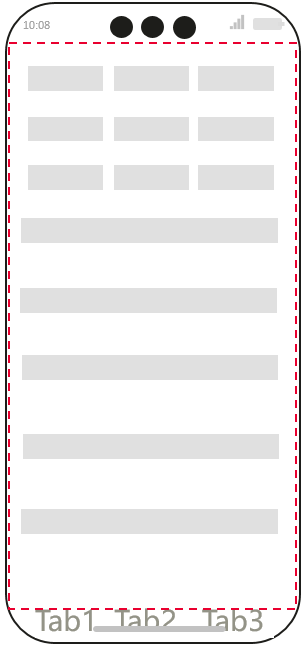
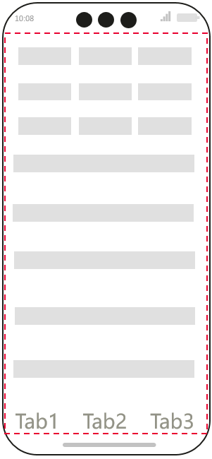

# Safe Area Calculation and Adaptation in Web Pages

## Overview

The safe area is defined as the display region of a page that, by default, does not overlap with system-defined non-safe areas (such as the status bar or navigation bar), ensuring that interfaces designed by developers are laid out within the safe area. However, when the Web component enables immersive mode, webpage elements may overlap with the status bar or navigation bar. As illustrated in Figure 1, the area enclosed by the red dashed line represents the safe area, while the top status bar, screen cutout area, and bottom navigation bar are defined as non-safe areas. When the Web component activates immersive effects, bottom elements on the webpage may overlap with the navigation bar.

**Figure 1** Bottom elements overlapping with the navigation bar when immersive effects are enabled in the Web component



The Web component provides the capability to calculate and adapt to safe areas using W3C CSS, supporting normal display of pages on devices with irregular screens under immersive effects. Web developers can use this feature to avoid overlapping elements. The ArkWeb kernel continuously monitors the position and dimensions of the Web component and the system's safe area, calculating the current safe area of the Web component and the required avoidance distances in each direction based on their overlapping regions.

## Implementation Scenarios

### Enabling Immersive Effects in the Web Component

Developers can enable immersive effects via [expandSafeArea](../reference/arkui-cj/cj-universal-attribute-expandsafearea.md#func-expandsafeareaarraysafeareatype-arraysafeareaedge).

<!-- compile -->

```cangjie
// index.cj
import ohos.arkui.state_macro_manage.*
import ohos.web.webview.WebviewController
import kit.ArkUI.{ Web, SafeAreaType, SafeAreaEdge }

@Entry
@Component
class EntryView {
    let webController = WebviewController()

    func build() {
        Column {
            Web(src: 'www.example.com', controller: this.webController)
                .width(100.percent)
                .height(100.percent)
                .expandSafeArea(types: [SafeAreaType.System], edges: [SafeAreaEdge.Top, SafeAreaEdge.Bottom])
        }
    }
}
```

### Configuring Webpage Layout Within the Viewport

`viewport-fit` controls how a webpage is displayed within the safe area. The default value is `auto`, which behaves the same as `contain`, meaning the viewport fully contains the webpage content (i.e., all content is displayed within the safe area). In contrast, `cover` indicates that the webpage content fully covers the viewport, extending into non-safe areas and potentially overlapping with the status bar or navigation bar. Only in this scenario does the webpage require adaptation to avoid overlaps. The configuration is as follows:

```html
<meta name='viewport' content='viewport-fit=cover'>
```

### Avoiding Overlaps for Webpage Elements

Adaptation for webpage elements primarily relies on the `env()` CSS function, which inserts user-defined variables into CSS. This allows developers to position content within the safe area of the viewport. The `safe-area-inset-*` values defined in the specification ensure content remains fully visible even in non-rectangular viewports. The syntax is as follows:

```html
/* safe-area-inset-* can set avoidance values for top, right, bottom, and left directions */
env(safe-area-inset-top);
env(safe-area-inset-right);
env(safe-area-inset-bottom);
env(safe-area-inset-left);

/* Using fallback values with safe-area-inset-* for avoidance in all directions */
/* For length units, refer to: https://developer.mozilla.org/en-US/docs/Web/CSS/Reference/Values/length */
env(safe-area-inset-top, 20px);
env(safe-area-inset-right, 1em);
env(safe-area-inset-bottom, 0.5vh);
env(safe-area-inset-left, 1.4rem);
```

> **Note:**
>
> `safe-area-inset-*` consists of four environment variables defining the `top`, `right`, `bottom`, and `left` edges of the rectangle within the viewport, ensuring content is safely placed without being clipped by non-rectangular display areas. In rectangular viewports (e.g., standard 2-in-1 device displays), these values are zero. For non-rectangular displays (e.g., circular watch faces or mobile screens), all content remains visible within the rectangle formed by the four values set by the user agent.

Unlike other CSS properties, user agent-defined property names are case-sensitive. Additionally, note that `env()` must be used with `viewport-fit=cover`.

For e-commerce websites, the bottom of the homepage often contains absolutely positioned tab elements. In immersive mode, these elements require bottom avoidance to prevent overlap with the system navigation bar. The avoidance effect is shown in Figure 2:

```html
.tab-bottom {
    padding-bottom: env(safe-area-inset-bottom);
}
```

Furthermore, `env()` can be combined with CSS math functions like `calc()`, `min()`, and `max()` for composite calculations, such as:

```html
.tab-bottom {
    padding-bottom: max(env(safe-area-inset-bottom), 30px);
}
```

**Figure 2** Bottom elements avoiding the navigation bar area when immersive effects are enabled in the Web component

