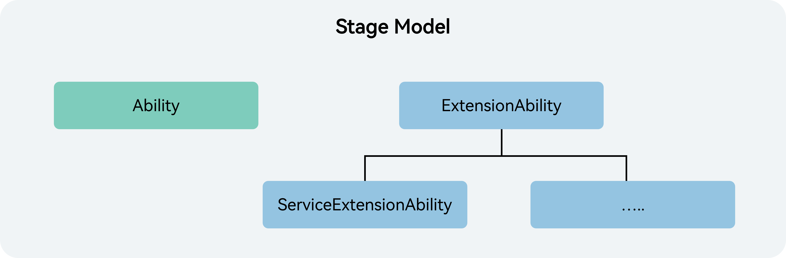

# 应用模型

## 应用模型的构成要素

应用模型是系统为开发者提供的应用程序所需能力的抽象提炼，它提供了应用程序必备的组件和运行机制。有了应用模型，开发者可以基于一套统一的模型进行应用开发，使应用开发更简单、高效。

应用模型的构成要素包括：

1. 应用组件

   应用组件是应用的基本组成单位，是应用的运行入口。用户启动、使用和退出应用过程中，应用组件会在不同的状态间切换，这些状态称为应用组件的生命周期。应用组件提供生命周期的回调函数，开发者通过应用组件的生命周期回调感知应用的[状态变化](cj-uiability-lifecycle.md)。应用开发者在编写应用时，首先需要编写的就是应用组件，同时还需编写应用组件的生命周期回调函数，并在应用配置文件中配置相关信息。这样，操作系统在运行期间通过配置文件创建应用组件的实例，并调度它的生命周期回调函数，从而执行开发者的代码。

2. 应用进程模型

   应用进程模型定义应用进程的创建和销毁方式，以及进程间的通信方式。

3. 应用线程模型

   应用线程模型定义应用进程内线程的创建和销毁方式、主线程和UI线程的创建方式、线程间的通信方式。

4. 应用任务管理模型（仅对系统应用开放）

   应用任务管理模型定义任务（Mission）的创建和销毁方式，以及任务与组件间的关系。所谓任务，即用户使用一个应用组件实例的记录。每次用户启动一个新的应用组件实例，都会生成一个新的任务。例如，用户启动一个视频应用，此时在“最近任务”界面，将会看到视频应用这个任务，当用户点击这个任务时，系统会把该任务切换到前台，如果这个视频应用中的视频编辑功能也是通过应用组件编写的，那么在用户启动视频编辑功能时，会创建视频编辑的应用组件实例，在“最近任务”界面中，将会展示视频应用、视频编辑两个任务。

5. 应用配置文件

   应用配置文件中包含应用配置信息、应用组件信息、权限信息、开发者自定义信息等，这些信息在编译构建、分发和运行阶段分别提供给编译工具、应用市场和操作系统使用。

## 应用模型概况

随着系统的演进发展，提供了如下应用模型：

- Stage模型：是目前主推且会长期演进的模型。在该模型中，由于提供了AbilityStage、WindowStage等类作为应用组件和Window窗口的“舞台”，因此称这种应用模型为Stage模型。

## 认识Stage模型

可通过如下表格了解型的整体概况。

  **表1** Stage模型概览

| 项目 | Stage模型 |
| -------- |  -------- |
| **应用组件** | 1.&nbsp;组件分类 <!-- ToBeReviewed -->&nbsp;&nbsp;&nbsp;-&nbsp;UIAbility组件：包含UI，提供展示UI的能力，主要用于和用户交互。详情请参见[UIAbility组件概述](cj-uiability-overview.md)。 &nbsp;&nbsp;&nbsp;-&nbsp;ExtensionAbility组件：提供特定场景（如卡片、输入法）的扩展能力，满足更多的使用场景。 2.&nbsp;开发方式 &nbsp;&nbsp;&nbsp;采用面向对象的方式，将应用组件以类接口的形式开放给开发者，可以进行派生，有利于扩展能力。 |
| **进程模型** |  有两类进程： 1.&nbsp;主进程 2.&nbsp;ExtensionAbility进程 |
|**任务管理模型**  | -&nbsp;每个UIAbility组件实例创建一个任务。 -&nbsp;任务会持久化存储，直到超过最大任务个数（根据产品配置自定义）或者用户主动删除任务。 -&nbsp;UIAbility组件之间不会形成栈的结构。 |
| **应用配置文件**  | 使用app.json5描述应用信息，module.json5描述HAP信息、应用组件信息。 |
