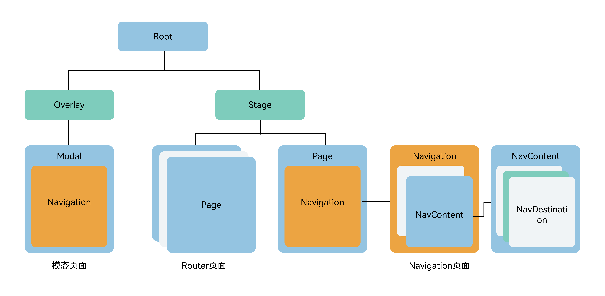

# 组件导航和页面路由概述

组件导航（Navigation）和页面路由（@ohos.router）均支持应用内的页面跳转，且组件导航支持在组件内部进行跳转，使用更灵活。组件导航具备更强的一次开发多端部署能力，可以进行更加灵活的页面栈操作，同时支持更丰富的动效和生命周期。因此，推荐使用组件导航（Navigation）来实现页面跳转以及组件内的跳转，以获得更佳的使用体验。

## 架构差异

从ArkUI组件树层级上来看，原先由Router管理的page在页面栈管理节点stage的下面。Navigation作为导航容器组件，可以挂载在单个page节点下，也可以叠加、嵌套。Navigation管理了标题栏、内容区和工具栏，内容区用于显示用户自定义页面的内容，并支持页面的路由能力。Navigation的这种设计上有如下优势：

1.接口上显式区分标题栏、内容区和工具栏，实现更加灵活的管理和UX动效能力；

2.显式提供路由容器概念，由开发者决定路由容器的位置，支持在全模态、半模态、弹窗中显示；

3.整合UX设计和一多能力，默认提供统一的标题显示、页面切换和单双栏适配能力；

4.基于通用[UIBuilder](./paradigm/cj-macro-builder.md)能力，由开发者决定页面别名和页面UI对应关系，提供更加灵活的页面配置能力；

5.基于组件属性动效和共享元素动效能力，将页面切换动效转换为组件属性动效实现，提供更加丰富和灵活的切换动效；

6.开放了页面栈对象，开发者可以继承，能更好地管理页面显示。
