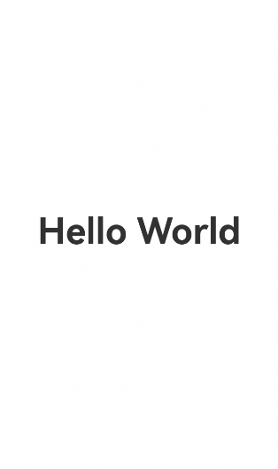

# 页面级弹出框

<!--Del-->
> **说明：**
>
> 当前为Beta阶段。
<!--DelEnd-->

弹出框默认设置为全局级别，弹窗节点作为页面根节点的子节点，显示层级高于应用中的所有路由/导航页面。当页面内进行路由跳转时，如果应用未主动调用close方法关闭弹出框，弹出框不会自动关闭，并且会在下一个跳转页面上继续显示。

如果开发者希望在路由跳转后，弹出框能够随前一个路由页面的切换而消失，并在路由返回后弹出框能够继续正常显示，可以通过页面级弹出框来实现。

> **说明：**
> - 当且仅当弹出框为非子窗模式时，页面级能力才会生效。即showInSubWindow参数不设置或设置为false。
> - 页面级弹出框通常与导航路由能力结合使用，可以参考[组件导航和页面路由概述](cj-navigation-introduction.md)了解相关术语。
> - 页面级弹出框的使用方式是在当前弹出框的入参之中新增了相关属性能力，使用前可以通过[弹出框概述](cj-dialog-base-overview.md)了解基础的弹出框使用方法。

## 设置参数

> **说明：**
>
> 详细变量定义请参考[完整示例](#完整示例)。

在弹出框的options入参中设置[levelMode](../reference/arkui-cj/cj-apis-uicontext-promptaction.md#enum-levelmode)属性，值为LevelMode.Embedded表示开启页面级弹出框能力。

当弹出框弹出时，会自动获取当前显示的Page页面并将弹出框节点挂载在此页面下。此时弹出框的显示层级高于此Page页面下的所有Navigation页面。

```cangjie
this.getUIContext().getPromptAction().openCustomDialog(
    CustomDialogOptions(
        builder: bind(this.CustomDialogBuilder, this)
        levelMode: LevelMode.Embedded, // 启用页面级弹出框
        // ···
    )
)
```

## 交互说明

页面内弹出框在部分交互逻辑上依然遵循部分弹出框指定的交互策略：

1. 侧滑时先关闭弹出框。通过侧滑手势返回上一页时，如果页面上存在弹出框，弹出框会优先关闭并结束本次手势行为。如果期望返回上一页，需要再次触发侧滑手势。

2. 点击弹出框的蒙层，默认会关闭弹出框，点击蒙层以外的区域则不会。

## 完整示例

下述示例为基于Router路由模式下的页面级弹出框。

```cangjie
package ohos_app_cangjie_entry

import kit.ArkUI.*
import ohos.arkui.state_macro_manage.*

@Entry
@Component
class EntryView {
    @State var message: String = 'Hello World'
    @State var customDialogId: Int32 = 0
    
    @Builder
    func customDialogBuilder() {
        Column() {
            Text('Custom dialog Message').fontSize(20).height(100)
            Row() {
                Button('Next').onClick({ evt => 
                    // 在弹窗内部进行路由跳转。
                    this.getUIContext().getRouter().pushUrl(url: 'Next')
                })
                Blank().width(50)
                Button('Close').onClick({ evt =>
                    this.getUIContext().getPromptAction().closeCustomDialog(customDialogId)
                })
            }
        }.padding(20)
    }

    func build() {
        NavDestination() {
            Row() {
                Column() {
                    Text(this.message).id('test_text')
                    .fontSize(50)
                    .fontWeight(FontWeight.Bold)
                    .onClick({ evt =>
                        this.getUIContext().getPromptAction().openCustomDialog(
                            CustomDialogConfig(
                                builder: bind(this.customDialogBuilder, this),
                                levelMode: LevelMode.Embedded, // 启用页面级弹出框
                            ),
                            { id =>
                                customDialogId = id
                            }
                        )    
                    })
                }
                .width(100.percent)
            }
            .height(100.percent)
        }
    }
}
```

```cangjie
// Next.cj

package ohos_app_cangjie_entry

import kit.ArkUI.*
import ohos.arkui.state_macro_manage.*

@Entry
@Component
class Next {
    @State var message: String = 'Back'

    func build() {
        Row() {
            Column() {
                Button(this.message)
                .fontSize(20)
                .fontWeight(FontWeight.Bold)
                .onClick({ evt =>
                    this.getUIContext().getRouter().back()
                })
            }
            .width(100.percent)
        }
        .height(100.percent)
    }
}
```


