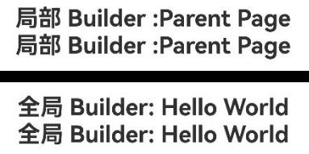

# @BuilderParam宏：引用@Builder函数

当开发者创建了自定义组件，并想对该组件添加特定功能，例如想在某一个指定的自定义组件中添加一个点击跳转操作，此时若直接在组件内嵌入事件方法，将会导致所有该自定义组件的实例都增加了功能。为解决此问题，ArkUI引入了@BuilderParam宏，@BuilderParam用来修饰指向@Builder方法的变量（@BuilderParam是用来承接@Builder函数的）。开发者可以在初始化自定义组件时，使用不同的方式（如：参数修改、父组件初始化等）对@BuilderParam修饰的自定义构建函数进行传参赋值，在自定义组件内部通过调用@BuilderParam为组件增加特定的功能。该宏用于声明任意UI描述的一个元素，类似slot占位符。

在阅读本文档前，建议提前阅读：[@Builder](./cj-macro-builder.md)。

## 宏使用说明

### 初始化@BuilderParam修饰的方法

@BuilderParam修饰的方法只能被自定义构建函数（@Builder修饰的方法）初始化。

使用全局的自定义构建函数，在本地初始化@BuilderParam。

```cangjie
package ohos_app_cangjie_entry
import kit.ArkUI.*
import ohos.arkui.state_macro_manage.*

@Builder func overBuilder() {}

@Component
class Child {
    // 使用全局自定义构建函数初始化@BuilderParam
    @BuilderParam var customOverBuilderParam: () -> Unit = overBuilder

    func build(){}
}
```

## 限制条件

使用@BuilderParam有如下限制：

- 所修饰的变量只能使用@Builder函数进行初始化。

- 所修饰变量的类型为函数类型，且返回值类型为Unit。

- 所修饰的变量声明中，变量的类型需要显式标注。

- 只能修饰类的成员变量声明，禁止修饰全局变量（否则将产生编译错误）。

- 所修饰的类成员变量（可见性与private修饰符一致）只允许在类内部使用。

- 所修饰变量可以是可变的，也可以是不可变的。变量的可变性遵循仓颉语法，即由let/var关键字标识的变量分别为不可变变量和可变变量。

## 使用场景

### 参数初始化组件

@BuilderParam修饰的方法可以是有参数和无参数的两种形式，需与指向的@Builder方法类型匹配。

 <!-- run -->

```cangjie
package ohos_app_cangjie_entry
import kit.ArkUI.*
import ohos.arkui.state_macro_manage.*

class Tmp{
    var label: String = ''
    init(label: String) {
        this.label = label
    }
}

@Builder func overBuilder(tmp: Tmp) {
    Text(tmp.label)
        .width(400)
        .height(50)
        .backgroundColor(Color.Green)
}

@Component
class Child {
    var label: String = 'Child'
    // 无参数类型，指向的customBuilder也是无参数类型
    @BuilderParam var customBuilderParam: () -> Unit
    // 有参数类型，指向的overBuilder也是有参数类型的方法
    @BuilderParam var customOverBuilderParam: (Tmp) -> Unit = overBuilder

    func build() {
        Column() {
            this.customBuilderParam()
            this.customOverBuilderParam(Tmp("  global Builder label"))
        }
    }
}

@Entry
@Component
class EntryView {
    var label: String = 'Parent'

    @Builder func componentBuilder() {
        Text(this.label)
    }

    func build() {
        Column() {
            this.componentBuilder()
            Child(customBuilderParam: this.componentBuilder)
        }
    }
}
```


**图1** 示例效果图

### 使用全局和父组件@Builder初始化@BuilderParam

在自定义组件中，使用@BuilderParam修饰的变量接收来自父组件通过@Builder传递的内容进行初始化。

 <!-- run -->

```cangjie
package ohos_app_cangjie_entry
import kit.ArkUI.*
import ohos.arkui.state_macro_manage.*

@Builder func customBuilder() {}

@Component
class ChildPage {
    var label: String = 'Child Page'

    @BuilderParam var customBuilderParam: () -> Unit = customBuilder

    func build() {
        Column() {
            this.customBuilderParam()
        }
    }
}

let builder_value: String = 'Hello World'

@Builder func overBuilder() {
    Row() {
        Text('全局 Builder: ${builder_value}')
            .fontSize(20)
            .fontWeight(FontWeight.Bold)
    }
}

@Entry
@Component
class EntryView{
    var label: String = 'Parent Page'

    @Builder func componentBuilder() {
        Row(){
            Text('局部 Builder :${this.label}')
                .fontSize(20)
                .fontWeight(FontWeight.Bold)
        }
    }

    func build() {
        Column() {
            // 调用this.componentBuilder()时，this指向当前@Entry所修饰的ParentPage组件，所以label变量的值为"Parent Page"。
            this.componentBuilder()
            ChildPage(
                // 把this.componentBuilder传给子组件ChildPage的@BuilderParam customBuilderParam。
                customBuilderParam: this.componentBuilder
                )
        Line()
            .width(1000)
            .height(10)
            .backgroundColor(0x000000).margin(10)
        // 调用全局overBuilder()时，所以展示的内容为"Hello World"。
        overBuilder()
        ChildPage(
            // 把全局overBuilder传给子组件ChildPage的@BuilderParam customBuilderParam，所以展示的内容为"Hello World"。
            customBuilderParam: overBuilder
        )
    }
  }
}
```



**图3** 示例效果图

## 常见问题

### @BuilderParam宏初始化的值必须为@Builder

使用@State宏修饰的变量，给子组件@BuilderParam和ChildBuilder变量进行初始化，在编译时会输出报错信息。

【反例】

```cangjie
package ohos_app_cangjie_entry
import kit.ArkUI.*
import ohos.arkui.state_macro_manage.*

@Builder func globalBuilder() {
    Text('Hello World')
}
@Entry
@Component
class EntryView {
    @State var message: String = "";
    func build() {
        Column() {
        // 子组件ChildBuilder接收@State修饰的变量，会出现编译和编辑报错
        ChildPage(ChildBuilder: this.message)
        }
    }
}

@Component
class ChildPage {
    @BuilderParam var ChildBuilder: () -> Unit = globalBuilder;
    func build() {
        Column() {
        this.ChildBuilder()
        }
    }
}
```

使用全局的@Builder修饰的globalBuilder()给子组件@BuilderParam修饰的ChildBuilder变量进行初始化，编译时没有报错，功能正常。

【正例】

 <!-- run -->

```cangjie
package ohos_app_cangjie_entry
import kit.ArkUI.*
import ohos.arkui.state_macro_manage.*

@Builder func globalBuilder() {
    Text('Hello World')
}
@Entry
@Component
class EntryView {
    func build() {
        Column() {
            ChildPage(ChildBuilder: globalBuilder)
        }
    }
}

@Component
class ChildPage {
    @BuilderParam var ChildBuilder: () -> Unit = globalBuilder;
    func build() {
        Column() {
        this.ChildBuilder()
        }
    }
}
```
