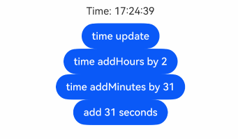

# \@Observed宏 和 \@Publish宏：嵌套类对象属性变化

上文所述的宏（包括 [\@State](./cj-macro-state.md)、[\@Prop](./cj-macro-prop.md)、[\@Link](./cj-macro-link.md)、[\@Provide和\@Consume](./cj-macro-provide-and-consume.md)宏）仅能观察到简单类型的变化，但是在实际应用开发中，应用会根据开发需要，使用数组或是封装自己的数据模型。对于这种情况，如数组、自定义类类型或者自定义类类型的数组，他们的成员变量的属性变化是无法观察到的。这就引出了 \@Observed宏 和 \@Publish宏。

\@Observed 和 \@Publish 配套使用是用于类类型属性变化的观察，主要是为了弥补其他宏仅能观察一层的能力限制。建议开发者提前阅读 [\@State](./cj-macro-state.md) 的基本用法，对宏的基本观察能力有一定的了解，再对比阅读本文档。

## 概述

\@Observed 宏和 \@Publish 类属性宏，用于在涉及自定义类类型或数组的场景中进行双向数据同步：

- 被 \@Observed 装饰的类，表示需要观察内部属性的变化。

- 子组件中 \@Publish 宏装饰的状态变量用于接收 \@Observed 装饰的类的实例，和父组件中对应的状态变量建立双向数据绑定。这个实例可以是数组中的被 \@Observed 装饰的项，或者是class中的属性，这个属性同样也需要被 \@Observed 装饰。

## 宏说明

| \@Observed  | 说明                                |
| :-------------- | :--------------------------------- |
| 宏参数          | 无。                                 |
| 类宏           | \@Observed 修饰类需要满足如下规范：<br>1. 只能装饰仓颉 class 类型，需要放在class的定义前。<br>2. 所修饰的仓颉 class 类型，禁止在类定义时继承其他类扩展和接口，支持但不建议使用扩展的方法让修饰的 class类型 实现接口。<br>3. 禁止修饰 open class，否则将产生编译错误。<br>4. 禁止自定义 \@Observed 所修饰 class 的构造函数。 |

| \@Publish | 说明                                       |
| :----------------- | :---------------------------------------- |
| 宏参数             | 无。                                       |
| 允许装饰的变量类型         | 只能修饰仓颉自定义类型的成员变量，包括简单类型、数组和类类型，建议为被 \@Observed 装饰的class的成员变量，且必须指定类型和初始值，但对于String，Int64，Float64和Bool类型，如果变量的初始值是上述类型的字面量，则可以省略类型。<br> 禁止修饰静态类型（被static修饰符修饰）。示例见[观察变化](#观察变化)。|
| 被装饰变量的初始值         | 无初始值，必须从父组件初始化。                                     |

## 变量的传递/访问规则说明

| \@Publish传递/访问 | 说明                                       |
| :----------------- | :---------------------------------------- |
| 属性初始化           | 必须从父组件初始化。若类定义时没有默认值，则要在声明该类的变量时调用构造函数为每一个成员变量没有初始化的成员变量初始化<br/>初始化 \@Publish 装饰的变量必须同时满足以下场景：<br/>-&nbsp;类型必须是仓颉自定义类型的成员变量，建议修饰 \@Observed 修饰的class类型的成员变量。<br/>-&nbsp; \@Publish 修饰的变量只能由var声明，即可读写。<br/>-&nbsp; \@Publish 修饰的变量必须指明类型和初始值，对于 String，Int64，Float64和Bool类型，如果变量的初始值是上述类型的字面量，则可以省略类型。 |

## 观察变化和行为表现

### 观察变化

\@Observed装饰的类，如果其成员为非简单类型，比如class或数组，class类型需要被\@Observed装饰，数组类型建议使用ObservedArrayList，否则将观察不到其属性的变化。

```cangjie
class Child{
    var num: Int64 = 0

    init(num: Int64){
        this.num = num
    }
}

@Observed
class Parent{
    @Publish
    var child: Child
    @Publish
    var count: Int64
    @Publish
    var arr: Array<Int64>
}
```

以上示例中，Parent被 \@Observed 装饰，其被 \@Publish 修饰的成员变量的赋值的变化是可以被观察到的。

对于child，因其类型Child没有被 \@Observed 装饰，且其中的属性没有被\@Publish属性修饰，其属性的修改不能被观察到；而数组arr，作为一种复杂类型，建议使用ObservedArrayList类型替换。

```cangjie
var parent: Parent = (child: Child(1), count: 1);

// 赋值变化可以被观察到
this.parent.child = new Child(5);
this.parent.count = 5;

// Child没有被@Observed装饰，其属性的变化观察不到
this.parent.child.num = 5;
```

\@Publish 修饰被 \@Observed 装饰class的成员变量，可以推荐设计单独的自定义组件来渲染每一个数组或对象。此时，对象数组或嵌套对象（属性是对象的对象称为嵌套对象）需要两个自定义组件，一个自定义组件呈现外部数组/对象，另一个自定义组件呈现嵌套在数组/对象内的类对象。可以观察到：

当装饰的对象是DateTime时，可以观察到DateTime整体的赋值，同时可通过调用DateTime的函数addDays(Int64), addHours(Int64), addMinutes(Int64), addMonths(Int64), addNanoseconds(Int64), addSeconds(Int64), addWeeks(Int64), addYears(Int64)更新DateTime的属性。

 <!-- run -->

```cangjie
package ohos_app_cangjie_entry

import kit.ArkUI.*
import ohos.arkui.state_macro_manage.*
import std.time.DateTime

@Observed
class TimeClass{
    @Publish
    var time: DateTime
}

@Entry
@Component
class EntryView{

    @State
    var Time: TimeClass = TimeClass(time: DateTime.now())

    func build(){
        Flex(justifyContent: FlexAlign.Center, alignItems: ItemAlign.Center){
            Column(){
                Text("Time: ${Time.time.format("HH:mm:ss")}").margin(10)
                Button("time update").onClick({
                    evt =>
                        Time.time = DateTime.now()
                })
                Button("time addHours by 2").onClick({
                    evt =>
                        Time.time = Time.time.addHours(2)
                })
                Button("time addMinutes by 31").onClick({
                    evt =>
                        Time.time = Time.time.addMinutes(31)
                })
                Button("add 31 seconds").onClick({
                    evt =>
                        Time.time = Time.time.addSeconds(31)
                })
            }
        }
    }
}
```



### 框架行为

1. 初始渲染：

   a. \@Observed 装饰的类会自动继承 ObservedObject，自动生成构造函数，并创建class上的setter和getter函数绑定的触发事件。

   b. 子组件中 \@Publish 装饰的从父组件初始化，接收被 \@Observed 装饰的class的实例，\@Publish 的包装类会将自己注册给 \@Observed class。

2. 当 \@Observed 装饰的class中 \@Publish 装饰的属性改变时：
   a. 当状态变量被使用时，将触发 ObservedProperty 中的 get函数，记录与该状态变量相关的组件id，为后续状态变量改变后修改组件做准备。
   b. 当状态变量被改变时，将触发 ObservedProperty 中的 set函数，然后遍历依赖它的组件UI，通知数据更新，并根据需要更新的组件id数组重新渲染UI。

## 限制条件

1. \@Observed 所装饰的类，不能在类定义时继承其他类扩展和接口，也不能装饰 open class 作为其他类的父类，否则将产生编译错误。

2. \@Observed 装饰的类不能定义构造函数。被 \@Observed 修饰的类会自动生成带命名参数的构造函数。

3. \@Publish 装饰的变量类型需要为自定义类型拥有的成员变量，且如果未不是 \@Observed 装饰的class成员变量，其内容更新不会触发UI更新。

4. \@Publish 只能修饰仓颉自定义类型由var声明的成员变量，不能修饰let变量和静态变量。

5. 在\@Observed 修饰的类中，\@Publish 修饰的成员变量一定要得到初始化。

## 使用场景

### 成员变量为自定义类型

 <!-- run -->

```cangjie
package ohos_app_cangjie_entry

import kit.ArkUI.*
import ohos.arkui.state_macro_manage.*

@Observed
class Book{
    @Publish
    var name: String
}

@Observed
class Bag{
    @Publish
    var book: Book
}

@Entry
@Component
class EntryView{
    @State
    var bag: Bag = Bag(book: Book(name: "Cangjie"))

    func build(){
        Column{
            Text("Index: ${this.bag.book.name}")
            Button("change book.name").onClick({
                evt =>
                    this.bag.book.name = "ArkUI"
            })
        }
    }
}
```

此例中多层嵌套类属性变化后，可以观察到UI更新触发。如果类中的属性也是类类型，且该属性需要被监听，那么这个类也要被 \@Observed 修饰。

## 常见问题

### \@Observed 装饰类不能定义构造函数

定义 \@Observed 装饰的类时不能有自定义构造函数，否则编译时会产生错误。\@Observed 会为该类生成构造函数，通过类名和传入命名参数的方式实例化。

【反例】

```cangjie

@Observed
class Info1{
  @Publish
  var count: Int64 = 0
  init(count: Int64){
      this.count = count
  }
}
```

【正例】

```cangjie

@Observed
class Info2{
    @Publish
    var count: Int64 = 0
}

@Component
class Test{
    // 创建该类设置成员变量的值时，需要指定命名参数。
    var info: Info2 = Info2(count: 5)

    func build(){
        Column{
            Text("info.count: ${info.count}")
        }
    }
}
```

### \@Publish 装饰成员变量未触发UI更新

如果需要观察到自定义类型的成员变化，触发UI重新渲染。\@Publish 装饰的变量需要是自定义类型中的成员变量，且该自定义类型需要被 \@Observed 装饰，否则缺少任意条件，其内容更新都不会触发UI更新。

```cangjie
@Observed
class Info{
    var count: Int64 = 0
}

class Test{
    @Publish
    var msg: Int64 = 0

    init(msg: Int64){
        this.msg = msg
    }
}

@Component
class Page{
    // info.count未被@Publish修饰，内容更新不会触发UI更新
    @State var info: Info = Info(count: 5)
    // Test.msg 未被@Observed修饰，内容更新不会触发UI更新
    @State var test: Test = Test(5)

    func build(){}
}
```

### 自定义类型作为成员变量更改失效

【反例】

以下示例创建了一个Parent类，包含一个自定义类型Child。

```cangjie
package ohos_app_cangjie_entry

import kit.ArkUI.*
import ohos.arkui.state_macro_manage.*

@Observed
class Parent{
    @Publish
    var parentId: Int64
    @Publish
    var child: Child
}

class Child{
    var childId: Int64=1
}

@Entry
@Component
class EntryView{
    @State
    var parent1: Parent = Parent(parentId: 0,child: Child())
    func build(){
        Column(space: 10){
            Text("parentId: ${parent1.parentId}")
            Button("change parentId by 1").onClick({
                evt =>
                    parent1.parentId += 1
            })

            Text("childId: ${parent1.child.childId}")
            Button("change childId by 1").onClick({
                evt =>
                    parent1.child.childId += 1
            })
        }
    }
}
```

对于Text("parentId: ${parent1.parentId}")和对应Button的onClick事件，执行了 parent1.parentId += 1 增加了parentId的值，会使UI重新刷新并观察到成员变量的变化。

在Text("parentId: ${parent1.parentId}")和对应Button的onClick中调用parent1.child.childId += 1，虽增加了parentId.child.childId的值，但是因为自定义类型Child未被 \@Observed 修饰，无法观察到成员变量的变化，UI不会重新刷新。

【正例】

对于上述问题，为了直接观察成员变量的变化，以便 parent1.child.childId += 1 刷新UI操作有效。可以为Child类添加 \@Observed，成员变量添加 \@Publish 修饰，表明该自定义类型的成员变量变化将会触发UI的刷新。

 <!-- run -->

```cangjie
package ohos_app_cangjie_entry

import kit.ArkUI.*
import ohos.arkui.state_macro_manage.*

@Observed
class Parent{
    @Publish
    var parentId: Int64
    @Publish
    var child: Child
}

@Observed
class Child{
    @Publish
    var childId: Int64
}

@Entry
@Component
class EntryView{
    @State
    var parent1: Parent = Parent(parentId: 0,child: Child(childId: 1))
    func build(){
        Column(space: 10){
            Text("parentId: ${parent1.parentId}")
            Button("change parentId by 1").onClick({
                evt =>
                    parent1.parentId += 1
            })

            Text("childId: ${parent1.child.childId}")
            Button("change childId by 1").onClick({
                evt =>
                    parent1.child.childId += 1
            })
        }
    }
}
```
