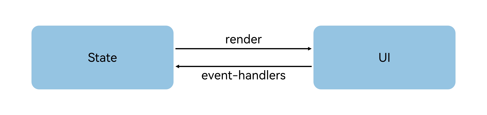

# 状态管理概述

如果希望构建一个动态的、有交互的界面，就需要引入“状态”的概念。

**图1** 效果图


上面的示例中，用户与应用程序的交互触发了文本状态变更，状态变更引起了UI渲染，UI从“Hello World”变更为“Hello Cangjie”。

在声明式UI编程框架中，UI是程序状态的运行结果，用户构建了一个UI模型，其中应用的运行时的状态是参数。当参数改变时，UI作为返回结果，也将进行对应的改变。这些运行时的状态变化所带来的UI的重新渲染，在仓颉中统称为状态管理机制。

自定义组件拥有变量，变量必须被装饰器装饰才可以成为状态变量，状态变量的改变会引起UI的渲染刷新。如果不使用状态变量，UI只能在初始化时渲染，后续将不会再刷新。 下图展示了State和View（UI）之间的关系。



- View(UI)：UI渲染，指将build方法内的UI描述和@Builder装饰的方法内的UI描述映射到界面。

- State：状态，指驱动UI更新的数据。用户通过触发组件的事件方法，改变状态数据。状态数据的改变，引起UI的重新渲染。

在阅读状态管理文档前，开发者需要对UI范式基本语法有基本的了解。建议提前阅读：基本语法概述，声明式UI描述，自定义组件-创建自定义组件。

## 基本概念

- 状态变量：被状态装饰器装饰的变量，状态变量值的改变会引起UI的渲染更新。示例：@State var num: Int32 = 1,其中，@State是状态装饰器，num是状态变量。
- 常规变量：没有被状态装饰器装饰的变量，通常应用于辅助计算。它的改变永远不会引起UI的刷新。以下示例中increaseBy变量为常规变量。
- 数据源/同步源：状态变量的原始来源，可以同步给不同的状态数据。通常意义为父组件传给子组件的数据。以下示例中数据源为count: 1。
- 命名参数机制：父组件通过指定参数传递给子组件的状态变量，为父子传递同步参数的主要手段。示例：CompA(aProp: this.aProp)。
- 从父组件初始化：父组件使用命名参数机制，将指定参数传递给子组件。子组件初始化的默认值在有父组件传值的情况下，会被覆盖。示例：

 <!-- run -->

```cangjie
package ohos_app_cangjie_entry
import kit.ArkUI.*
import ohos.arkui.state_macro_manage.*

@Component
class MyComponent {
    @State var count: Int32 = 0
    private var increaseBy: Int32 = 1
    func build() {}
}
@Entry
@Component
class Parent {
    func build() {
        Column() {
            // 从父组件初始化，覆盖本地定义的默认值
            MyComponent(count: 1, increaseBy: 2 )
        }
    }
}
```

- 初始化子组件：父组件中状态变量可以传递给子组件，初始化子组件对应的状态变量。示例同上。
- 本地初始化：在变量声明的时候赋值，作为变量的默认值。示例：@State count: Int32 = 0。

> **说明：**
>
> 当前状态管理的功能仅支持在UI主线程使用，不能在子线程、worker、taskpool中使用。

## 状态管理（V1）

开发者可以选择使用状态管理V1版本进行应用开发。

### 装饰器总览

仓颉状态管理V1提供了多种装饰器，通过使用这些装饰器，状态变量不仅可以观察在组件内的改变，还可以在不同组件层级间传递，比如父子组件、跨组件层级，也可以观察全局范围内的变化。根据状态变量的影响范围，将所有的装饰器可以大致分为:

- 管理组件内状态的装饰器：组件级别的状态管理，可以观察同一个组件树上（即同一个页面内）组件内或不同组件层级的变量变化。
- 管理应用级状态的装饰器：应用级别的状态管理，可以观察不同页面，甚至不同UIAbility的状态变化，是应用内全局的状态管理。

从数据的传递形式和同步类型层面看，装饰器也可分为：

- 只读的单向传递；
- 可变更的双向传递。

图示如下，具体装饰器的介绍，请参见[管理组件拥有的状态](./cj-macro-state.md)和[管理应用拥有的状态](./cj-application-state-management-overview.md)。开发者可以灵活地利用这些能力来实现数据和UI的联动。


[管理组件拥有的状态](./cj-macro-state.md)，即图中Components级别的状态管理：

- [@State](./cj-macro-state.md)：@State装饰的变量拥有其所属组件的状态，可以作为其子组件单向和双向同步的数据源。当其数值改变时，会引起相关组件的渲染刷新。
- [@Prop](./cj-macro-prop.md)：@Prop装饰的变量可以和父组件建立单向同步关系，@Prop装饰的变量是可变的，但修改不会同步回父组件。
- [@Link](./cj-macro-link.md)：@Link装饰的变量可以和父组件建立双向同步关系，子组件中@Link装饰变量的修改会同步给父组件中建立双向数据绑定的数据源，父组件的更新也会同步给@Link装饰的变量。
- [@Provide/@Consume](./cj-macro-provide-and-consume.md)：@Provide/@Consume装饰的变量用于跨组件层级（多层组件）同步状态变量，可以不需要通过参数命名机制传递，通过alias（别名）或者属性名绑定。
- [@Observed](./cj-macro-observed-and-publish.md)：@Observed装饰class，需要观察多层嵌套场景的class需要被@Observed装饰。单独使用@Observed没有任何作用，需要和@Publish联用。
- [@Publish](./cj-macro-observed-and-publish.md)：@Publish装饰的变量接收@Observed装饰的class的实例，应用于观察多层嵌套场景，和父组件的数据源构建双向同步。

> **说明：**
>
> 仅[@Observed/@Publish](./cj-macro-observed-and-publish.md)可以观察嵌套场景，其他的状态变量仅能观察第一层，详情见各个装饰器章节的“观察变化和行为表现”小节。

[管理应用拥有的状态](./cj-application-state-management-overview.md)，即图中Application级别的状态管理：

- [AppStorage](./cj-appstorage.md)是应用程序中的一个特殊的单例[LocalStorage](./cj-localstorage.md)对象，是应用级的数据库，和进程绑定，通过[@StorageProp](./cj-appstorage.md#StorageProp)和[@StorageLink](./cj-appstorage.md#StorageLink)装饰器可以和组件联动。
- AppStorage是应用状态的“中枢”，将需要与组件（UI）交互的数据存入AppStorage，比如持久化数据[PersistentStorage](./cj-persiststorage.md)和环境变量[Environment](./cj-environment.md)。UI再通过AppStorage提供的装饰器或者API接口，访问这些数据。
- 框架还提供了LocalStorage，AppStorage是LocalStorage特殊的单例。LocalStorage是应用程序声明的应用状态的内存“数据库”，通常用于页面级的状态共享，通过[@LocalStorageProp](./cj-localstorage.md#LocalStorageProp)和[@LocalStorageLink](./cj-localstorage.md#LocalStorageLink)装饰器可以和UI联动。

### 其他状态管理V1功能

[@Watch](./cj-macro-watch.md)用于监听状态变量的变化。
