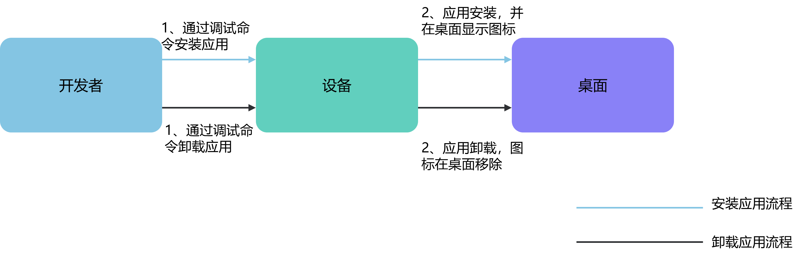
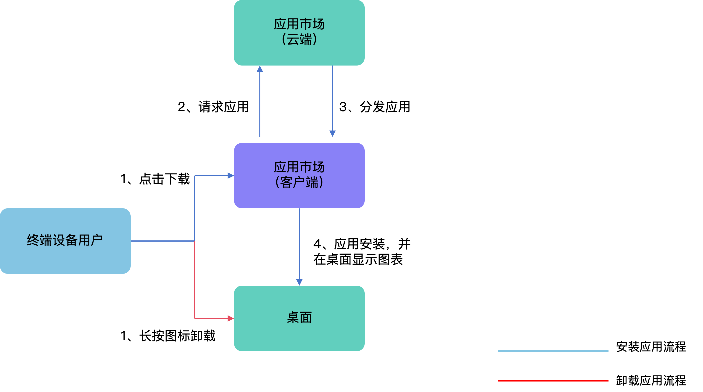

# 应用安装卸载与更新开发指导

本章节介绍应用程序包的安装卸载流程和两种更新方式。

## 应用程序包的安装卸载

开发者可以通过调试命令安装和卸载应用，安装应用命令参考bm工具中的[install](../../tools/cj-bm-tool.md#安装命令install)，卸载应用命令参考bm工具中的[uninstall](../../tools/cj-bm-tool.md#卸载命令uninstall)，详情参考[编译发布与上架部署流程图](./application-package-structure-stage.md#发布态包结构)。

**图1** 应用程序包安装和卸载流程（开发者）

应用上架应用市场后，终端设备用户可在设备上通过应用市场安装和卸载应用。

**图2** 应用程序包安装和卸载流程（终端设备用户）

## 应用程序包的更新

对于开发者，应用程序包的更新，首先需要更新[app.json5配置文件](./app-configuration-file.md#appjson5配置文件)中的versionCode版本号字段，通过DevEco Studio打包后在应用市场发布，发布流程与首次发布一致。对于终端设备用户，新版本发布后，可以通过以下方式更新应用程序包。

- 应用市场内更新：应用市场通知用户该应用有新版本，用户根据通知到应用市场（客户端）进行升级。
