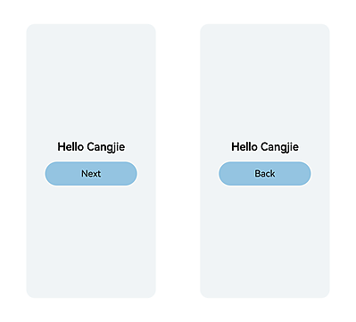

# 构建第一个仓颉应用

> **说明：**
>
> 为确保运行效果，本文以使用**最新DevEco Studio版本**为例，点击[此处](https://developer.huawei.com/consumer/cn/download/)获取下载链接。

## 创建仓颉工程

1. 若首次打开**DevEco Studio**，请单击**Create Project**创建工程。如果已经打开了一个工程，请在菜单栏选择**File** > **New** > **Create Project**来创建一个新工程。

2. 选择**Application**应用开发（本文以应用开发为例，仓颉暂不支持元服务开发），选择模板 **[Cangjie] Empty Ability**，单击**Next**进行下一步配置。

   

3. 进入配置工程界面，可以修改工程名称和存储路径等工程的基本信息，也可以保持默认设置。

   

4. 单击 **Finish**，完成工程创建，工具会自动生成基础示例代码和相关资源。

## 仓颉工程目录结构

仓颉工程目录结构如下所示。

```text
Project_name
├── .hvigor
├── .idea
├── AppScope
├── entry
│    ├── libs
│    ├── src
│    │    ├── main
│    │    │    ├── cangjie
│    │    │    │    ├── ability_stage.cj
│    │    │    │    ├── index.cj
│    │    │    │    └── main_ability.cj
│    │    │    ├── resources
│    │    │    └── module.json5
│    │    └── ohosTest
│    ├── build-profile.json5
│    ├── cjpm.toml
│    ├── hvigorfile.ts
│    └── oh-package.json5
├── hvigor
│    ├── cangjie-build-support-x.y.z-cj.x.tgz
│    └── hvigor-config.json5
├── oh_modules
├── build-profile.json5
├── code-linter.json5
├── hvigorfile.ts
├── local.properties
├── oh-package.json5
└── oh-package-lock.json5
```

其中关键文件信息如下：

- **AppScope > app.json5**：应用的全局配置信息。
- **entry**：仓颉工程模块，编译构建生成一个HAP包。
    - **src > main > cangjie**：用于存放仓颉源码。
    - **src > main > resources**：用于存放应用/服务所用到的资源文件，如图形、多媒体、字符串、布局文件等。关于资源文件，请参见[资源分类与访问](../ide-resource-categories-and-access.md#资源分类与访问)。
    - **src > main > module.json5**：stage 模块配置文件，主要包含 HAP 的配置信息、应用在具体设备上的配置信息以及应用的全局配置信息。
    - **build-profile.json5**：当前的模块信息 、编译信息配置项，包括buildOption、targets配置等。
    - **hvigorfile.ts**：模块级编译构建任务脚本。
    - **cjpm.toml**：仓颉的包管理配置文件。
    - **oh-package.json5**：用来描述包名、版本、入口文件（类型声明文件）和依赖项等信息。
    - **src > ohosTest**：存放仓颉测试源码，用于仓颉Instrument Test。
- **hvigor**：用于存放当前工程使用的 hvigor。
    - **cangjie-build-support-x.y.z-cj.x.tgz**：仓颉指定的hvigor任务包。
    - **hvigor-config.json5**：指定工程全局使用的 hvigor 以及 hvigor 参数配置。
- **oh_modules**：用于存放三方库依赖信息，包含应用/服务所依赖的第三方库文件。
- **build-profile.json5**：应用级配置信息，包括签名、产品配置等。
- **hvigorfile.ts**：应用级编译构建任务脚本。
- **oh-package.json5**：主要用来描述全局配置，如：依赖覆盖（overrides）、依赖关系重写（overrideDependencyMap）和参数化配置（parameterFile）等。

## 构建第一个页面

1. 使用文本组件。

   工程同步完成后，在**Project**窗口，点击**entry > src > main > cangjie**，打开**index.cj**文件，使用仓颉语言进行应用页面的编写。针对本文中使用文本/按钮来实现页面跳转/返回的应用场景，页面均使用Row和Column组件为例来组建布局。

   ```text
   entry
   └── src
        └── main
             ├── cangjie
             │    ├── ability_stage.cj
             │    ├── index.cj
             │    └── main_ability.cj
             ├── resources
             └── module.json5
   ```

   **index.cj**文件的初始代码如下：

   <!-- compile -->

   ```cangjie
   // index.cj
   package ohos_app_cangjie_entry

   internal import ohos.base.LengthProp
   internal import ohos.arkui.component.Column
   internal import ohos.arkui.component.Row
   internal import ohos.arkui.component.Button
   internal import ohos.arkui.component.Text
   internal import ohos.arkui.component.CustomView
   internal import ohos.arkui.component.CJEntry
   internal import ohos.arkui.component.loadNativeView
   internal import ohos.arkui.component.FontWeight
   internal import ohos.arkui.state_management.SubscriberManager
   internal import ohos.arkui.state_management.ObservedProperty
   internal import ohos.arkui.state_management.LocalStorage
   import ohos.arkui.state_macro_manage.Entry
   import ohos.arkui.state_macro_manage.Component
   import ohos.arkui.state_macro_manage.State
   import ohos.arkui.state_macro_manage.r

   @Entry
   @Component
   class EntryView {
       @State
       var message: String = "Hello World"
       func build() {
           Row {
               Column {
                   Text(this.message)
                       .fontSize(50)
                       .fontWeight(FontWeight.Bold)
                       .onClick {
                           evt => this.message = "Hello Cangjie"
                       }
               }.width(100.percent)
           }.height(100.percent)
       }
   }
   ```

2. 添加文本，修改按钮。

   在默认页面基础上，我们添加一个Button组件，作为按钮响应用户点击，从而实现跳转到另一个页面。**index.cj**文件的示例如下：

   <!-- compile -->

   ```cangjie
   // index.cj
   package ohos_app_cangjie_entry

   internal import ohos.base.LengthProp
   internal import ohos.arkui.component.Column
   internal import ohos.arkui.component.Row
   internal import ohos.arkui.component.Button
   internal import ohos.arkui.component.Text
   internal import ohos.arkui.component.CustomView
   internal import ohos.arkui.component.CJEntry
   internal import ohos.arkui.component.loadNativeView
   internal import ohos.arkui.component.FontWeight
   internal import ohos.arkui.state_management.SubscriberManager
   internal import ohos.arkui.state_management.ObservedProperty
   internal import ohos.arkui.state_management.LocalStorage
   import ohos.arkui.state_macro_manage.Entry
   import ohos.arkui.state_macro_manage.Component
   import ohos.arkui.state_macro_manage.State
   import ohos.arkui.state_macro_manage.r

   @Entry
   @Component
   class EntryView {
       @State
       var message: String = "Hello Cangjie"

       func build() {
           Row {
               Column() {
                   Text(this.message)
                    .fontSize(50)
                    .fontWeight(FontWeight.Bold)
                    .onClick {
                        evt => this.message = "Hello Cangjie"
                    }
                   // 添加按钮，以响应用户点击
                   Button("Next")
                   .onClick {
                       evt => AppLog.info("Hello Cangjie")
                   }
                   .fontSize(30)
                   .width(180)
                   .height(50)
                   .margin(top: 20)
               }.width(100.percent)
           }.height(100.percent)
       }
   }
   ```

## 构建第二个页面

1. 创建第二个页面。

   在**Project**页面，进入**entry > src > main > cangjie**目录，右键单击**cangjie**文件夹，选择**New > Cangjie File**，命名为**second**，单击**OK**。文件目录结构如下：

   ```text
   entry
   └── src
        └── main
             ├── cangjie
             │    ├── ability_stage.cj
             │    ├── index.cj
             │    ├── main_ability.cj
             │    └── second.cj
             ├── resources
             └── module.json5
   ```

2. 添加文本及按钮。

   参照第一个页面，在第二个页面添加Text组件和Button组件，并设置其样式。**second.cj**文件的示例如下：

   <!-- compile -->

   ```cangjie
   // second.cj
   package ohos_app_cangjie_entry

   import ohos.arkui.state_macro_manage.Entry
   import ohos.arkui.state_macro_manage.Component
   import ohos.arkui.state_macro_manage.State
   import ohos.arkui.state_macro_manage.r
   import ohos.arkui.component.Button

   @Entry
   @Component
   class Second {
       @State
       var message: String = "Hi there"

       func build() {
           Row {
               Column() {
                   Text(this.message)
                       .fontSize(50)
                       .fontWeight(FontWeight.Bold)
                   Button("Back")
                       .onClick {
                           evt => AppLog.info("Hi there")
                       }
                       .fontSize(30)
                       .width(180)
                       .height(50)
                       .margin(top: 20)
               }.width(100.percent)
           }.height(100.percent)
       }
   }
   ```

## 实现页面间的跳转

页面间的导航可以通过页面路由router来实现。页面路由router根据页面url找到目标页面，从而实现跳转。使用页面路由请导入router模块。

1. 第一个页面跳转到第二个页面。

   在第一个页面中，跳转按钮绑定onClick事件，单击按钮时跳转到第二页。**index.cj**文件的示例如下：

   <!-- compile -->

   ```cangjie
   // index.cj
   package ohos_app_cangjie_entry

   internal import ohos.base.LengthProp
   internal import ohos.arkui.component.Column
   internal import ohos.arkui.component.Row
   internal import ohos.arkui.component.Button
   internal import ohos.arkui.component.Text
   internal import ohos.arkui.component.CustomView
   internal import ohos.arkui.component.CJEntry
   internal import ohos.arkui.component.loadNativeView
   internal import ohos.arkui.component.FontWeight
   internal import ohos.arkui.state_management.SubscriberManager
   internal import ohos.arkui.state_management.ObservedProperty
   internal import ohos.arkui.state_management.LocalStorage
   import ohos.arkui.state_macro_manage.Entry
   import ohos.arkui.state_macro_manage.Component
   import ohos.arkui.state_macro_manage.State
   import ohos.arkui.state_macro_manage.r
   import ohos.arkui.ui_context.* // 导入页面路由模块

   @Entry
   @Component
   class EntryView {
       @State
       var message: String = "Hello Cangjie"

       func build() {
           Row {
               Column() {
                   Text(this.message)
                    .fontSize(50)
                    .fontWeight(FontWeight.Bold)
                    .onClick {
                        evt => this.message = "Hello Cangjie"
                    }
                   // 添加按钮，以响应用户点击
                   Button("Next")
                   .onClick {
                       evt => getUIContext().getRouter().pushUrl(url: "Second") // 实现到第二页的跳转
                   }
                   .fontSize(30)
                   .width(180)
                   .height(50)
                   .margin(top: 20)
               }.width(100.percent)
           }.height(100.percent)
       }
   }

   ```

2. 第二个页面返回到第一个页面。

   在第二个页面中，返回按钮绑定onClick事件，单击按钮时返回到第一页。**second.cj**文件的示例如下：

   <!-- compile -->

   ```cangjie
   // second.cj
   package ohos_app_cangjie_entry

   import ohos.arkui.state_macro_manage.Entry
   import ohos.arkui.state_macro_manage.Component
   import ohos.arkui.state_macro_manage.State
   import ohos.arkui.state_macro_manage.r
   import ohos.arkui.ui_context.* // 导入页面路由模块

   @Entry
   @Component
   class Second {
       @State
       var message: String = "Hi there"

       func build() {
           Row {
               Column() {
                   Text(this.message)
                       .fontSize(50)
                       .fontWeight(FontWeight.Bold)
                   Button("Back")
                       .onClick {
                           evt => Router.back(url: "EntryView") // 实现返回第一页
                       }
                       .fontSize(30)
                       .width(180)
                       .height(50)
                       .margin(top: 20)
               }.width(100.percent)
           }.height(100.percent)
       }
   }

   ```

## 使用真机或模拟器运行应用

### 使用真机运行应用

1. 将搭载OpenHarmony系统的真机与电脑连接。

2. 真机连接成功后，进入**File > Project Structure > Project > Signing Configs**界面勾选**Support OpenHarmony**和**Automatically generate signature**，单击界面提示的**Sign In**，使用用户账号登录。等待自动签名完成后，单击**OK**即可。如下图所示：

   

3. 在编辑窗口右上角的工具栏，单击按钮运行。效果如下图所示：

   

### 使用模拟器

仓颉语言编写的OpenHarmony应用/服务，支持在DevEco Studio提供的模拟器（Emulator）上运行。

1. 创建一个类型为Phone的模拟器设备，并在DevEco Studio右上角的设备列表中，选中该设备。

2. 仓颉工程默认编译架构为**arm64-v8a**，因此在使用**x86模拟器**时（即，当前开发环境为**Windows/x86_64**或**MacOS/x86_64**时），仓颉工程及三方库需要编译出x86_64版本的so，请在仓颉模块的**build-profile.json5**配置文件中，为**cangjieOptions/abiFilters**的值增加“**x86_64**”，具体编译配置如下：

   ```json
   "buildOption": {      // 配置项目在构建过程中使用的相关配置
     "cangjieOptions": { // 仓颉相关配置
       "path": "./cjpm.toml", // cjpm配置文件路径，提供仓颉构建配置
       "abiFilters": ["arm64-v8a", "x86_64"]   // 自定义仓颉编译架构，默认编译架构为arm64-v8a
     }
   }
   ```

3. 在编辑窗口右上角的工具栏，单击按钮运行。效果同使用真机运行。

恭喜您已经构建完成第一个仓颉应用。
