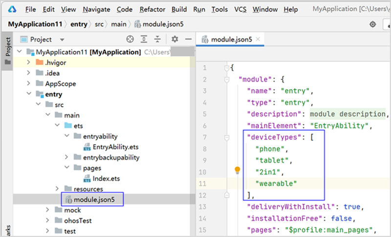

# 在已有ArkTS工程中增量使用仓颉

> **说明：**
>
> 为确保运行效果，本文以**DevEco Studio 5.0.2 Release** 和 **DevEco Studio-Cangjie Plugin 5.0.7.100 Beta1** 版本为例，单击[此处](https://developer.huawei.com/consumer/cn/download/)获取最新版本的下载链接。

本文档适用于对仓颉语言、ArkTS语言、UI框架等有基本概念的OpenHarmony应用开发者。基于一个简单的、支持页面跳转/返回功能的、纯ArkTS开发的应用，通过引入仓颉来开发一些增量业务（比如，仓颉提供一个同步接口给ArkTS调用，仓颉提供一个异步接口给ArkTS调用，在原ArkTS页面中嵌入一个仓颉组件），来帮助开发者快速了解如何在存量ArkTS业务中，快速引入仓颉进行开发，熟悉混合应用的开发流程。

假设原ArkTS应用的初始运行效果如下图所示（有两个页面，支持页面跳转/返回）：


现在引入仓颉期望实现以下两个效果：

1. 在ArkTS页面中，新增两个Button按钮，单击时会分别触发调用仓颉的同步接口和异步接口，更新Text文本，如下图所示。

   

2. 在ArkTS页面中，嵌入一个仓颉组件。并在在仓颉组件中提供一个Button按钮，单击时会更新Text文本，如下图所示。

   

## 原ArkTS工程初始状态

开发者可参照示例创建原始ArkTS工程，作为示例的原ArkTS应用工程目录结构如下所示：

```text
Project_name
├── .hvigor
├── .idea
├── AppScope
├── entry
├── hvigor
│    └── hvigor-config.json5
├── my_module
├── oh_modules
├── build-profile.json5
├── code-linter.json5
├── hvigorfile.ts
├── local.properties
├── oh-package.json5
└── oh-package-lock.json5
```

其中：

- **entry** 是通过 **Empty Ability** 工程模板创建的ArkTS模块，该模块会被编译为HAP包。
- **my_module** 是通过 **Static Library** 工程模块创建的ArkTS静态库模块，该模块会被编译为HAR包，被**entry**模块依赖。

**entry**和**my_module**模块内各有一个页面，通过Navigation进行页面路由。

1. **entry**模块的目录结构如下所示：

   ```text
   entry
   ├── build
   ├── oh_modules
   ├── src
   │    ├── main
   │    │    ├── ets
   │    │    │    ├── entryability
   │    │    │    ├── entrybackupability
   │    │    │    └── pages
   │    │    │         └── Index.ets
   │    │    ├── resources
   │    │    └── module.json5
   │    ├── mock
   │    ├── ohosTest
   │    └── test
   ├── build-profile.json5
   ├── hvigorfile.ts
   ├── obfuscation-rules.txt
   ├── oh-package.json5
   └── oh-package-lock.json5
   ```

    - **entry > src > main > ets > pages > Index.ets** 文件的示例如下：

   ```typescript
   // Index.ets
   @Entry
   @Component
   struct Index {
     pathStack: NavPathStack = new NavPathStack()
     @State message: string = 'Hello World';

     build() {
       Navigation(this.pathStack) {
         Column() {
           Button('路由到：MyModulePage')
             .width('80%')
             .height(40)
             .margin(20)
             .onClick(() => {
               this.pathStack.pushPathByName('MyModulePage', null)
             })
         }
         .width('100%')
         .height('100%')
       }
       .title("首页")
       .mode(NavigationMode.Stack)
     }
   }
   ```

    - 模块的**oh-package.json5**文件中，添加my_module作为依赖：

   ```json
   "dependencies": {
     "my_module": "file:../my_module"
   }
   ```

2. **my_module**模块的目录结构如下：

   ```text
   entry
   ├── build
   ├── src
   │    ├── main
   │    │    ├── ets
   │    │    │    └── pages
   │    │    │         └── MyModulePage.ets
   │    │    ├── resources
   │    │    │    └── base
   │    │    │         ├── element
   │    │    │         └── profile
   │    │    │              └──router_map.json
   │    │    └── module.json5
   │    ├── ohosTest
   │    └── test
   ├── build-profile.json5
   ├── BuildProfile.ets
   ├── consumer-rules.txt
   ├── hvigorfile.ts
   ├── Index.ets
   ├── obfuscation-rules.txt
   └── oh-package.json5
   ```

    - **my_module > src > main > ets > pages > MyModulePage.ets**文件的示例如下：

   ```typescript
   // MyModulePage.ets

   @Builder
   export function MyModulePageBuilder() {
     MyModulePage()
   }

   @Component
   export struct MyModulePage {
     pathStack: NavPathStack = new NavPathStack()

     build() {
       NavDestination() {
         Column() {
           Button('回到首页')
             .type(ButtonType.Capsule)
             .width('80%')
             .height(40)
             .margin(20)
             .onClick(() => {
               this.pathStack.clear()
             })
         }
         .width('100%')
         .height('100%')
       }
       .title('MyModulePage')
       .onReady((context: NavDestinationContext) => {
         this.pathStack = context.pathStack
       })
     }
   }
   ```

    - **my_module > src > main > resources > base > profile > route_map.json**需要配置子页的路由信息，示例如下：

   ```json
   // route_map.json
   {
     "routerMap": [
       {
         "name": "MyModulePage",
         "pageSourceFile": "src/main/ets/pages/MyModulePage.ets",
         "buildFunction": "MyModulePageBuilder",
         "data": {
           "description": "this is MyModulePage"
         }
       }
     ]
   }
   ```

    - **my_module > src > main > module.json5**配置文件的module标签中定义routerMap字段，指向定义的本模块路由表配置文件route_map.json。示例如下：

   ```json5
   // module.json5
   "routerMap": "$profile:route_map"
   ```

   > **注意：**
   >
   >module标签中如果原有"pages": "$profile:main_pages"这行配置，则必须删除，否则上架后运行，路由跳转会出现异常导致白屏。

## 在ArkTS模块中增量使用仓颉

> **说明：**
>
> 仓颉模块目前仅支持OpenHarmony的静态库模块，即HAR静态共享包。

仓颉支持在SDK范围为API 12~15、设备类型为 phone、tablet、2in1 的ArkTS HAP模块或HAR模块中，直接使能仓颉开发。
若当前模块支持的设备类型包括default、phone、tablet、2in1之外的其他设备类型，请将模块下module.json5中的deviceTypes字段中不支持的设备类型删去，修改为支持的设备类型格式（如下图应删去wearable设备），再进行增量使用仓颉的操作。



仍以上方原始的ArkTS应用工程为例，介绍如何在ArkTS模块中（即**my_module**）使能仓颉开发。

### 右键菜单一键使能仓颉-ArkTS混合模块

1. 按照下图所示，在**Project**窗口，右键单击**my_module**目录，选择 **New -> Cangjie(Interop)**。


工程自动同步完成之后，目录结构如下：

```text
├── hvigor
│    ├── cangjie-build-support-x.y.z.tgz
│    └── hvigor-config.json5
└── my_module
    ├── build
    ├── libs
    ├── oh_modules
    ├── src
    │    ├── main
    │    │    ├── cangjie
    │    │    │    ├── types
    │    │    │    │    └── libohos_app_cangjie_entry
    │    │    │    │          ├── Index.d.ts
    │    │    │    │          └── oh-package.json5
    │    │    │    └── index.cj
    │    │    ├── ets
    │    │    │    └── pages
    │    │    │         └── MyModulePage.ets
    │    │    ├── resources
    │    │    │    └── base
    │    │    │         ├── element
    │    │    │         └── profile
    │    │    │              └── route_map.json
    │    │    └── module.json5
    │    ├── ohosTest
    │    └── test
    ├── build-profile.json5
    ├── consumer-rules.txt
    ├── hvigorfile.ts
    ├── Index.ets
    ├── obfuscation-rules.txt
    ├── oh-package.json5
    └── oh-package-lock.json5
```

可以看出，**my_module** 变成了一个仓颉-ArkTS混合模块。

> **说明：**
>
> 首次在ArkTS工程中使能仓颉开发时，会在工程的 “hvigor” 目录下同步创建一个“cangjie-build-support-x.y.z.tgz”的插件包，用于支持仓颉相关的编译。

### 在同一个工程内，纯ArkTS工程跨模块调用仓颉函数

1. 在仓颉侧开发业务代码，并暴露接口给ArkTS。

   在**Project**窗口，单击**my_module > src > main > cangjie**，打开**index.cj**文件，编写代码，示例如下：

   <!-- compile -->

   ```cangjie
   // index.cj
   package ohos_app_cangjie_my_module // 注意包名需要跟cjpm.toml里的[package] name字段保持相同

   import ohos.base.*
   import ohos.ark_interop.*
   import ohos.ark_interop_macro.*
   import std.core.sleep
   import std.core.Duration

   // 同步接口：在主线程上同步执行
   @Interop[ArkTS]
   public func callSync(msg: String): String {
       // do something
       return "callSync: ${msg}"
   }

   // 异步接口：在仓颉轻量级线程上异步执行
   @Interop[ArkTS, Async]
   public func callAsync(msg: String): String {
       // 通过 sleep 函数，模拟耗时操作。
       sleep(Duration.second * 5)
       return "callAsync: ${msg}"
   }
   ```

2. 自动生成仓颉-ArkTS互操作接口声明。

   打开上述**index.cj**文件，在文件编辑界面中右键单击选择**Generate... > Cangjie-ArkTS Interop API**，则会在**entry > src > main > cangjie > types > libohos_app_cangjie_entry**目录下的**Index.d.ts**文件中自动生成仓颉暴露给ArkTS的.d.ts接口声明，目录结构如下所示：

   ```text
   my_module
   ├── build
   ├── libs
   ├── oh_modules
   └── src
        └── main
             ├── cangjie
             │    ├── ark_interop_api
             │    ├── types
             │    │    └── libohos_app_cangjie_entry
             │    │         │── Index.d.ts
             │    │         └── oh-package.json5
             │    └── index.cj
             └── ets
   ```

   接口声明如下所示：

   ```typescript
   // Index.d.ts
   export declare function callSync(msg: string): string
   export declare function callAsync(msg: string): Promise<string>
   ```

   > **说明：**
   >
   > 创建Cangjie Hybrid Ability混合工程之后，在模块下**my_module > oh-package.json5**文件中会自动将**libohos_app_cangjie_my_module**库添加到**dependencies**字段中作为依赖。

3. 仓颉暴露给ArkTS的.d.ts接口声明生成后，如果需要在纯Arkts模块中引入仓颉接口，需要先修改纯Arkts模块的**hvigorfile.ts**文件。如本例中，需要修改  **entry > hvigorfile.ts**  ，将首行接口 import { hapTasks } from '@ohos/hvigor-ohos-plugin' 修改为 import { hapTasks } from '@ohos/cangjie-build-support'。

4. 完成纯Arkts模块的**hvigorfile.ts**文件修改后，可以直接在ArkTS文件中引入.d.ts文件中接口的依赖。

   修改 **my_module > src > main > ets > pages > MyModulePage.ets**文件，示例代码如下：

   ```typescript
   // MyModulePage.ets
   // 导入 libohos_app_cangjie_entry.so 中的 callSync 和 callAsync 接口
   import cjlib from 'libohos_app_cangjie_my_module.so'

   @Builder
   export function MyModulePageBuilder() {
     MyModulePage()
   }

   @Component
   export struct MyModulePage {
     pathStack: NavPathStack = new NavPathStack()
     @State msg: string = "Hello"

     build() {
       NavDestination() {
         Column() {
           Button('回到首页')
             .type(ButtonType.Capsule)
             .width('80%')
             .height(40)
             .margin(20)
             .onClick(() => {
               this.pathStack.clear()
             })

           // 添加一个文本组件，用于显示 this.msg 的变化
           Text(`msg = ${this.msg}`)
             .fontSize(20)
             .fontWeight(FontWeight.Bold)

           // 添加两个按钮，触发调用
           Button('调用 cjlib.callSync')
             .width('80%')
             .height(40)
             .margin(20)
             .onClick(() => {
               // 调用同步接口
               this.msg = cjlib.callSync('Hello')
             })
           Button('调用 cjlib.callAsync')
             .width('80%')
             .height(40)
             .margin(20)
             .onClick(() => {
               // 调用异步接口
               cjlib.callAsync('Hello')
                 .then((res) => {
                   this.msg = res
                 })
             })
         }
         .width('100%')
         .height('100%')
       }
       .title('MyModulePage')
       .onReady((context: NavDestinationContext) => {
         this.pathStack = context.pathStack
       })
     }
   }
   ```

5. 使用真机或模拟器运行应用。

   应用编译安装成功后，先跳转到**MyModulePage**页面，再单击按钮触发函数调用，其效果如下：

   

   > **说明：**
   >
   > 使用真机或模拟器运行应用的具体步骤请参见[构建第一个仓颉应用](./cj-quick-start-first-cangjie-hybrid-app.md#使用真机或模拟器运行应用)。

### 在同模块内，ArkTS页面嵌入仓颉组件

1. 创建仓颉页面。

   在**Project**窗口，打开**my_module > src > main**，右键单击**cangjie**文件夹，选择**New -> Cangjie HybridComponent File**，**Component name**命名为**CangjiePage**，并选中**Cangjie**选项，最后单击**OK**，可以看到文件目录结构如下：

   ```text
   my_module
   ├── build
   ├── libs
   ├── oh_modules
   └── src
        ├── main
        │    ├── cangjie
        │    │    ├── ark_interop_api
        │    │    ├── types
        │    │    ├── cangjie_page.cj
        │    │    └── index.cj
        │    ├── ets
        │    │    └── pages
        │    │         └── MyModulePage.ets
        │    ├── resources
        │    └── module.json5
        ├── ohosTest
        └── test
   ```

    - 在仓颉页面中添加Text组件、Button组件等，并设置其样式。**cangjie_page.cj**文件的示例如下：

   <!-- compile -->

   ```cangjie
   // cangjie_page.cj
   package ohos_app_cangjie_my_module

   import ohos.base.*
   import ohos.arkui.component.*
   import ohos.arkui.state_macro_manage.*
   import ohos.arkui.state_management.*
   import ohos.hybrid_base.*

   @HybridComponentEntry
   @Component
   class CangjiePage {
       @State
       var msg: String = "Hi, this is Cangjie"

       public func build() {
           Column {
               Text(msg)
                   .fontSize(20)
                   .fontWeight(FontWeight.Bold)
               Button("点击修改上方文本")
                   .shape(ShapeType.Capsule)
                   .width(80.percent)
                   .height(40)
                   .margin(20)
                   .onClick {
                       msg = "Okay, Cangjie clicked"
                   }
           }
           .width(100.percent)
           .height(100.percent)
       }
   }
   ```

2. 在ArkTS侧嵌入该仓颉页面。

   在**Project**窗口，打开**my_module > src > main > pages**，修改**MyModulePage.ets**文件，示例如下：

   ```typescript
   // MyModulePage.ets
   // 在 ArkTS 页面中嵌入仓颉页面
   import { CJHybridComponentV2 } from '@cangjie/cjhybridview'
   // 导入 libohos_app_cangjie_entry.so 中的 callSync 和 callAsync 接口
   import cjlib from 'libohos_app_cangjie_my_module.so'

   @Builder
   export function MyModulePageBuilder() {
     MyModulePage()
   }

   @Component
   export struct MyModulePage {
     pathStack: NavPathStack = new NavPathStack()
     @State msg: string = "Hello"

     build() {
       NavDestination() {
         Column() {
           Button('回到首页')
             .type(ButtonType.Capsule)
             .width('80%')
             .height(40)
             .margin(20)
             .onClick(() => {
               this.pathStack.clear()
             })

             // 添加一个文本组件，用于显示 this.msg 的变化
           Text(`msg = ${this.msg}`)
             .fontSize(20)
             .fontWeight(FontWeight.Bold)

           // 添加两个按钮，触发调用
           Button('调用 cjlib.callSync')
             .width('80%')
             .height(40)
             .margin(20)
             .onClick(() => {
               // 调用同步接口
               this.msg = cjlib.callSync('Hello')
             })
           Button('调用 cjlib.callAsync')
             .width('80%')
             .height(40)
             .margin(20)
             .onClick(() => {
               // 调用异步接口
               cjlib.callAsync('Hello')
                 .then((res) => {
                   this.msg = res
                 })
             })
             // 通过 CJHybridComponent 嵌入仓颉页面
           CJHybridComponentV2({
             library: 'ohos_app_cangjie_my_module', // 仓颉页面所在的 package 名字
             component: 'CangjiePage'               // 仓颉页面对应的 class 名字
           })
         }
         .width('100%')
         .height('100%')
       }
       .title('MyModulePage')
       .onReady((context: NavDestinationContext) => {
         this.pathStack = context.pathStack
       })
     }
   }
   ```

3. 使用真机或模拟器运行应用。

   应用编译安装成功后，先跳转到 **MyModulePage** 页面，再单击仓颉Button触发仓颉Text更新文本，其效果如下：

   

   > **说明：**
   >
   > 使用真机或模拟器运行应用的具体步骤请参见[构建第一个仓颉应用](./cj-quick-start-first-cangjie-app.md#构建第一个仓颉应用)。

恭喜您已经在ArkTS应用中成功使用仓颉完成业务模块开发。
