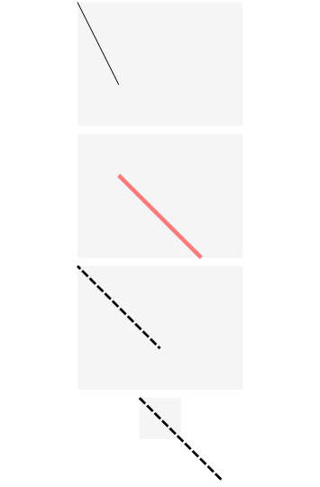
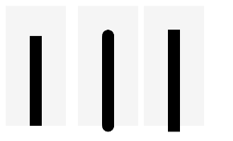
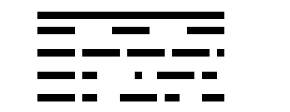

# Line

直线绘制组件。

## 导入模块

```cangjie
import kit.ArkUI.*
```

## 子组件

无

## 创建组件

### init(?Length, ?Length)

```cangjie
public init(width!: ?Length = None, height!: ?Length = None)
```

**功能：** 在宽度为width、高度为height的填充区域内绘制一条直线。

**系统能力：** SystemCapability.ArkUI.ArkUI.Full

**起始版本：** 22

**参数：**

|参数名|类型|必填|默认值|说明|
|:---|:---|:---|:---|:---|
|width|?Length|否|None| **命名参数。** 宽度，取值范围≥0。<br>值为异常值或缺省时按照自身内容需要的宽度处理。<br> 初始值: 0.vp|
|height|?Length|否|None| **命名参数。** 高度，取值范围≥0。<br>值为异常值或缺省时按照自身内容需要的高度处理。<br> 初始值: 0.vp|

## 通用属性/通用事件

通用属性：全部支持。

通用事件：全部支持。

## 组件属性

### func endPoint(?(Float64,Float64))

```cangjie
public func endPoint(value: ?(Float64, Float64)): This
```

**功能：** 设置直线终点坐标点（相对坐标），异常值按照初始值处理。

**系统能力：** SystemCapability.ArkUI.ArkUI.Full

**起始版本：** 22

**参数：**

|参数名|类型|必填|默认值|说明|
|:---|:---|:---|:---|:---|
|value|?(Float64,Float64)|是|-|直线终点坐标点（相对坐标）。<br>初始值：(0.0, 0.0)。|

### func startPoint(?(Float64,Float64))

```cangjie
public func startPoint(value: ?(Float64, Float64)): This
```

**功能：** 设置直线起点坐标点（相对坐标），异常值按照初始值处理。

**系统能力：** SystemCapability.ArkUI.ArkUI.Full

**起始版本：** 22

**参数：**

|参数名|类型|必填|默认值|说明|
|:---|:---|:---|:---|:---|
|value|?(Float64,Float64)|是|-|直线起点坐标点（相对坐标）。<br>初始值：(0.0, 0.0)。|

## 示例代码

### 示例1（组件属性绘制）

使用startPoint、endPoint、fillOpacity、stroke、strokeDashArray、strokeDashOffset属性分别绘制直线的起始点、结束点、透明度、直线颜色、边框间隙、绘制起点。

<!-- run -->

```cangjie
package ohos_app_cangjie_entry
import kit.ArkUI.*
import ohos.arkui.state_macro_manage.*

@Entry
@Component
class EntryView {
    func build() {
        Column(space: 10) {
            // 线条绘制的起止点坐标均是相对于Line组件本身绘制区域的坐标
            Line()
                .width(200)
                .height(150)
                .startPoint((0.0, 0.0))
                .endPoint((50.0, 100.0))
                .stroke(Color.Black)
                .backgroundColor(0xF5F5F5)
            Line()
                .width(200)
                .height(150)
                .startPoint((50.0, 50.0))
                .endPoint((150.0, 150.0))
                .strokeWidth(5)
                .stroke(Color.Red)
                .strokeOpacity(0.5)
                .backgroundColor(0xF5F5F5)
            // strokeDashOffset用于定义关联虚线strokeDashArray数组渲染时的偏移
            Line()
                .width(200)
                .height(150)
                .startPoint((0.0, 0.0))
                .endPoint((100.0, 100.0))
                .stroke(Color.Black)
                .strokeWidth(3)
                .strokeDashArray([10, 3])
                .strokeDashOffset(5)
                .backgroundColor(0xF5F5F5)
            // 当坐标点设置的值超出Line组件的宽高范围时，线条会画出组件绘制区域
            Line()
                .width(50)
                .height(50)
                .startPoint((0.0, 0.0))
                .endPoint((100.0, 100.0))
                .stroke(Color.Black)
                .strokeWidth(3)
                .strokeDashArray([10, 3])
                .backgroundColor(0xF5F5F5)
        }.width(100.percent)
    }
}
```



### 示例2（边框端点绘制）

使用strokeLineCap绘制直线的边框端点样式。

<!-- run -->

```cangjie
package ohos_app_cangjie_entry
import kit.ArkUI.*
import ohos.arkui.state_macro_manage.*

@Entry
@Component
class EntryView {
    func build() {
        Row(space: 10) {
            // 当LineCapStyle值为Butt时
            Line()
                .width(100)
                .height(200)
                .startPoint((50.0, 50.0))
                .endPoint((50.0, 200.0))
                .stroke(Color.Black)
                .strokeWidth(20)
                .strokeLineCap(LineCapStyle.Butt)
                .backgroundColor(0xF5F5F5)
                .margin(10)
            // 当LineCapStyle值为Round时
            Line()
                .width(100)
                .height(200)
                .startPoint((50.0, 50.0))
                .endPoint((50.0, 200.0))
                .stroke(Color.Black)
                .strokeWidth(20)
                .strokeLineCap(LineCapStyle.Round)
                .backgroundColor(0xF5F5F5)
            // 当LineCapStyle值为Square时
            Line()
                .width(100)
                .height(200)
                .startPoint((50.0, 50.0))
                .endPoint((50.0, 200.0))
                .stroke(Color.Black)
                .strokeWidth(20)
                .strokeLineCap(LineCapStyle.Square)
                .backgroundColor(0xF5F5F5)
        }
    }
}
```



### 示例3（边框间隙绘制）

使用strokeDashArray绘制直线的边框间隙。

<!-- run -->

```cangjie
package ohos_app_cangjie_entry
import kit.ArkUI.*
import ohos.arkui.state_macro_manage.*

@Entry
@Component
class EntryView {
    func build() {
        Column() {
            Line()
                .width(300)
                .height(30)
                .startPoint((50.0, 30.0))
                .endPoint((300.0, 30.0))
                .stroke(Color.Black)
                .strokeWidth(10)
            // 设置strokeDashArray的数组间隔为 50
            Line()
                .width(300)
                .height(30)
                .startPoint((50.0, 20.0))
                .endPoint((300.0, 20.0))
                .stroke(Color.Black)
                .strokeWidth(10)
                .strokeDashArray([50])
            // 设置strokeDashArray的数组间隔为 50, 10
            Line()
                .width(300)
                .height(30)
                .startPoint((50.0, 20.0))
                .endPoint((300.0, 20.0))
                .stroke(Color.Black)
                .strokeWidth(10)
                .strokeDashArray([50, 10])
            // 设置strokeDashArray的数组间隔为 50, 10, 20
            Line()
                .width(300)
                .height(30)
                .startPoint((50.0, 20.0))
                .endPoint((300.0, 20.0))
                .stroke(Color.Black)
                .strokeWidth(10)
                .strokeDashArray([50, 10, 20])
            // 设置strokeDashArray的数组间隔为 50, 10, 20, 30
            Line()
                .width(300)
                .height(30)
                .startPoint((50.0, 20.0))
                .endPoint((300.0, 20.0))
                .stroke(Color.Black)
                .strokeWidth(10)
                .strokeDashArray([50, 10, 20, 30])
        }
    }
}
```


