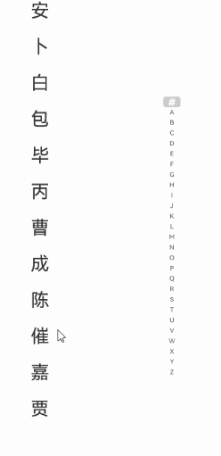

# AlphabetIndexer

可以与容器组件联动，用于按逻辑结构快速定位容器显示区域的组件。

## 导入模块

```cangjie
import kit.ArkUI.*
```

## 子组件

无

## 创建组件

### init(Array\<String>, ?UInt32)

```cangjie
public init(arrayValue!: Array<String>, selected!: ?UInt32)
```

**功能：** 创建一个AlphabetIndexer组件。

**系统能力：** SystemCapability.ArkUI.ArkUI.Full

**起始版本：** 22

**参数：**

|参数名|类型|必填|默认值|说明|
|:---|:---|:---|:---|:---|
|arrayValue|Array\<String>|是|-|**命名参数。** 字符串数组，每个字符串代表一个索引项。|
|selected|?UInt32|是|-|**命名参数。** 初始选中项索引值，若超出索引值范围，则取默认值0。初始值: 0|

## 通用属性/通用事件

通用属性：全部支持。

> **说明：**
>
> - [width](cj-text-input-imagespan.md#var-width)属性设置"auto"时表示自适应宽度，宽度会随索引项最大宽度变化。
> - [padding](./cj-universal-attribute-size.md#func-paddinglength)属性默认为4.vp。
> - 文本最大的字体缩放倍数[maxFontScale](./cj-common-types.md#var-maxfontscale)和最小的字体缩放倍数[minFontScale](./cj-common-types.md#var-minfontscale)皆为1，不跟随系统字体大小调节变化。

通用事件：全部支持。

## 组件属性

### func alignStyle(?IndexerAlign)

```cangjie
public func alignStyle(value: ?IndexerAlign): This
```

**功能：** 设置字母索引条弹框的对齐样式。

**系统能力：** SystemCapability.ArkUI.ArkUI.Full

**起始版本：** 22

**参数：**

|参数名|类型|必填|默认值|说明|
|:---|:---|:---|:---|:---|
|value|?IndexerAlign|是|-|字母索引条弹框的对齐样式，支持索引条显示在弹窗左侧和右侧。初始值: IndexerAlign.Right|

### func color(?ResourceColor)

```cangjie
public func color(value: ?ResourceColor): This
```

**功能：** 设置未选中项文本颜色。

**系统能力：** SystemCapability.ArkUI.ArkUI.Full

**起始版本：** 22

**参数：**

|参数名|类型|必填|默认值|说明|
|:---|:---|:---|:---|:---|
|value|?ResourceColor|是|-|未选中项文本颜色。初始值: Color(0x99182431)|

### func font(?Length, ?FontWeight, ?ResourceStr, ?FontStyle)

```cangjie
public func font(
    size!: ?Length = None,
    weight!: ?FontWeight = None,
    family!: ?ResourceStr = None,
    style!: ?FontStyle = None
): This
```

**功能：** 设置选中项文字样式。

**系统能力：** SystemCapability.ArkUI.ArkUI.Full

**起始版本：** 22

**参数：**

|参数名|类型|必填|默认值|说明|
|:---|:---|:---|:---|:---|
|size|?Length|否|None|**命名参数。** 选中项文字大小。初始值: 10.vp|
|weight|?FontWeight|否|None|**命名参数。** 选中文字字体粗细。初始值: FontWeight.Normal|
|family|?ResourceStr|否|None|**命名参数。** 选中文字字体家族。初始值: "HarmonyOS Sans"|
|style|?FontStyle|否|None|**命名参数。** 选中文字样式。初始值: FontStyle.Normal|

### func itemSize(?Length)

```cangjie
public func itemSize(size: ?Length): This
```

**功能：** 设置索引项区域大小。

**系统能力：** SystemCapability.ArkUI.ArkUI.Full

**起始版本：** 22

**参数：**

|参数名|类型|必填|默认值|说明|
|:---|:---|:---|:---|:---|
|size|?Length|是|-|索引项区域大小，索引项区域为正方形，即正方形边长。<br>不支持设置为百分比。初始值: 16.vp|

### func popupBackground(?ResourceColor)

```cangjie
public func popupBackground(value: ?ResourceColor): This
```

**功能：** 设置提示弹窗背景颜色。

**系统能力：** SystemCapability.ArkUI.ArkUI.Full

**起始版本：** 22

**参数：**

|参数名|类型|必填|默认值|说明|
|:---|:---|:---|:---|:---|
|value|?ResourceColor|是|-|提示弹窗背景颜色。初始值: Color(0x66808080)|

### func popupColor(?ResourceColor)

```cangjie
public func popupColor(value: ?ResourceColor): This
```

**功能：** 设置提示弹窗一级索引项文本颜色。

**系统能力：** SystemCapability.ArkUI.ArkUI.Full

**起始版本：** 22

**参数：**

|参数名|类型|必填|默认值|说明|
|:---|:---|:---|:---|:---|
|value|?ResourceColor|是|-|提示弹窗一级索引项文本颜色。初始值: Color(0xFF007DFF)|

### func popupFont(?Length, ?FontWeight, ?ResourceStr, ?FontStyle)

```cangjie
public func popupFont(
    size!: ?Length = None,
    weight!: ?FontWeight = None,
    family!: ?ResourceStr = None,
    style!: ?FontStyle = None
): This
```

**功能：** 设置提示弹窗字体样式。

**系统能力：** SystemCapability.ArkUI.ArkUI.Full

**起始版本：** 22

**参数：**

|参数名|类型|必填|默认值|说明|
|:---|:---|:---|:---|:---|
|size|?Length|否|None|**命名参数。** 提示弹窗文字大小。初始值: 24.vp|
|weight|?FontWeight|否|None|**命名参数。** 提示弹窗文字字体粗细。初始值: FontWeight.Normal|
|family|?ResourceStr|否|None|**命名参数。** 提示弹窗文字字体家族。初始值: "HarmonyOS Sans"|
|style|?FontStyle|否|None|**命名参数。** 提示弹窗文字样式。初始值: FontStyle.Normal|

### func popupPosition(?Length, ?Length)

```cangjie
public func popupPosition(x!: ?Length = None, y!: ?Length = None): This
```

**功能：** 设置弹出窗口相对于索引器条上边框中点的位置。

**系统能力：** SystemCapability.ArkUI.ArkUI.Full

**起始版本：** 22

**参数：**

|参数名|类型|必填|默认值|说明|
|:---|:---|:---|:---|:---|
|x|?Length|否|None|**命名参数。** 弹出窗口相对于索引器条上边框中点的x坐标。初始值: 60.vp|
|y|?Length|否|None|**命名参数。** 弹出窗口相对于索引器条上边框中点的y坐标。初始值: 48.vp|

### func selected(?Int32)

```cangjie
public func selected(index: ?Int32): This
```

**功能：** 设置选中项索引值。

**系统能力：** SystemCapability.ArkUI.ArkUI.Full

**起始版本：** 22

**参数：**

|参数名|类型|必填|默认值|说明|
|:---|:---|:---|:---|:---|
|index|?Int32|是|-|选中项索引值。初始值: 0|

### func selectedBackgroundColor(?ResourceColor)

```cangjie
public func selectedBackgroundColor(value: ?ResourceColor): This
```

**功能：** 设置选中项背景颜色。

**系统能力：** SystemCapability.ArkUI.ArkUI.Full

**起始版本：** 22

**参数：**

|参数名|类型|必填|默认值|说明|
|:---|:---|:---|:---|:---|
|value|?ResourceColor|是|-|选中项背景颜色。初始值: Color(0x1A007DFF)|

### func selectedColor(?ResourceColor)

```cangjie
public func selectedColor(value: ?ResourceColor): This
```

**功能：** 设置选中项文字颜色。

**系统能力：** SystemCapability.ArkUI.ArkUI.Full

**起始版本：** 22

**参数：**

|参数名|类型|必填|默认值|说明|
|:---|:---|:---|:---|:---|
|value|?ResourceColor|是|-|选中项文字颜色。初始值: Color(0xFF007DFF)|

### func selectedFont(?Length, ?FontWeight, ?ResourceStr, ?FontStyle)

```cangjie
public func selectedFont(
    size!: ?Length = None,
    weight!: ?FontWeight = None,
    family!: ?ResourceStr = None,
    style!: ?FontStyle = None
): This
```

**功能：** 设置选中项文字样式。

**系统能力：** SystemCapability.ArkUI.ArkUI.Full

**起始版本：** 22

**参数：**

|参数名|类型|必填|默认值|说明|
|:---|:---|:---|:---|:---|
|size|?Length|否|None|**命名参数。** 选中项文字大小。初始值: 10.vp|
|weight|?FontWeight|否|None|**命名参数。** 选中项文字字体粗细。初始值: FontWeight.Normal|
|family|?ResourceStr|否|None|**命名参数。** 选中项文字字体家族。初始值: "HarmonyOS Sans"|
|style|?FontStyle|否|None|**命名参数。** 选中项文字样式。初始值: FontStyle.Normal|

### func usingPopup(?Bool)

```cangjie
public func usingPopup(value: ?Bool): This
```

**功能：** 设置是否使用提示弹窗。

**系统能力：** SystemCapability.ArkUI.ArkUI.Full

**起始版本：** 22

**参数：**

|参数名|类型|必填|默认值|说明|
|:---|:---|:---|:---|:---|
|value|?Bool|是|-|是否使用提示弹窗。<br/>初始值: false|

## 组件事件

### func onPopupSelect(?OnAlphabetIndexerPopupSelectCallback)

```cangjie
public func onPopupSelect(callback: ?OnAlphabetIndexerPopupSelectCallback): This
```

**功能：** 字母索引提示弹窗字符串列表选中触发该事件。

**系统能力：** SystemCapability.ArkUI.ArkUI.Full

**起始版本：** 22

**参数：**

|参数名|类型|必填|默认值|说明|
|:---|:---|:---|:---|:---|
|callback|?OnAlphabetIndexerPopupSelectCallback|是|-|回调函数，字母索引提示弹窗字符串列表选中时触发。初始值: { _: Int64 => }|

### func onRequestPopupData(?OnAlphabetIndexerRequestPopupDataCallback)

```cangjie
public func onRequestPopupData(callback: ?OnAlphabetIndexerRequestPopupDataCallback): This
```

**功能：** 选中字母索引后触发该事件，请求索引提示弹窗显示内容。

**系统能力：** SystemCapability.ArkUI.ArkUI.Full

**起始版本：** 22

**参数：**

|参数名|类型|必填|默认值|说明|
|:---|:---|:---|:---|:---|
|callback|?OnAlphabetIndexerRequestPopupDataCallback|是|-|回调函数，当前选中索引触发。<br>返回值：索引对应的字符串数组，此字符串数组在弹窗中竖排显示，字符串列表最多显示5个，超出部分可以滑动显示。初始值: { _: Int64 => Array<String>() }|

### func onSelect(?OnAlphabetIndexerSelectCallback)

```cangjie
public func onSelect(callback: ?OnAlphabetIndexerSelectCallback): This
```

**功能：** 索引条选中触发该事件，返回值为当前选中索引。

**系统能力：** SystemCapability.ArkUI.ArkUI.Full

**起始版本：** 22

**参数：**

|参数名|类型|必填|默认值|说明|
|:---|:---|:---|:---|:---|
|callback|?OnAlphabetIndexerSelectCallback|是|-|回调函数，索引条选中时触发。初始值: { _: Int64 => }|

## 基础类型定义

### type OnAlphabetIndexerSelectCallback

```cangjie
public type OnAlphabetIndexerSelectCallback = (Int64) -> Unit
```

**功能：** 索引项被选中时触发的事件。

**系统能力：** SystemCapability.ArkUI.ArkUI.Full

**起始版本：** 22

### type OnAlphabetIndexerRequestPopupDataCallback

```cangjie
public type OnAlphabetIndexerRequestPopupDataCallback = (Int64) -> Array<String>
```

**功能：** usingPopup设置值为true，索引项被选中时触发的事件。

**系统能力：** SystemCapability.ArkUI.ArkUI.Full

**起始版本：** 22

### type OnAlphabetIndexerPopupSelectCallback

```cangjie
public type OnAlphabetIndexerPopupSelectCallback = (Int64) -> Unit
```

**功能：** 提示弹窗二级索引项被选中时触发的事件。

**系统能力：** SystemCapability.ArkUI.ArkUI.Full

**起始版本：** 22

## 示例代码

### 示例1（设置提示弹窗显示文本内容）

<!-- run -->

```cangjie
package ohos_app_cangjie_entry
import kit.ArkUI.*
import ohos.hilog.*
import ohos.arkui.state_macro_manage.*

@Entry
@Component
class EntryView {
    var arrayA: Array<String> = ["安"]
    var arrayB: Array<String> = ["卜", "白", "包", "毕", "丙"]
    var arrayC: Array<String> = ["曹", "成", "陈", "催"]
    var arrayJ: Array<String> = ["嘉", "贾"]
    var arrayNull: Array<String> = []
    let value: Array<String> = ["#", "A", "B", "C", "D", "E", "F", "G", "H", "I", "J", "K", "L", "M", "N", "O", "P", "Q","R", "S", "T", "U", "V", "W", "X", "Y", "Z"]
    @State var indexerHeight: Length = 75.percent;
    func build() {
        Stack(alignContent: Alignment.Start) {
            Row() {
                List(space: 20, initialIndex: 0) {
                    ForEach(
                        this.arrayA,
                        {
                            item: String, idx: Int64 => ListItem() {
                                Text(item)
                                    .width(80.percent)
                                    .height(5.percent)
                                    .fontSize(30)
                                    .textAlign(TextAlign.Center)
                            }
                        }
                    )
                    ForEach(
                        this.arrayB,
                        {
                            item: String, idx: Int64 => ListItem() {
                                Text(item)
                                    .width(80.percent)
                                    .height(5.percent)
                                    .fontSize(30)
                                    .textAlign(TextAlign.Center)
                            }
                        }
                    )
                    ForEach(
                        this.arrayC,
                        {
                            item: String, idx: Int64 => ListItem() {
                                Text(item)
                                    .width(80.percent)
                                    .height(5.percent)
                                    .fontSize(30)
                                    .textAlign(TextAlign.Center)
                            }
                        }
                    )
                    ForEach(
                        this.arrayJ,
                        {
                            item: String, idx: Int64 => ListItem() {
                                Text(item)
                                    .width(80.percent)
                                    .height(5.percent)
                                    .fontSize(30)
                                    .textAlign(TextAlign.Center)
                            }
                        }
                    )
                }
                    .width(50.percent)
                    .height(100.percent)
                Column() {
                    Column() {
                        AlphabetIndexer(arrayValue: value, selected: 0)
                            .height(this.indexerHeight) // 索引条高度
                            .selectedColor(0xFFFFFF) // 选中项文本颜色
                            .popupColor(0xFFFAF0) // 弹出框文本颜色
                            .selectedBackgroundColor(0xCCCCCC) // 选中项背景颜色
                            .popupBackground(0xD2B48C) // 弹出框背景颜色
                            .usingPopup(true) // 是否显示弹出框
                            .selectedFont(size: 16.vp, weight: FontWeight.Bolder) // 选中项字体样式
                            .popupFont(size: 30.vp, weight: FontWeight.Bolder) // 弹出框内容的字体样式
                            .itemSize(28) // 每一项的尺寸大小
                            .alignStyle(IndexerAlign.Right) // 弹出框在索引条右侧弹出
                            .popupBackground(0xCCCCCC) // 设置提示弹窗首个索引项背板颜色
                            .selectedColor(0x00FF00)
                            .onSelect({index: Int64 => Hilog.info(0, "AppLogCj", this.value[index] + " Selected!");})
                            .onRequestPopupData(
                                {
                                    index: Int64 => if (this.value[index] == "A") {
                                        return this.arrayA.toArray()
                                    } else if (this.value[index] == "B") {
                                        return this.arrayB.toArray()
                                    } else if (this.value[index] == "C") {
                                        return this.arrayC.toArray()
                                    } else if (this.value[index] == "J") {
                                        return this.arrayJ.toArray()
                                    } else {
                                        return Array<String>()
                                    }
                                })
                            .onPopupSelect({
                                index: Int64 => Hilog.info(0, "AppLogCj", "onPopupSelected:${index}");
                            })
                    }
                        .height(80.percent)
                        .justifyContent(FlexAlign.Center)
                }
                    .width(50.percent)
                    .justifyContent(FlexAlign.Center)
            }
                .width(100.percent)
                .height(100.percent)
        }
    }
}
```

