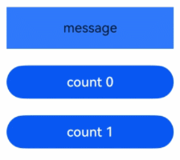

# Badge

信息标记组件，可以附加在单个组件上用于信息提醒的容器组件。

## 导入模块

```cangjie
import kit.ArkUI.*
```

## 子组件

支持单个子组件。

> **说明：**
>
> 子组件类型：系统组件和自定义组件，支持渲染控制类型（[if/else](../../../Dev_Guide/arkui-cj/rendering_control/cj-rendering-control-ifelse.md)、[ForEach](cj-state-rendering-foreach.md)、[LazyForEach](cj-state-rendering-lazyforeach.md)）。

## 创建组件

### init(Int32, ?BadgeStyle, ?BadgePosition, ?Int32, () -> Unit)

```cangjie
public init(count!: Int32, style!: ?BadgeStyle, position!: ?BadgePosition = None,
    maxCount!: ?Int32 = None, child!: () -> Unit)
```

**功能：** 根据数字创建标记组件。

**系统能力：** SystemCapability.ArkUI.ArkUI.Full

**起始版本：** 22

**参数：**

|参数名|类型|必填|默认值|说明|
|:---|:---|:---|:---|:---|
|count|Int32|是|-|**命名参数。** 设置提醒消息数。小于等于0时不显示信息标记。|
|style|?BadgeStyle|是|-|**命名参数。** Badge组件可设置的样式，支持设置文本颜色、尺寸、圆点颜色和尺寸。|
|position|?BadgePosition|否|None|**命名参数。** 提示点显示位置。初始值：BadgePosition.RightTop|
|maxCount|?Int32|否|None|**命名参数。** 最大消息数，超过最大消息时仅显示 maxCount+。初始值：99|
|child|() -> Unit|是|-|容器的子组件。|

### init(String, ?BadgeStyle, ?BadgePosition, () -> Unit)

```cangjie
public init(value!: String, style!: ?BadgeStyle, position!: ?BadgePosition = None, child!: () -> Unit)
```

**功能：** 根据字符串创建标记组件。

**系统能力：** SystemCapability.ArkUI.ArkUI.Full

**起始版本：** 22

**参数：**

|参数名|类型|必填|默认值|说明|
|:---|:---|:---|:---|:---|
|value|String|是|-|**命名参数。** 文本标记组件参数。|
|style|?BadgeStyle|是|-|**命名参数。** Badge组件可设置的样式，支持设置文本颜色、尺寸、圆点颜色和尺寸。|
|position|?BadgePosition|否|None|**命名参数。** 提示点显示位置。初始值：BadgePosition.RightTop|
|child|() -> Unit|是|-|容器的子组件。|

## 通用属性/通用事件

通用属性：除文本样式外，其余全部支持。

通用事件：全部支持。

## 基础类型定义

### class BadgeStyle

```cangjie
public class BadgeStyle {
    public var color: ?ResourceColor
    public var fontSize: ?Length
    public var badgeSize: ?Length
    public var badgeColor: ?ResourceColor
    public var fontWeight: ?FontWeight
    public var borderColor: ?ResourceColor
    public var borderWidth: ?Length
    public init(color!: ?ResourceColor = None, fontSize!: ?Length = None, badgeSize!: ?Length = None,
        badgeColor!: ?ResourceColor = None, fontWeight!: ?FontWeight = None,
        borderColor!: ?ResourceColor = None, borderWidth!: ?Length = None)
}
```

**功能：** 包含Badge组件的样式参数。

**系统能力：** SystemCapability.ArkUI.ArkUI.Full

**起始版本：** 22

#### var badgeColor

```cangjie
public var badgeColor: ?ResourceColor
```

**功能：** badge的颜色。

**类型：** ?[ResourceColor](../apis/BasicServicesKit/cj-apis-base.md#interface-resourcecolor)

**读写能力：** 可读写

**系统能力：** SystemCapability.ArkUI.ArkUI.Full

**起始版本：** 22

#### var badgeSize

```cangjie
public var badgeSize: ?Length
```

**功能：** badge的大小，单位为vp。

**类型：** ?[Length](../apis/BasicServicesKit/cj-apis-base.md#interface-length)

**读写能力：** 可读写

**系统能力：** SystemCapability.ArkUI.ArkUI.Full

**起始版本：** 22

#### var borderColor

```cangjie
public var borderColor: ?ResourceColor
```

**功能：** 底板描边颜色。

**类型：** ?[ResourceColor](../apis/BasicServicesKit/cj-apis-base.md#interface-resourcecolor)

**读写能力：** 可读写

**系统能力：** SystemCapability.ArkUI.ArkUI.Full

**起始版本：** 22

#### var borderWidth

```cangjie
public var borderWidth: ?Length
```

**功能：** 底板描边粗细。

**类型：** ?[Length](../apis/BasicServicesKit/cj-apis-base.md#interface-length)

**读写能力：** 可读写

**系统能力：** SystemCapability.ArkUI.ArkUI.Full

**起始版本：** 22

#### var color

```cangjie
public var color: ?ResourceColor
```

**功能：** 文本颜色。

**类型：** ?[ResourceColor](../apis/BasicServicesKit/cj-apis-base.md#interface-resourcecolor)

**读写能力：** 可读写

**系统能力：** SystemCapability.ArkUI.ArkUI.Full

**起始版本：** 22

#### var fontSize

```cangjie
public var fontSize: ?Length
```

**功能：** 文本大小，单位为fp。

**类型：** ?[Length](../apis/BasicServicesKit/cj-apis-base.md#interface-length)

**读写能力：** 可读写

**系统能力：** SystemCapability.ArkUI.ArkUI.Full

**起始版本：** 22

#### var fontWeight

```cangjie
public var fontWeight: ?FontWeight
```

**功能：** 设置文本的字体粗细。

**类型：** ?[FontWeight](./cj-common-types.md#enum-fontweight)

**读写能力：** 可读写

**系统能力：** SystemCapability.ArkUI.ArkUI.Full

**起始版本：** 22

#### init(?ResourceColor, ?Length, ?Length, ?ResourceColor, ?FontWeight, ?ResourceColor, ?Length)

```cangjie
public init(color!: ?ResourceColor = None, fontSize!: ?Length = None, badgeSize!: ?Length = None,
    badgeColor!: ?ResourceColor = None, fontWeight!: ?FontWeight = None,
    borderColor!: ?ResourceColor = None, borderWidth!: ?Length = None)
```

**功能：** 创建一个BadgeStyle对象。

**系统能力：** SystemCapability.ArkUI.ArkUI.Full

**起始版本：** 22

**参数：**

|参数名|类型|必填|默认值|说明|
|:---|:---|:---|:---|:---|
|color|?ResourceColor|否|None|**命名参数。** 文本颜色。初始值：Color.White|
|fontSize|?Length|否|None|**命名参数。** 文本大小。初始值：10.fp|
|badgeSize|?Length|否|None|**命名参数。** badge的大小。初始值：16.vp|
|badgeColor|?ResourceColor|否|None|**命名参数。** badge的颜色。初始值：Color.Red|
|fontWeight|?FontWeight|否|None|**命名参数。** 设置文本的字体粗细。初始值：FontWeight.Normal|
|borderColor|?ResourceColor|否|None|**命名参数。** 底板描边颜色。初始值：Color.Red|
|borderWidth|?Length|否|None|**命名参数。** 底板描边粗细。初始值：1.vp|

### enum BadgePosition

```cangjie
public enum BadgePosition <: Equatable<BadgePosition> {
    | RightTop
    | Right
    | Left
    | ...
}
```

**功能：** 定义badge位置属性。

**系统能力：** SystemCapability.ArkUI.ArkUI.Full

**起始版本：** 22

**父类型：**

- Equatable\<BadgePosition>

#### Left

```cangjie
Left
```

**功能：** badge显示在父组件的左侧纵向居中。

**系统能力：** SystemCapability.ArkUI.ArkUI.Full

**起始版本：** 22

#### Right

```cangjie
Right
```

**功能：** badge显示在父组件的右侧纵向居中。

**系统能力：** SystemCapability.ArkUI.ArkUI.Full

**起始版本：** 22

#### RightTop

```cangjie
RightTop
```

**功能：** badge显示在父组件的右上角。

**系统能力：** SystemCapability.ArkUI.ArkUI.Full

**起始版本：** 22

#### operator func !=(BadgePosition)

```cangjie
public operator func !=(other: BadgePosition): Bool
```

**功能：** 比较两个枚举值是否不相等。

**系统能力：** SystemCapability.ArkUI.ArkUI.Full

**起始版本：** 22

**参数：**

|参数名|类型|必填|默认值|说明|
|:---|:---|:---|:---|:---|
|other|[BadgePosition](#enum-badgeposition)|是|-|待比较的另一个枚举值。|

**返回值：**

|类型|说明|
|:----|:----|
|Bool|如果两个枚举值不相等则返回true，否则返回false。|

#### operator func ==(BadgePosition)

```cangjie
public operator func ==(other: BadgePosition): Bool
```

**功能：** 比较两个枚举值是否相等。

**系统能力：** SystemCapability.ArkUI.ArkUI.Full

**起始版本：** 22

**参数：**

|参数名|类型|必填|默认值|说明|
|:---|:---|:---|:---|:---|
|other|[BadgePosition](#enum-badgeposition)|是|-|待比较的另一个枚举值。|

**返回值：**

|类型|说明|
|:----|:----|
|Bool|如果两个枚举值相等则返回true，否则返回false。|

## 示例代码

### 示例1（设置标记组件内容）

该示例通过value和count属性，实现了传入空值、字符、数字时标记组件展现不同的效果。

<!-- run -->

```cangjie
package ohos_app_cangjie_entry
import kit.ArkUI.*
import ohos.arkui.state_macro_manage.*

@Entry
@Component
class EntryView {
    func build() {
        Column() {
            Text("numberBadge").width(80.percent)
            Row(space: 10) {
                // 数字上标，maxCount默认99,超过99展示99+
                Badge(
                    count: 1,
                    style: BadgeStyle(color: Color(0xFFFFFF), fontSize: 16, badgeSize: 20, badgeColor: Color.Red,
                        fontWeight: FontWeight.Bolder, borderColor: Color.Black, borderWidth: 2.vp),
                    position: BadgePosition.RightTop,
                    maxCount: 99
                ) {
                    Button("message").width(100).height(50).backgroundColor(0x317aff)
                }.width(100).height(50)
                Badge(
                    count: 1,
                    style: BadgeStyle(color: Color(0xFFFFFF), fontSize: 16, badgeSize: 20, badgeColor: Color.Red,
                        fontWeight: FontWeight.Bolder, borderColor: Color.Green, borderWidth: 2.vp),
                    position: BadgePosition.Left,
                    maxCount: 99
                ) {
                    Button("message").width(100).height(50).backgroundColor(0x317aff)
                }.width(100).height(50)
                // 数字上标
                Badge(
                    count: 1,
                    style: BadgeStyle(color: Color(0xFFFFFF), fontSize: 16, badgeSize: 20, badgeColor: Color.Red,
                        fontWeight: FontWeight.Regular, borderColor: Color.Gray, borderWidth: 4.vp),
                    position: BadgePosition.Right,
                    maxCount: 99
                ) {
                    Button("message").width(100).height(50).backgroundColor(0x317aff)
                }.width(100).height(50)
            }.margin(10)
            Text("stringBadge").width(80.percent)
            Row(space: 30) {
                Badge(
                    value: "new",
                    style: BadgeStyle(color: Color(0xFFFFFF), fontSize: 9, badgeSize: 20, badgeColor: Color.Blue)
                ) {
                    Text("message")
                        .width(80)
                        .height(50)
                        .fontSize(16)
                        .lineHeight(37)
                        .borderRadius(10)
                        .textAlign(TextAlign.Center)
                        .backgroundColor(0xF3F4ED)
                }.width(80).height(50)
                // value为空，设置圆点标记
                Badge(
                    value: "",
                    style: BadgeStyle(badgeSize: 6, badgeColor: Color.Blue),
                    position: BadgePosition.Right
                ) {
                    Text("message")
                        .width(90)
                        .height(50)
                        .fontSize(16)
                        .lineHeight(37)
                        .borderRadius(10)
                        .textAlign(TextAlign.Center)
                        .backgroundColor(0xF3F4ED)
                }.width(90).height(50)
            }.margin(10)
        }
    }
}
```


### 示例2（设置数字控制标记显隐）

该示例通过count属性，实现了设置数字0和1时标记组件的隐藏和显示效果。

<!-- run -->

```cangjie
package ohos_app_cangjie_entry
import kit.ArkUI.*
import ohos.arkui.state_macro_manage.*

@Entry
@Component
class EntryView {
    @State var badgeCount: Int32 = 1
    func build() {
        Column() {
            Badge(
                count: this.badgeCount,
                style: BadgeStyle(color: Color(0xFFFFFF), fontSize: 16, badgeSize: 20, badgeColor: Color.Red,fontWeight: FontWeight.Bolder, borderColor: Color.Black, borderWidth: 2.vp),
                position: BadgePosition.RightTop,
            ){
                Text("message")
                    .width(100)
                    .height(50)
                    .backgroundColor(0x317aff)
            }
                .width(100)
                .height(50)
            Button("count 0")
                .onClick({ evt =>  this.badgeCount =0;})
            Button("count 1")
                .onClick({ evt =>  this.badgeCount =1;})
        }.margin(10)
    }
}
```

