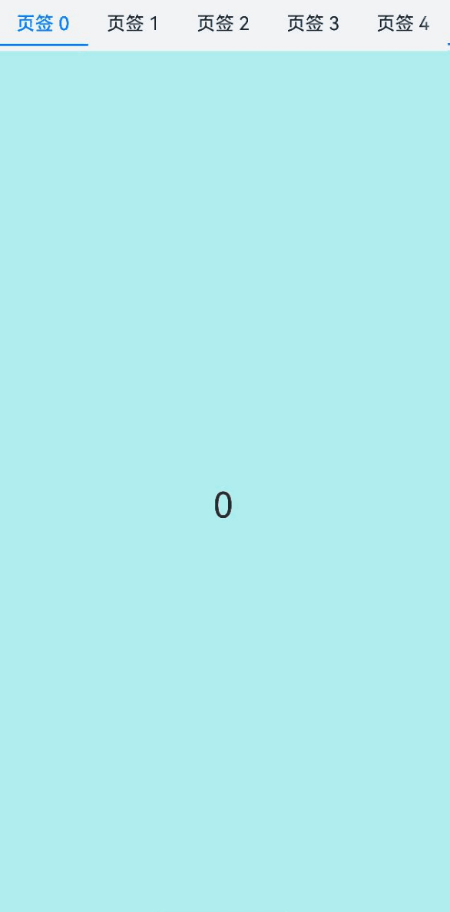

# Tabs

通过页签进行内容视图切换的容器组件，每个页签对应一个内容视图。

## 导入模块

```cangjie
import kit.ArkUI.*
```

## 子组件

不支持自定义组件作为子组件，仅可包含子组件[TabContent](./cj-navigation-switching-tabcontent.md)，以及渲染控制类型[if/else](../../../Dev_Guide/arkui-cj/rendering_control/cj-rendering-control-ifelse.md)和[ForEach](cj-state-rendering-foreach.md)，并且if/else和ForEach下也仅支持TabContent，不支持自定义组件。

> **说明：**
>
> - Tabs子组件的visibility属性设置为None，或者visibility属性设置为Hidden时，对应子组件不显示，但依然会在视窗内占位。
> - Tabs子组件TabContent显示之后不会销毁，若需要页面懒加载和释放，请参见[示例12](#示例12页面懒加载和释放)。

## 创建组件

### init(?BarPosition, ?TabsController, ?Int32, () -> Unit)

```cangjie
public init(
    barPosition!: ?BarPosition = None,
    controller!: ?TabsController = None,
    index!: ?Int32 = None,
    child!: () -> Unit = {=>}
)
```

**功能：** 创建一个Tabs容器。

**系统能力：** SystemCapability.ArkUI.ArkUI.Full

**起始版本：** 22

**参数：**

|参数名|类型|必填|默认值|说明|
|:---|:---|:---|:---|:---|
|barPosition|?[BarPosition](#enum-barposition)|否|None|**命名参数** 设置Tabs的页签位置。<br> 初始值: BarPosition.Start|
|controller|?[TabsController](#class-tabscontroller)|否|None|**命名参数** 设置Tabs控制器。<br> 初始值：TabsController()|
|index|?Int32|否|None|**命名参数** 设置当前显示页签的索引。<br> 初始值：0 <br> **说明：**<br> 设置为小于0的值时按初始值显示。可选值为[0, TabContent子节点数量-1]。直接修改index跳页时，切换动效不生效。 使用TabController的changeIndex时，默认生效切换动效，可以设置animationDuration为0关闭动画。|
|child|()->Unit|否|{=>}|**命名参数** 声明容器内的子组件。|

## 通用属性/通用事件

通用属性：全部支持。

通用事件：全部支持。

## 组件属性

### func animationDuration(?Float32)

```cangjie
public func animationDuration(value: ?Float32): This
```

**功能：** 设置Tabs的动画时长。

**系统能力：** SystemCapability.ArkUI.ArkUI.Full

**起始版本：** 22

**参数：**

|参数名|类型|必填|默认值|说明|
|:---|:---|:---|:---|:---|
|value|?Float32|是|-|动画时长，单位为毫秒。初始值：-1.0。|

### func barHeight(?Length)

```cangjie
public func barHeight(value: ?Length): This
```

**功能：** 设置Tabs页签栏的高度。

**系统能力：** SystemCapability.ArkUI.ArkUI.Full

**起始版本：** 22

**参数：**

|参数名|类型|必填|默认值|说明|
|:---|:---|:---|:---|:---|
|value|?[Length](../cj-common-types.md#interface-length)|是|-|页签栏高度。当页签栏为水平方向时，该参数为页签栏的高；当页签栏为垂直方向时，该参数为页签栏的宽。|

### func barMode(?BarMode)

```cangjie
public func barMode(value: ?BarMode): This
```

**功能：** 设置Tabs页签栏的布局模式。

**系统能力：** SystemCapability.ArkUI.ArkUI.Full

**起始版本：** 22

**参数：**

|参数名|类型|必填|默认值|说明|
|:---|:---|:---|:---|:---|
|value|?[BarMode](#enum-barmode)|是|-|页签栏布局模式。初始值：BarMode.Fixed。|

### func barWidth(?Length)

```cangjie
public func barWidth(value: ?Length): This
```

**功能：** 设置Tabs页签栏的宽度。

**系统能力：** SystemCapability.ArkUI.ArkUI.Full

**起始版本：** 22

**参数：**

|参数名|类型|必填|默认值|说明|
|:---|:---|:---|:---|:---|
|value|?[Length](../cj-common-types.md#interface-length)|是|-|页签栏宽度。当页签栏为水平方向时，该参数为页签栏的宽；当页签栏为垂直方向时，该参数为页签栏的高。|

### func scrollable(?Bool)

```cangjie
public func scrollable(value: ?Bool): This
```

**功能：** 设置Tabs是否可滚动。

**系统能力：** SystemCapability.ArkUI.ArkUI.Full

**起始版本：** 22

**参数：**

|参数名|类型|必填|默认值|说明|
|:---|:---|:---|:---|:---|
|value|?Bool|是|-|是否可滚动。初始值：true。|

### func vertical(?Bool)

```cangjie
public func vertical(value: ?Bool): This
```

**功能：** 设置Tabs页签栏的排列方向。

**系统能力：** SystemCapability.ArkUI.ArkUI.Full

**起始版本：** 22

**参数：**

|参数名|类型|必填|默认值|说明|
|:---|:---|:---|:---|:---|
|value|?Bool|是|-|页签栏是否垂直排列。初始值：false。|

## 组件事件

### func onChange(?Callback\<Int32, Unit>)

```cangjie
public func onChange(event: ?Callback<Int32, Unit>): This
```

**功能：** 页签切换时触发该回调。

**系统能力：** SystemCapability.ArkUI.ArkUI.Full

**起始版本：** 22

**参数：**

|参数名|类型|必填|默认值|说明|
|:---|:---|:---|:---|:---|
|event|?Callback\<Int32, Unit>|是|-|页签索引改变时触发的回调函数。初始值：{ _ => }。|

## 基础类型定义

### class TabsController

```cangjie
public class TabsController {
    public init()
}
```

**功能：** Tabs控制器。

**系统能力：** SystemCapability.ArkUI.ArkUI.Full

**起始版本：** 22

#### init()

```cangjie
public init()
```

**功能：** 构造Tabs控制器。

**系统能力：** SystemCapability.ArkUI.ArkUI.Full

**起始版本：** 22

#### func changeIndex(?Int32)

```cangjie
public func changeIndex(value: ?Int32): Unit
```

**功能：** 切换到指定索引的页签。

**系统能力：** SystemCapability.ArkUI.ArkUI.Full

**起始版本：** 22

**参数：**

|参数名|类型|必填|默认值|说明|
|:---|:---|:---|:---|:---|
|value|?Int32|是|-|要切换到的页签索引。初始值：0。|

## 示例代码

### 示例1（自定义页签切换联动）

本示例通过onChange实现切换时自定义tabBar和TabContent的联动。

<!-- run -->

```cangjie
package ohos_app_cangjie_entry

import kit.ArkUI.*
import std.collection.*
import ohos.arkui.state_macro_manage.*

@Entry
@Component
class EntryView {
    @State var fontColor: UInt32 = 0x182431
    @State var selectedFontColor: UInt32 = 0x007DFF
    @State var currentIndex: Int32 = 0
    @State var selectedIndex: Int32 = 0
    var controller: TabsController = TabsController()

    func getFontColor(index: Int32): UInt32 {
        if (this.selectedIndex == index) {
            return this.selectedFontColor
        }
        return this.fontColor
    }

    func getFontWeight(index: Int32): FontWeight {
        if (this.selectedIndex == index) {
            return FontWeight.W400
        }
        return FontWeight.W500
    }

    func getOpacity(index: Int32): Int64 {
        if (this.selectedIndex == index) {
            return 1
        }
        return 0
    }

    @Builder
    func tabBuilder(index: Int32, name: String) {
        Column() {
            Text(name)
            .fontColor(this.getFontColor(index))
            .fontSize(16)
            .fontWeight(this.getFontWeight(index))
            .lineHeight(22)
            .margin(top: 17, bottom: 7)
            Divider()
            .strokeWidth(2)
            .color(0x007DFF)
        }.width(100.percent)
    }

    func build() {
        Column() {
            Tabs(barPosition: BarPosition.Start, controller: this.controller, index: this.currentIndex) {
                TabContent() {
                    Column().width(100.percent).height(100.percent).backgroundColor(0x00CB87)
                }.tabBar({=>bind(this.tabBuilder, this)(0, "green")})

                TabContent() {
                    Column().width(100.percent).height(100.percent).backgroundColor(0x007DFF)
                }.tabBar({=>bind(this.tabBuilder, this)(1,"blue")})

                TabContent() {
                    Column().width(100.percent).height(100.percent).backgroundColor(0xFFBF00)
                }.tabBar({=>bind(this.tabBuilder, this)(2,"yellow")})

                TabContent() {
                    Column().width(100.percent).height(100.percent).backgroundColor(0xE67C92)
                }.tabBar({=>bind(this.tabBuilder, this)(3, "pink")})
              }
            .vertical(false)
            .barMode(BarMode.Fixed)
            .barWidth(360)
            .barHeight(56)
            .animationDuration(400.0)
            .onChange({index: Int32 =>
                // currentIndex控制TabContent显示页签
                this.currentIndex = index
            })
            .width(360)
            .height(296)
            .margin(top: 52)
            .backgroundColor(0xF1F3F5)

        }.width(100.percent)
    }
}
```


### 示例2（页面懒加载和释放）

本示例通过使用自定义TabBar与Swiper配合LazyForEach实现页面懒加载和释放。

<!-- run -->

```cangjie
package ohos_app_cangjie_entry

import kit.ArkUI.*
import ohos.hilog.*
import std.collection.*
import ohos.arkui.state_macro_manage.*

class MyDataSource <: IDataSource<String> {
  public MyDataSource(let list: ArrayList<String> ) {}

  public func totalCount(): Int64 {
    return this.list.size
  }

  public func getData(index: Int64): String {
    return this.list[index]
  }

  public func registerDataChangeListener(listener: DataChangeListener): Unit {
  }

  public func unregisterDataChangeListener(listener: DataChangeListener): Unit {
  }
}

@Entry
@Component
class EntryView {
    @State var fontColor: Color = Color(0x182431)
    @State var selectedFontColor: Color = Color(0x007DFF)
    @State var currentIndex: Int32 = 0
    var list: ArrayList<String> = ArrayList<String>()
    var tabsController: TabsController = TabsController()
    var swiperController: SwiperController = SwiperController()
    var swiperData: MyDataSource = MyDataSource(ArrayList<String>())

    protected override func aboutToAppear() {
        for (i in 0..9) {
          this.list.add("${i}");
        }
        this.swiperData = MyDataSource(this.list)
    }

    @Builder
    func tabBuilder(index: Int32, name: String) {
        Column() {
            Text(name)
            .fontColor(if(this.currentIndex == index) {this.selectedFontColor} else {this.fontColor})
            .fontSize(16)
            .fontWeight(if(this.currentIndex == index) {FontWeight.W500} else {FontWeight.W400})
            .lineHeight(22)
            .margin(top: 17, bottom: 7)

            Divider()
            .strokeWidth(2)
            .color(0x007DFF)
            .opacity(if(this.currentIndex == index) {1.0} else {0.0})
        }.width(20.percent)
    }

    func build() {
        Column() {
            Tabs(barPosition: BarPosition.Start, controller: this.tabsController) {
                ForEach(this.list, itemGeneratorFunc:{item: String, index: Int64 =>
                    TabContent(){}.tabBar({=>bind(this.tabBuilder, this)(Int32(index), '页签 ${this.list[index]}')})
                })
            }
            .id("TabsExample12")
            .barMode(BarMode.Scrollable)
            .backgroundColor(0xF1F3F5)
            .height(56)
            .width(100.percent)

            Swiper(controller: this.swiperController) {
                LazyForEach(this.swiperData, itemGeneratorFunc: {item: String, idx: Int64 =>
                    Text(item)
                    .onAppear({=>
                      Hilog.info(0, "AppLogCj", 'onAppear ' + item)
                    })
                    .onDisAppear({=>
                      Hilog.info(0, "AppLogCj", 'onDisAppear ' + item)
                    })
                    .width(100.percent)
                    .height(100.percent)
                    .backgroundColor(0xAFEEEE)
                    .textAlign(TextAlign.Center)
                    .fontSize(30)
                })
            }
            .loop(false)
            .onChange({index: Int32 =>
                this.currentIndex = index
                this.tabsController.changeIndex(index)
            })
        }
    }
}
```



### 示例3（设置TabBar的布局模式）

本示例通过barMode分别实现了页签均分布局和以实际长度布局，且展示了当页签布局长度之和超过了TabBar总长度后可滑动的效果。

<!-- run -->

```cangjie
package ohos_app_cangjie_entry

import kit.ArkUI.*
import std.collection.*
import ohos.arkui.state_macro_manage.*

@Entry
@Component
class EntryView{
    @State var text: String = "文本"
    @State var barMode: BarMode = BarMode.Fixed

    func build(){
        Column(){
            Row(){
                Button("文本增加 ")
                .width(47.percent)
                .height(50)
                .onClick({event => this.text += "文本"})
                .margin(right: 6.percent, bottom: 12)

                Button("文本重置")
                .width(47.percent)
                .height(50)
                .onClick({event => this.text = "文本"})
                .margin(bottom: 12)
            }

            Row(){
                Button("BarMode.Fixed")
                .width(47.percent)
                .height(50)
                .onClick({event => this.barMode = BarMode.Fixed})
                .margin(right: 6.percent, bottom: 12)

                Button("BarMode.Scrollable")
                .width(47.percent)
                .height(50)
                .onClick({event => this.barMode = BarMode.Scrollable})
                .margin(bottom: 12)
            }
            Tabs(){
                TabContent(){
                    Column().width(100.percent).height(100.percent).backgroundColor(0xFEC0CD)
                }.tabBar(this.text)

                TabContent(){
                    Column().width(100.percent).height(100.percent).backgroundColor(Color.Green)
                }.tabBar(this.text)

                TabContent(){
                    Column().width(100.percent).height(100.percent).backgroundColor(Color.Blue)
                }.tabBar(this.text)
            }
            .height(60.percent)
            .backgroundColor(0xf1f3f5)
            .barMode(this.barMode)
        }
        .width(100.percent)
        .height(500)
        .padding(24)
    }
}
```

