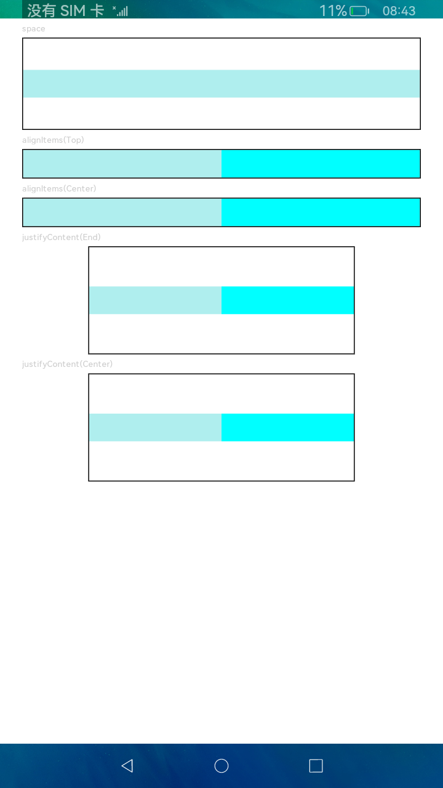

# Row

沿水平方向布局的容器。

## 导入模块

```cangjie
import kit.ArkUI.*
```

## 子组件

可以包含子组件。

## 创建组件

### init(?Length, () -> Unit)

```cangjie
public init(space!: ?Length = None, child!: () -> Unit = {=>})
```

**功能：** 创建一个横向布局元素间距为space的Row容器。

**系统能力：** SystemCapability.ArkUI.ArkUI.Full

**起始版本：** 22

**参数：**

|参数名|类型|必填|默认值|说明|
|:---|:---|:---|:---|:---|
|space|?Length|否|None|**命名参数。** 横向布局元素间距。space为负数或者justifyContent设置为FlexAlign.SpaceBetween、FlexAlign.SpaceAround、FlexAlign.SpaceEvenly时不生效。初始值：0，单位：vp。|
|child|() -> Unit|否|{=>}|**命名参数。** 容器内的子组件。|

## 通用属性/通用事件

通用属性：全部支持。

通用事件：全部支持。

## 组件属性

### func alignItems(?VerticalAlign)

```cangjie
public func alignItems(value: ?VerticalAlign): This
```

**功能：** 设置子组件在垂直方向上的对齐格式。

**系统能力：** SystemCapability.ArkUI.ArkUI.Full

**起始版本：** 22

**参数：**

|参数名|类型|必填|默认值|说明|
|:---|:---|:---|:---|:---|
|value|?VerticalAlign|是|-|在垂直方向上子组件的对齐格式。初始值：VerticalAlign.Center。|

### func justifyContent(?FlexAlign)

```cangjie
public func justifyContent(value: ?FlexAlign): This
```

**功能：** 设置子组件在水平方向上的对齐格式。

**系统能力：** SystemCapability.ArkUI.ArkUI.Full

**起始版本：** 22

**参数：**

|参数名|类型|必填|默认值|说明|
|:---|:---|:---|:---|:---|
|value|?FlexAlign|是|-|子组件在水平方向上的对齐格式。初始值：FlexAlign.Start。|

> **说明：**
>
> Row布局时若子组件不设置[flexShrink](cj-universal-attribute-flexlayout.md#func-flexshrinkfloat64)则默认不会压缩子组件，即所有子组件主轴大小累加可超过容器主轴。

## 示例代码

本示例展示了Row设置alignItems和justifyContent属性的用法。

<!-- run -->

```cangjie
package ohos_app_cangjie_entry
import kit.ArkUI.*
import ohos.arkui.state_macro_manage.*

@Entry
@Component
class EntryView {
    func build() {
            Column(space: 5) {
            // 设置子组件水平方向的间距为5
                Text("space")
                .fontSize(9)
                .fontColor(0xCCCCCC)
                .width(90.percent)
                Row(space: 5) {
                    Row()
                    .width(30.percent)
                    .height(50)
                    .backgroundColor(0xAFEEEE)
                    Row()
                    .width(30.percent)
                    .height(50)
                    .backgroundColor(0x00FFFF)
                }
                .width(90.percent)
                .height(107)
                .border(width: 1.vp)

                // 设置子元素垂直方向对齐方式
                Text("alignItems(Bottom)")
                .fontSize(9)
                .fontColor(0xCCCCCC)
                .width(90.percent)
                Row() {
                    Row()
                    .width(30.percent)
                    .height(50)
                    .backgroundColor(0xAFEEEE)
                    Row()
                    .width(30.percent)
                    .height(50)
                    .backgroundColor(0x00FFFF)
                }
                .alignItems(VerticalAlign.Bottom)
                .width(90.percent)
                .height(15.percent)
                .border(width: 1.vp)

                Text("alignItems(Center)")
                .fontSize(9)
                .fontColor(0xCCCCCC)
                .width(90.percent)
                Row() {
                    Row()
                    .width(30.percent)
                    .height(50)
                    .backgroundColor(0xAFEEEE)
                    Row()
                    .width(30.percent)
                    .height(50)
                    .backgroundColor(0x00FFFF)
                }
                .alignItems(VerticalAlign.Center)
                .width(90.percent)
                .height(15.percent)
                .border(width: 1.vp)

              // 设置子元素水平方向对齐方式
                Text("justifyContent(End)")
                .fontSize(9)
                .fontColor(0xCCCCCC)
                .width(90.percent)
                Row() {
                    Row()
                    .width(30.percent)
                    .height(50)
                    .backgroundColor(0xAFEEEE)
                    Row()
                    .width(30.percent)
                    .height(50)
                    .backgroundColor(0x00FFFF)
                }
                .height(15.percent)
                .width(90.percent)
                .border(width: 1.vp)
                .justifyContent(FlexAlign.End)

                Text("justifyContent(Center)")
                .fontSize(9)
                .fontColor(0xCCCCCC)
                .width(90.percent)
                Row() {
                    Row()
                    .width(30.percent)
                    .height(50)
                    .backgroundColor(0xAFEEEE)
                    Row()
                    .width(30.percent)
                    .height(50)
                    .backgroundColor(0x00FFFF)
                }
                .width(90.percent)
                .border(width: 1.vp)
                .justifyContent(FlexAlign.Center)
            }
            .width(100.percent)
            .padding(top: 5)
        }
}
```

