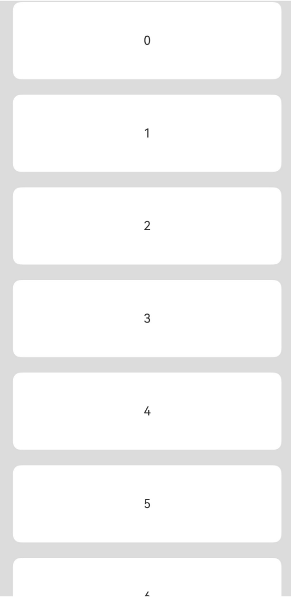

# ListItem

用来展示列表具体item，必须配合List来使用。

## 导入模块

```cangjie
import kit.ArkUI.*
```

## 子组件

可以包含单个子组件。

## 创建组件

### init(() -> Unit)

```cangjie
public init(child: () -> Unit)
```

**功能：** 创建ListItem组件。

**系统能力：** SystemCapability.ArkUI.ArkUI.Full

**起始版本：** 22

**参数：**

|参数名|类型|必填|默认值|说明|
|:---|:---|:---|:---|:---|
|child|() -> Unit|是|-|容器内的ListItem子组件。|

## 通用属性/通用事件

通用属性：全部支持。

通用事件：全部支持。

## 组件属性

### func selectable(?Bool)

```cangjie
public func selectable(value: ?Bool): This
```

**功能：** 设置当前ListItem元素是否可选择。

**系统能力：** SystemCapability.ArkUI.ArkUI.Full

**起始版本：** 22

**参数：**

|参数名|类型|必填|默认值|说明|
|:---|:---|:---|:---|:---|
|value|?Bool|是|-|ListItem元素是否可选择。<br>初始值：true。|

### func swipeAction(?CustomBuilder, ?CustomBuilder, ?SwipeEdgeEffect, ?(Float64) -> Unit)

```cangjie
public func swipeAction(
    start!: ?CustomBuilder = None,
    end!: ?CustomBuilder = None,
    edgeEffect!: ?SwipeEdgeEffect = Option.None,
    onOffsetChange!: ?(Float64) -> Unit = None
): This
```

**功能：** 用于设置ListItem的划出组件。

**系统能力：** SystemCapability.ArkUI.ArkUI.Full

**起始版本：** 22

**参数：**

|参数名|类型|必填|默认值|说明|
|:---|:---|:---|:---|:---|
|start|?CustomBuilder|否|None| **命名参数。** ListItem向右划动时item左边的组件（List垂直布局时）或ListItem向下划动时item上方的组件（List水平布局时）。<br>初始值：{=>}。|
|end|?CustomBuilder|否|None| **命名参数。** ListItem向左划动时item右边的组件（List垂直布局时）或ListItem向上划动时item下方的组件（List水平布局时）。<br>初始值：{=>}。|
|edgeEffect|?SwipeEdgeEffect|否|Option.None| **命名参数。** 滑动效果。<br>初始值：SwipeEdgeEffect.Spring。|
|onOffsetChange|?(Float64) -> Unit|否|None| **命名参数。** 滑动操作偏移量更改时调用。<br>初始值：{_: Float64 =>}。|

## 组件事件

### func onSelect(?(Bool) -> Unit)

```cangjie
public func onSelect(event: ?(Bool) -> Unit): This
```

**功能：** ListItem元素被选择的状态改变时触发回调。

**系统能力：** SystemCapability.ArkUI.ArkUI.Full

**起始版本：** 22

**参数：**

|参数名|类型|必填|默认值|说明|
|:---|:---|:---|:---|:---|
|event|?(Bool) -> Unit|是|-|选择状态改变时的回调函数。<br>初始值：{ res: Bool => }。|

## 示例代码

该实例实现了创建ListItem的基本用法。

<!-- run -->

```cangjie
package ohos_app_cangjie_entry
import kit.ArkUI.*
import ohos.arkui.state_macro_manage.*

@Entry
@Component
class EntryView {
    let arr = [0, 1, 2, 3, 4, 5, 6, 7, 8, 9]
    func build() {
        Column() {
            List(space: 20, initialIndex: 0) {
                ForEach(this.arr,itemGeneratorFunc: {item: Int64, _: Int64 => ListItem() {
                            Text("${item}")
                            .width(100.percent)
                            .height(100)
                            .fontSize(16)
                            .textAlign(TextAlign.Center)
                            .borderRadius(10)
                            .backgroundColor(0xFFFFFF)
                        }
                    }
                )
            }
            .scrollBar(BarState.Off)
            .width(90.percent)
        }
        .width(100.percent)
        .height(100.percent)
        .backgroundColor(0xDCDCDC)
        .padding(top: 5.px)
    }
}
```

