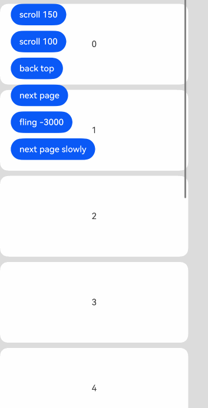
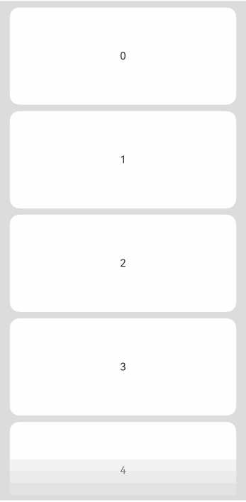

# Scroll

可滚动的容器组件，当子组件的布局尺寸超过父组件的尺寸时，内容可以滚动。

> **说明：**
>
> - 该组件嵌套List子组件滚动时，若List不设置宽高，则默认全部加载，在对性能有要求的场景下建议指定List的宽高。
> - 该组件滚动的前提是主轴方向大小小于内容大小。
> - Scroll组件[通用属性clip](./cj-universal-attribute-shapclip.md#func-clipbool)的默认值为true。

## 导入模块

```cangjie
import kit.ArkUI.*
```

## 子组件

支持单个子组件。

## 创建组件

### init()

```cangjie
public init()
```

**功能：** 创建一个Scroll容器。

**系统能力：** SystemCapability.ArkUI.ArkUI.Full

**起始版本：** 22

### init(() -> Unit)

```cangjie
public init(child: () -> Unit)
```

**功能：** 创建一个包含子组件的Scroll容器。

**系统能力：** SystemCapability.ArkUI.ArkUI.Full

**起始版本：** 22

**参数：**

|参数名|类型|必填|默认值|说明|
|:---|:---|:---|:---|:---|
|child|() -> Unit|是|-|声明容器内的子组件。|

### init(?Scroller, () -> Unit)

```cangjie
public init(scroller: ?Scroller, child: () -> Unit)
```

**功能：** 创建一个包含子组件的Scroll容器，并绑定一个滚动条控制器。

**系统能力：** SystemCapability.ArkUI.ArkUI.Full

**起始版本：** 22

**参数：**

|参数名|类型|必填|默认值|说明|
|:---|:---|:---|:---|:---|
|scroller|?Scroller|是|-|滚动条控制器。初始值：Scroller()。|
|child|() -> Unit|是|-|声明容器内的子组件。|

## 通用属性/通用事件

通用属性：支持通用属性和[滚动组件通用属性](./cj-scroll-swipe-common.md)。

通用事件：支持通用事件和[滚动组件通用事件](./cj-scroll-swipe-common.md)。

> **说明：**
>
> 不支持滚动组件通用事件中的[onWillScroll](./cj-scroll-swipe-common.md#func-onwillscrollfloat64scrollstatescrollsource---float64)、[onDidScroll](./cj-scroll-swipe-common.md#func-ondidscrollfloat64-scrollstate---unit)事件。

## 组件属性

### func scrollable(?ScrollDirection)

```cangjie
public func scrollable(scrollDirection: ?ScrollDirection): This
```

**功能：** 设置滚动方向。

**系统能力：** SystemCapability.ArkUI.ArkUI.Full

**起始版本：** 22

**参数：**

|参数名|类型|必填|默认值|说明|
|:---|:---|:---|:---|:---|
|scrollDirection|?ScrollDirection|是|-|滚动方向。初始值：ScrollDirection.Vertical。|

## 组件事件

### func onWillScroll(?(Float64, Float64, ScrollState, ScrollSource) -> OffsetResult)

```cangjie
public func onWillScroll(handler: ?(Float64, Float64, ScrollState, ScrollSource) -> OffsetResult): This
```

**功能：** 滚动事件回调，Scroll滚动前触发该事件。

回调当前帧将要滚动的偏移量和当前滚动状态和滚动操作来源，其中回调的偏移量为计算得到的将要滚动的偏移量值，并非最终实际滚动偏移。可以通过该回调返回值指定Scroll将要滚动的偏移。

触发该事件的条件 ：

1. 滚动组件触发滚动时触发，支持键鼠操作和其他触发滚动的输入设置。

2. 通过滚动控制器API接口调用。

3. 越界回弹。

**系统能力：** SystemCapability.ArkUI.ArkUI.Full

**起始版本：** 22

**参数：**

|参数名|类型|必填|默认值|说明|
|:---|:---|:---|:---|:---|
|handler|?(Float64, Float64, ScrollState, ScrollSource) -> OffsetResult|是|-|回调函数，Scroll滚动前触发。参数一：每帧滚动时水平方向的偏移量，Scroll中的内容向左滚动时偏移量为正，向右滚动时偏移量为负。单位vp。参数二：每帧滚动时竖直方向的偏移量，Scroll中的内容向上滚动时偏移量为正，向下滚动时偏移量为负。单位vp。参数三：当前滚动状态。参数四：当前滚动操作的来源。返回值：滑动偏移量对象。返回OffsetResult时按照开发者指定的偏移量滚动。初始值：{ _, _, _, _ => OffsetResult(0.0, 0.0)}。|

### func onWillScroll(?(Float64, Float64, ScrollState, ScrollSource) -> Unit)

```cangjie
public func onWillScroll(handler: ?(Float64, Float64, ScrollState, ScrollSource) -> Unit): This
```

**功能：** 滚动事件回调，Scroll滚动前触发该事件。

回调当前帧将要滚动的偏移量和当前滚动状态和滚动操作来源，其中回调的偏移量为计算得到的将要滚动的偏移量值，并非最终实际滚动偏移。可以通过该回调返回值指定Scroll将要滚动的偏移。

触发该事件的条件 ：

1. 滚动组件触发滚动时触发，支持键鼠操作和其他触发滚动的输入设置。

2. 通过滚动控制器API接口调用。

3. 越界回弹。

**系统能力：** SystemCapability.ArkUI.ArkUI.Full

**起始版本：** 22

**参数：**

|参数名|类型|必填|默认值|说明|
|:---|:---|:---|:---|:---|
|handler|?(Float64, Float64, ScrollState, ScrollSource) -> Unit|是|-|回调函数，Scroll滚动前触发。参数一：每帧滚动时水平方向的偏移量，Scroll中的内容向左滚动时偏移量为正，向右滚动时偏移量为负。单位vp。参数二：每帧滚动时竖直方向的偏移量，Scroll中的内容向上滚动时偏移量为正，向下滚动时偏移量为负。单位vp。参数三：当前滚动状态。参数四：当前滚动操作的来源。初始值：{ _, _, _, _ => }。|

### func onDidScroll(?ScrollOnScrollCallback)

```cangjie
public func onDidScroll(callback: ?ScrollOnScrollCallback): This
```

**功能：** 滚动事件回调，Scroll滚动时触发。

返回当前帧滚动的偏移量和当前滚动状态。

触发该事件的条件 ：

1. 滚动组件触发滚动时触发，支持键鼠操作和其他触发滚动的输入设置。

2. 通过滚动控制器API接口调用。

3. 越界回弹。

**系统能力：** SystemCapability.ArkUI.ArkUI.Full

**起始版本：** 22

**参数：**

|参数名|类型|必填|默认值|说明|
|:---|:---|:---|:---|:---|
|callback|?ScrollOnScrollCallback|是|-|回调函数，Scroll滚动时触发。参数一：每帧滚动时水平方向的偏移量，Scroll中的内容向左滚动时偏移量为正，向右滚动时偏移量为负。单位vp。参数二：每帧滚动时竖直方向的偏移量，Scroll中的内容向上滚动时偏移量为正，向下滚动时偏移量为负。单位vp。参数三：当前滚动状态。初始值：{ _, _, _ => }。|

### func onScrollFrameBegin(?OnScrollFrameBeginCallback)

```cangjie
public func onScrollFrameBegin(event: ?OnScrollFrameBeginCallback): This
```

**功能：** 每帧开始滚动时触发该事件，事件参数传入即将发生的滚动量，事件处理函数中可根据应用场景计算实际需要的滚动量并作为事件处理函数的返回值返回，Scroll将按照返回值的实际滚动量进行滚动。

支持offsetRemain为负值。

若通过onScrollFrameBegin事件和scrollBy方法实现容器嵌套滚动，需设置子滚动节点的EdgeEffect为None。如Scroll嵌套List滚动时，List组件的edgeEffect属性需设置为EdgeEffect.None。

触发该事件的条件：

1. 滚动组件触发滚动时触发，包括键鼠操作和其他触发滚动的输入设置。

2. 调用控制器接口时不触发。

3. 越界回弹不触发。

4. 拖动滚动条不触发。

**系统能力：** SystemCapability.ArkUI.ArkUI.Full

**起始版本：** 22

**参数：**

|参数名|类型|必填|默认值|说明|
|:---|:---|:---|:---|:---|
|event|?OnScrollFrameBeginCallback|是|-|回调函数，每帧开始滚动时触发。参数一：即将发生的滑动量，单位vp。参数二：当前滑动状态。初始值：{ _, _ => 0.0 }。|

### func onScrollEdge(?OnScrollEdgeCallback)

```cangjie
public func onScrollEdge(event: ?OnScrollEdgeCallback): This
```

**功能：** 滚动到边缘时触发该事件。

触发该事件的条件 ：

1. 滚动组件滚动到边缘时触发，支持键鼠操作和其他触发滚动的输入设置。

2. 通过滚动控制器API接口调用。

3. 越界回弹。

**系统能力：** SystemCapability.ArkUI.ArkUI.Full

**起始版本：** 22

**参数：**

|参数名|类型|必填|默认值|说明|
|:---|:---|:---|:---|:---|
|event|?OnScrollEdgeCallback|是|-|回调函数，滚动到边缘时触发。参数：滚动到的边缘位置。初始值：{ _ => 0.0 }。|

## 基础类型定义

### interface ScrollableCommonMethod

```cangjie
public interface ScrollableCommonMethod<T> <: CommonMethod<T> {
  func scrollBar(barState: ?BarState): T
  func scrollBarColor(color: ?ResourceColor): T
  func scrollBarWidth(value: ?Length): T
  func nestedScroll(value: ?NestedScrollOptions): T
  func enableScrollInteraction(value: ?Bool): T
  func friction(value: ?Float64): T
  func friction(value: ?AppResource): T
  func onReachStart(event: ?() -> Unit): T
  func onReachEnd(event: ?() -> Unit): T
  func onScrollStart(event: ?() -> Unit): T
  func onScrollStop(event: ?() -> Unit): T
  func flingSpeedLimit(speedLimit: ?Float64): T
  func fadingEdge(enabled: Option<Bool>): T
  func fadingEdge(enabled: Option<Bool>, options: ?FadingEdgeOptions): T
  func clipContent(clip: ?ContentClipMode): T
  func clipContent(clip: ?RectShape): T
  func onWillScroll(handler: Option<(Float64, ScrollState, ScrollSource) -> ScrollResult>): T
  func onWillScroll(handler: Option<(Float64, ScrollState, ScrollSource) -> Unit>): T
  func onDidScroll(handler: ?OnScrollCallBack): T
}
```

**功能：** 可滚动组件通用方法接口。

**系统能力：** SystemCapability.ArkUI.ArkUI.Full

**起始版本：** 22

**父类型：**

- CommonMethod\<T>

#### func scrollBar(?BarState)

```cangjie
func scrollBar(barState: ?BarState): T
```

**功能：** 设置滚动条状态。

**系统能力：** SystemCapability.ArkUI.ArkUI.Full

**起始版本：** 22

**参数：**

|参数名|类型|必填|默认值|说明|
|:---|:---|:---|:---|:---|
|barState|?BarState|是|-|滚动条状态。|

#### func scrollBarColor(?ResourceColor)

```cangjie
func scrollBarColor(color: ?ResourceColor): T
```

**功能：** 设置滚动条颜色。

**系统能力：** SystemCapability.ArkUI.ArkUI.Full

**起始版本：** 22

**参数：**

|参数名|类型|必填|默认值|说明|
|:---|:---|:---|:---|:---|
|color|?ResourceColor|是|-|滚动条颜色。|

#### func scrollBarWidth(?Length)

```cangjie
func scrollBarWidth(value: ?Length): T
```

**功能：** 设置滚动条宽度。

**系统能力：** SystemCapability.ArkUI.ArkUI.Full

**起始版本：** 22

**参数：**

|参数名|类型|必填|默认值|说明|
|:---|:---|:---|:---|:---|
|value|?Length|是|-|滚动条宽度。|

#### func nestedScroll(?NestedScrollOptions)

```cangjie
func nestedScroll(value: ?NestedScrollOptions): T
```

**功能：** 设置嵌套滚动选项。

**系统能力：** SystemCapability.ArkUI.ArkUI.Full

**起始版本：** 22

**参数：**

|参数名|类型|必填|默认值|说明|
|:---|:---|:---|:---|:---|
|value|?NestedScrollOptions|是|-|嵌套滚动选项。|

#### func enableScrollInteraction(?Bool)

```cangjie
func enableScrollInteraction(value: ?Bool): T
```

**功能：** 设置是否支持滚动交互。

**系统能力：** SystemCapability.ArkUI.ArkUI.Full

**起始版本：** 22

**参数：**

|参数名|类型|必填|默认值|说明|
|:---|:---|:---|:---|:---|
|value|?Bool|是|-|是否支持滚动交互。|

#### func friction(?Float64)

```cangjie
func friction(value: ?Float64): T
```

**功能：** 设置摩擦系数。

**系统能力：** SystemCapability.ArkUI.ArkUI.Full

**起始版本：** 22

**参数：**

|参数名|类型|必填|默认值|说明|
|:---|:---|:---|:---|:---|
|value|?Float64|是|-|摩擦系数。|

#### func friction(?AppResource)

```cangjie
func friction(value: ?AppResource): T
```

**功能：** 设置摩擦系数。

**系统能力：** SystemCapability.ArkUI.ArkUI.Full

**起始版本：** 22

**参数：**

|参数名|类型|必填|默认值|说明|
|:---|:---|:---|:---|:---|
|value|?AppResource|是|-|摩擦系数。|

#### func onReachStart(?(...) -> Unit)

```cangjie
func onReachStart(event: ?() -> Unit): T
```

**功能：** 滚动到达起始位置时触发。

**系统能力：** SystemCapability.ArkUI.ArkUI.Full

**起始版本：** 22

**参数：**

|参数名|类型|必填|默认值|说明|
|:---|:---|:---|:---|:---|
|event|?() -> Unit|是|-|滚动到达起始位置时的回调函数。初始值：{ => }。|

#### func onReachEnd(?(...) -> Unit)

```cangjie
func onReachEnd(event: ?() -> Unit): T
```

**功能：** 滚动到达末尾位置时触发。

**系统能力：** SystemCapability.ArkUI.ArkUI.Full

**起始版本：** 22

**参数：**

|参数名|类型|必填|默认值|说明|
|:---|:---|:---|:---|:---|
|event|?() -> Unit|是|-|滚动到达末尾位置时的回调函数。初始值：{ => }。|

#### func onScrollStart(?(...) -> Unit)

```cangjie
func onScrollStart(event: ?() -> Unit): T
```

**功能：** 滚动开始时触发。

**系统能力：** SystemCapability.ArkUI.ArkUI.Full

**起始版本：** 22

**参数：**

|参数名|类型|必填|默认值|说明|
|:---|:---|:---|:---|:---|
|event|?() -> Unit|是|-|滚动开始时的回调函数。初始值：{ => }。|

#### func onScrollStop(?(...) -> Unit)

```cangjie
func onScrollStop(event: ?() -> Unit): T
```

**功能：** 滚动停止时触发。

**系统能力：** SystemCapability.ArkUI.ArkUI.Full

**起始版本：** 22

**参数：**

|参数名|类型|必填|默认值|说明|
|:---|:---|:---|:---|:---|
|event|?() -> Unit|是|-|滚动停止时的回调函数。初始值：{ => }。|

#### func flingSpeedLimit(?Float64)

```cangjie
func flingSpeedLimit(speedLimit: ?Float64): T
```

**功能：** 设置惯性滚动速度限制。

**系统能力：** SystemCapability.ArkUI.ArkUI.Full

**起始版本：** 22

**参数：**

|参数名|类型|必填|默认值|说明|
|:---|:---|:---|:---|:---|
|speedLimit|?Float64|是|-|惯性滚动速度限制。初始值：0.0。|


#### func fadingEdge(Option\<Bool>)

```cangjie
func fadingEdge(enabled: Option<Bool>): T
```

**功能：** 设置边缘淡出效果。

**系统能力：** SystemCapability.ArkUI.ArkUI.Full

**起始版本：** 22

**参数：**

|参数名|类型|必填|默认值|说明|
|:---|:---|:---|:---|:---|
|enabled|Option\<Bool>|是|-|是否启用边缘淡出效果。|

#### func fadingEdge(Option\<Bool>, ?FadingEdgeOptions)

```cangjie
func fadingEdge(enabled: Option<Bool>, options: ?FadingEdgeOptions): T
```

**功能：** 设置边缘淡出效果。

**系统能力：** SystemCapability.ArkUI.ArkUI.Full

**起始版本：** 22

**参数：**

|参数名|类型|必填|默认值|说明|
|:---|:---|:---|:---|:---|
|enabled|Option\<Bool>|是|-|是否启用边缘淡出效果。|
|options|?FadingEdgeOptions|是|-|边缘淡出选项。初始值：FadingEdgeOptions()。|

#### func clipContent(?ContentClipMode)

```cangjie
func clipContent(clip: ?ContentClipMode): T
```

**功能：** 设置内容裁剪模式。

**系统能力：** SystemCapability.ArkUI.ArkUI.Full

**起始版本：** 22

**参数：**

|参数名|类型|必填|默认值|说明|
|:---|:---|:---|:---|:---|
|clip|?ContentClipMode|是|-|内容裁剪模式。|

#### func clipContent(?RectShape)

```cangjie
func clipContent(clip: ?RectShape): T
```

**功能：** 设置内容裁剪形状。

**系统能力：** SystemCapability.ArkUI.ArkUI.Full

**起始版本：** 22

**参数：**

|参数名|类型|必填|默认值|说明|
|:---|:---|:---|:---|:---|
|clip|?RectShape|是|-|内容裁剪形状。|

#### func onWillScroll(Option\<(Float64, ScrollState, ScrollSource) -> ScrollResult>)

```cangjie
func onWillScroll(handler: Option<(Float64, ScrollState, ScrollSource) -> ScrollResult>): T
```

**功能：** 滚动前触发的回调函数。

**系统能力：** SystemCapability.ArkUI.ArkUI.Full

**起始版本：** 22

**参数：**

|参数名|类型|必填|默认值|说明|
|:---|:---|:---|:---|:---|
|handler|Option\<(Float64, ScrollState, ScrollSource) -> ScrollResult>|是|-|滚动前触发的回调函数。|

#### func onWillScroll(Option\<(Float64, ScrollState, ScrollSource) -> Unit>)

```cangjie
func onWillScroll(handler: Option<(Float64, ScrollState, ScrollSource) -> Unit>): T
```

**功能：** 滚动前触发的回调函数。

**系统能力：** SystemCapability.ArkUI.ArkUI.Full

**起始版本：** 22

**参数：**

|参数名|类型|必填|默认值|说明|
|:---|:---|:---|:---|:---|
|handler|Option\<(Float64, ScrollState, ScrollSource) -> Unit>|是|-|滚动前触发的回调函数。|

#### func onDidScroll(?OnScrollCallBack)

```cangjie
func onDidScroll(handler: ?OnScrollCallBack): T
```

**功能：** 滚动时触发的回调函数。

**系统能力：** SystemCapability.ArkUI.ArkUI.Full

**起始版本：** 22

**参数：**

|参数名|类型|必填|默认值|说明|
|:---|:---|:---|:---|:---|
|handler|?OnScrollCallBack|是|-|滚动时触发的回调函数。初始值：{ _, _ => }。|

### class ScrollableCommonMethodComponent

```cangjie
public abstract class ScrollableCommonMethodComponent<T> <: CommonMethodComponent<T> {}
```

**功能：** 可滚动组件通用方法组件基类。

**系统能力：** SystemCapability.ArkUI.ArkUI.Full

**起始版本：** 22

**父类型：**

- CommonMethodComponent\<T>

#### public func scrollBar(?BarState)

```cangjie
public func scrollBar(barState: ?BarState): T
```

**功能：** 设置滚动条状态。

**系统能力：** SystemCapability.ArkUI.ArkUI.Full

**起始版本：** 22

**参数：**

|参数名|类型|必填|默认值|说明|
|:---|:---|:---|:---|:---|
|barState|?BarState|是|-|滚动条状态。初始值：BarState.Auto。|

#### public func scrollBarColor(?ResourceColor)

```cangjie
public func scrollBarColor(color: ?ResourceColor): T
```

**功能：** 设置滚动条颜色。

**系统能力：** SystemCapability.ArkUI.ArkUI.Full

**起始版本：** 22

**参数：**

|参数名|类型|必填|默认值|说明|
|:---|:---|:---|:---|:---|
|color|?ResourceColor|是|-|滚动条颜色。|

#### public func scrollBarWidth(?Length)

```cangjie
public func scrollBarWidth(value: ?Length): T
```

**功能：** 设置滚动条宽度。

**系统能力：** SystemCapability.ArkUI.ArkUI.Full

**起始版本：** 22

**参数：**

|参数名|类型|必填|默认值|说明|
|:---|:---|:---|:---|:---|
|value|?Length|是|-|滚动条宽度。初始值：4.vp。|

#### public func nestedScroll(?NestedScrollOptions)

```cangjie
public func nestedScroll(value: ?NestedScrollOptions): T
```

**功能：** 设置嵌套滚动选项。

**系统能力：** SystemCapability.ArkUI.ArkUI.Full

**起始版本：** 22

**参数：**

|参数名|类型|必填|默认值|说明|
|:---|:---|:---|:---|:---|
|value|?NestedScrollOptions|是|-|嵌套滚动选项。|

#### public func enableScrollInteraction(?Bool)

```cangjie
public func enableScrollInteraction(value: ?Bool): T
```

**功能：** 设置是否支持滚动交互。

**系统能力：** SystemCapability.ArkUI.ArkUI.Full

**起始版本：** 22

**参数：**

|参数名|类型|必填|默认值|说明|
|:---|:---|:---|:---|:---|
|value|?Bool|是|-|是否支持滚动交互。|

#### public func friction(?Float64)

```cangjie
public func friction(value: ?Float64): T
```

**功能：** 设置摩擦系数。

**系统能力：** SystemCapability.ArkUI.ArkUI.Full

**起始版本：** 22

**参数：**

|参数名|类型|必填|默认值|说明|
|:---|:---|:---|:---|:---|
|value|?Float64|是|-|摩擦系数。|

#### public func friction(?AppResource)

```cangjie
public func friction(value: ?AppResource): T
```

**功能：** 设置摩擦系数。

**系统能力：** SystemCapability.ArkUI.ArkUI.Full

**起始版本：** 22

**参数：**

|参数名|类型|必填|默认值|说明|
|:---|:---|:---|:---|:---|
|value|?AppResource|是|-|摩擦系数。|

#### public func onReachStart(?(...) -> Unit)

```cangjie
public func onReachStart(event: ?() -> Unit): T
```

**功能：** 滚动到达起始位置时触发。

**系统能力：** SystemCapability.ArkUI.ArkUI.Full

**起始版本：** 22

**参数：**

|参数名|类型|必填|默认值|说明|
|:---|:---|:---|:---|:---|
|event|?() -> Unit|是|-|滚动到达起始位置时的回调函数。初始值：{ => }。|

#### public func onReachEnd(?(...) -> Unit)

```cangjie
public func onReachEnd(event: ?() -> Unit): T
```

**功能：** 滚动到达末尾位置时触发。

**系统能力：** SystemCapability.ArkUI.ArkUI.Full

**起始版本：** 22

**参数：**

|参数名|类型|必填|默认值|说明|
|:---|:---|:---|:---|:---|
|event|?() -> Unit|是|-|滚动到达末尾位置时的回调函数。初始值：{ => }。|

#### public func onScrollStart(?(...) -> Unit)

```cangjie
public func onScrollStart(event: ?() -> Unit): T
```

**功能：** 滚动开始时触发。

**系统能力：** SystemCapability.ArkUI.ArkUI.Full

**起始版本：** 22

**参数：**

|参数名|类型|必填|默认值|说明|
|:---|:---|:---|:---|:---|
|event|?() -> Unit|是|-|滚动开始时的回调函数。初始值：{ => }。|

#### public func onScrollStop(?(...) -> Unit)

```cangjie
public func onScrollStop(event: ?() -> Unit): T
```

**功能：** 滚动停止时触发。

**系统能力：** SystemCapability.ArkUI.ArkUI.Full

**起始版本：** 22

**参数：**

|参数名|类型|必填|默认值|说明|
|:---|:---|:---|:---|:---|
|event|?() -> Unit|是|-|滚动停止时的回调函数。初始值：{ => }。|

#### public func flingSpeedLimit(?Float64)

```cangjie
public func flingSpeedLimit(speedLimit: ?Float64): T
```

**功能：** 设置惯性滚动速度限制。

**系统能力：** SystemCapability.ArkUI.ArkUI.Full

**起始版本：** 22

**参数：**

|参数名|类型|必填|默认值|说明|
|:---|:---|:---|:---|:---|
|speedLimit|?Float64|是|-|惯性滚动速度限制。初始值：0.0。|

#### public func fadingEdge(Option\<Bool>)

```cangjie
public func fadingEdge(enabled: Option<Bool>): T
```

**功能：** 设置边缘淡出效果。

**系统能力：** SystemCapability.ArkUI.ArkUI.Full

**起始版本：** 22

**参数：**

|参数名|类型|必填|默认值|说明|
|:---|:---|:---|:---|:---|
|enabled|Option\<Bool>|是|-|是否启用边缘淡出效果。|

#### public func fadingEdge(Option\<Bool>, ?FadingEdgeOptions)

```cangjie
public func fadingEdge(enabled: Option<Bool>, options: ?FadingEdgeOptions): T
```

**功能：** 设置边缘淡出效果。

**系统能力：** SystemCapability.ArkUI.ArkUI.Full

**起始版本：** 22

**参数：**

|参数名|类型|必填|默认值|说明|
|:---|:---|:---|:---|:---|
|enabled|Option\<Bool>|是|-|是否启用边缘淡出效果。|
|options|?FadingEdgeOptions|是|-|边缘淡出选项。初始值：FadingEdgeOptions()。|

#### public func clipContent(?ContentClipMode)

```cangjie
public func clipContent(clip: ?ContentClipMode): T
```

**功能：** 设置内容裁剪模式。

**系统能力：** SystemCapability.ArkUI.ArkUI.Full

**起始版本：** 22

**参数：**

|参数名|类型|必填|默认值|说明|
|:---|:---|:---|:---|:---|
|clip|?ContentClipMode|是|-|内容裁剪模式。|

#### public func clipContent(?RectShape)

```cangjie
public func clipContent(clip: ?RectShape): T
```

**功能：** 设置内容裁剪形状。

**系统能力：** SystemCapability.ArkUI.ArkUI.Full

**起始版本：** 22

**参数：**

|参数名|类型|必填|默认值|说明|
|:---|:---|:---|:---|:---|
|clip|?RectShape|是|-|内容裁剪形状。|

#### public func onWillScroll(Option\<(Float64, ScrollState, ScrollSource) -> ScrollResult>)

```cangjie
public func onWillScroll(handler: Option<(Float64, ScrollState, ScrollSource) -> ScrollResult>): T
```

**功能：** 滚动前触发的回调函数。

**系统能力：** SystemCapability.ArkUI.ArkUI.Full

**起始版本：** 22

**参数：**

|参数名|类型|必填|默认值|说明|
|:---|:---|:---|:---|:---|
|handler|Option\<(Float64, ScrollState, ScrollSource) -> ScrollResult>|是|-|滚动前触发的回调函数。|

#### public func onWillScroll(Option\<(Float64, ScrollState, ScrollSource) -> Unit>)

```cangjie
public func onWillScroll(handler: Option<(Float64, ScrollState, ScrollSource) -> Unit>): T
```

**功能：** 滚动前触发的回调函数。

**系统能力：** SystemCapability.ArkUI.ArkUI.Full

**起始版本：** 22

**参数：**

|参数名|类型|必填|默认值|说明|
|:---|:---|:---|:---|:---|
|handler|Option\<(Float64, ScrollState, ScrollSource) -> Unit>|是|-|滚动前触发的回调函数。|

#### public func onDidScroll(?OnScrollCallBack)

```cangjie
public func onDidScroll(handler: ?OnScrollCallBack): T
```

**功能：** 滚动时触发的回调函数。

**系统能力：** SystemCapability.ArkUI.ArkUI.Full

**起始版本：** 22

**参数：**

|参数名|类型|必填|默认值|说明|
|:---|:---|:---|:---|:---|
|handler|?OnScrollCallBack|是|-|滚动时触发的回调函数。初始值：{ _, _ => }。|

### class ScrollResult

```cangjie
public class ScrollResult {
    public var offsetRemain: Float64
    public init(offsetRemain!: Float64)
}
```

**功能：** 表示滚动操作产生的滚动值。

**系统能力：** SystemCapability.ArkUI.ArkUI.Full

**起始版本：** 22

**父类型：**

无

#### var offsetRemain

```cangjie
public var offsetRemain: Float64
```

**功能：** 滚动偏移量剩余值。

**类型：** Float64

**读写能力：** 可读写

**系统能力：** SystemCapability.ArkUI.ArkUI.Full

**起始版本：** 22

#### init(Float64)

```cangjie
public init(offsetRemain!: Float64)
```

**功能：** 构造一个滚动结果。

**系统能力：** SystemCapability.ArkUI.ArkUI.Full

**起始版本：** 22

**参数：**

|参数名|类型|必填|默认值|说明|
|:---|:---|:---|:---|:---|
|offsetRemain|Float64|是|-|滚动偏移量剩余值。|

### class OffsetResult

```cangjie
public class OffsetResult {
    public var xOffset: Float64
    public var yOffset: Float64
    public init(xOffset: Float64, yOffset: Float64)
}
```

**功能：** 表示滚动操作产生的偏移值。

**系统能力：** SystemCapability.ArkUI.ArkUI.Full

**起始版本：** 22

**父类型：**

无

#### var xOffset

```cangjie
public var xOffset: Float64
```

**功能：** 水平滚动偏移。

**类型：** Float64

**读写能力：** 可读写

**系统能力：** SystemCapability.ArkUI.ArkUI.Full

**起始版本：** 22

#### var yOffset

```cangjie
public var yOffset: Float64
```

**功能：** 垂直滚动偏移。

**类型：** Float64

**读写能力：** 可读写

**系统能力：** SystemCapability.ArkUI.ArkUI.Full

**起始版本：** 22

#### init(Float64, Float64)

```cangjie
public init(xOffset: Float64, yOffset: Float64)
```

**功能：** 构造一个偏移结果。

**系统能力：** SystemCapability.ArkUI.ArkUI.Full

**起始版本：** 22

**参数：**

|参数名|类型|必填|默认值|说明|
|:---|:---|:---|:---|:---|
|xOffset|Float64|是|-|水平滚动偏移。|
|yOffset|Float64|是|-|垂直滚动偏移。|

### class RectResult

```cangjie
public class RectResult {
    public var x: ?Float64
    public var y: ?Float64
    public var width: ?Float64
    public var height: ?Float64
    public init(
        x: Float64,
        y: Float64,
        width: Float64,
        height: Float64
    )
}
```

**功能：** 表示滚动操作产生的矩形值。

**系统能力：** SystemCapability.ArkUI.ArkUI.Full

**起始版本：** 22

**父类型：**

无

#### var x

```cangjie
public var x: ?Float64
```

**功能：** 矩形值中的x坐标。

**类型：** ?Float64

**读写能力：** 可读写

**系统能力：** SystemCapability.ArkUI.ArkUI.Full

**起始版本：** 22

#### var y

```cangjie
public var y: ?Float64
```

**功能：** 矩形值中的y坐标。

**类型：** ?Float64

**读写能力：** 可读写

**系统能力：** SystemCapability.ArkUI.ArkUI.Full

**起始版本：** 22

#### var width

```cangjie
public var width: ?Float64
```

**功能：** 矩形值中的宽度。

**类型：** ?Float64

**读写能力：** 可读写

**系统能力：** SystemCapability.ArkUI.ArkUI.Full

**起始版本：** 22

#### var height

```cangjie
public var height: ?Float64
```

**功能：** 矩形值中的高度。

**类型：** ?Float64

**读写能力：** 可读写

**系统能力：** SystemCapability.ArkUI.ArkUI.Full

**起始版本：** 22

#### init(Float64, Float64, Float64, Float64)

```cangjie
public init(
    x: Float64,
    y: Float64,
    width: Float64,
    height: Float64
)
```

**功能：** 构造一个矩形结果。

**系统能力：** SystemCapability.ArkUI.ArkUI.Full

**起始版本：** 22

**参数：**

|参数名|类型|必填|默认值|说明|
|:---|:---|:---|:---|:---|
|x|Float64|是|-|矩形值中的x坐标。|
|y|Float64|是|-|矩形值中的y坐标。|
|width|Float64|是|-|矩形值中的宽度。|
|height|Float64|是|-|矩形值中的高度。|

### class ScrollAnimationOptions

```cangjie
public class ScrollAnimationOptions {
    public var duration: ?Float64
    public var curve: ?Curve
    public var canOverScroll: ?Bool
    public init(
        duration!: ?Float64 = None,
        curve!: ?Curve = None,
        canOverScroll!: ?Bool = None
    )
}
```

**功能：** 提供自定义滚动动画的参数。

**系统能力：** SystemCapability.ArkUI.ArkUI.Full

**起始版本：** 22

**父类型：**

无

#### var duration

```cangjie
public var duration: ?Float64
```

**功能：** 滚动持续时间。

**类型：** ?Float64

**读写能力：** 可读写

**系统能力：** SystemCapability.ArkUI.ArkUI.Full

**起始版本：** 22

#### var curve

```cangjie
public var curve: ?Curve
```

**功能：** 滚动曲线。

**类型：** ?Curve

**读写能力：** 可读写

**系统能力：** SystemCapability.ArkUI.ArkUI.Full

**起始版本：** 22

#### var canOverScroll

```cangjie
public var canOverScroll: ?Bool
```

**功能：** 是否启用越界滚动。

**类型：** ?Bool

**读写能力：** 可读写

**系统能力：** SystemCapability.ArkUI.ArkUI.Full

**起始版本：** 22

#### init(?Float64, ?Curve, ?Bool)

```cangjie
public init(
    duration!: ?Float64 = None,
    curve!: ?Curve = None,
    canOverScroll!: ?Bool = None
)
```

**功能：** 构造一个自定义滚动动画。

**系统能力：** SystemCapability.ArkUI.ArkUI.Full

**起始版本：** 22

**参数：**

|参数名|类型|必填|默认值|说明|
|:---|:---|:---|:---|:---|
|duration|?Float64|否|None|**命名参数。** 滚动持续时间。初始值：1000.0。|
|curve|?Curve|否|None|**命名参数。** 滚动曲线。初始值：Curve.Ease。|
|canOverScroll|?Bool|否|None|**命名参数。** 是否启用越界滚动。初始值：false。|

### class NestedScrollOptions

```cangjie
public class NestedScrollOptions {
    public var scrollForward: ?NestedScrollMode
    public var scrollBackward: ?NestedScrollMode
    public init(scrollForward: ?NestedScrollMode, scrollBackward: ?NestedScrollMode)
}
```

**功能：** 提供自定义滚动嵌套的参数。

**系统能力：** SystemCapability.ArkUI.ArkUI.Full

**起始版本：** 22

**父类型：**

无

#### var scrollForward

```cangjie
public var scrollForward: ?NestedScrollMode
```

**功能：** 自定义滚动嵌套中的向前方向。

**类型：** ?NestedScrollMode

**读写能力：** 可读写

**系统能力：** SystemCapability.ArkUI.ArkUI.Full

**起始版本：** 22

#### var scrollBackward

```cangjie
public var scrollBackward: ?NestedScrollMode
```

**功能：** 自定义滚动嵌套中的向后方向。

**类型：** ?NestedScrollMode

**读写能力：** 可读写

**系统能力：** SystemCapability.ArkUI.ArkUI.Full

**起始版本：** 22

#### init(?NestedScrollMode, ?NestedScrollMode)

```cangjie
public init(scrollForward: ?NestedScrollMode, scrollBackward: ?NestedScrollMode)
```

**功能：** 提供自定义滚动嵌套的参数。

**系统能力：** SystemCapability.ArkUI.ArkUI.Full

**起始版本：** 22

**参数：**

|参数名|类型|必填|默认值|说明|
|:---|:---|:---|:---|:---|
|scrollForward|?NestedScrollMode|是|-|自定义滚动嵌套中的向前方向。初始值：NestedScrollMode.SelfOnly。|
|scrollBackward|?NestedScrollMode|是|-|自定义滚动嵌套中的向后方向。初始值：NestedScrollMode.SelfOnly。|

### class FadingEdgeOptions

```cangjie
public class FadingEdgeOptions {
    public var fadingEdgeLength: ?Length
    public init(fadingEdgeLength!: ?Length = None)
}
```

**功能：** 提供自定义淡出边缘的参数。

**系统能力：** SystemCapability.ArkUI.ArkUI.Full

**起始版本：** 22

**父类型：**

无

#### var fadingEdgeLength

```cangjie
public var fadingEdgeLength: ?Length
```

**功能：** 自定义淡出边缘中的长度。

**类型：** ?Length

**读写能力：** 可读写

**系统能力：** SystemCapability.ArkUI.ArkUI.Full

**起始版本：** 22

#### init(?Length)

```cangjie
public init(fadingEdgeLength!: ?Length = None)
```

**功能：** 构造一个自定义淡出边缘。

**系统能力：** SystemCapability.ArkUI.ArkUI.Full

**起始版本：** 22

**参数：**

|参数名|类型|必填|默认值|说明|
|:---|:---|:---|:---|:---|
|fadingEdgeLength|?Length|否|None|**命名参数。** 自定义淡出边缘中的长度。初始值：32.vp。|

### class ScrollEdgeOptions

```cangjie
public class ScrollEdgeOptions {
    public var velocity: ?Float32
    public init(velocity!: ?Float32 = None)
}
```

**功能：** 提供滚动边缘选项参数。

**系统能力：** SystemCapability.ArkUI.ArkUI.Full

**起始版本：** 22

**父类型：**

无

#### var velocity

```cangjie
public var velocity: ?Float32
```

**功能：** 滚动边缘选项中的速度。

**类型：** ?Float32

**读写能力：** 可读写

**系统能力：** SystemCapability.ArkUI.ArkUI.Full

**起始版本：** 22

#### init(?Float32)

```cangjie
public init(velocity!: ?Float32 = None)
```

**功能：** 构造滚动边缘选项。

**系统能力：** SystemCapability.ArkUI.ArkUI.Full

**起始版本：** 22

**参数：**

|参数名|类型|必填|默认值|说明|
|:---|:---|:---|:---|:---|
|velocity|?Float32|否|None|**命名参数。** 滚动边缘选项中的速度。初始值：0.0。|

### class ScrollToIndexOptions

```cangjie
public class ScrollToIndexOptions {
    public var extraOffset: ?Length
    public init(extraOffset!: ?Length = None)
}
```

**功能：** 提供滚动到索引选项参数。

**系统能力：** SystemCapability.ArkUI.ArkUI.Full

**起始版本：** 22

**父类型：**

无

#### var extraOffset

```cangjie
public var extraOffset: ?Length
```

**功能：** 滚动到索引选项中的额外偏移量。

**类型：** ?Length

**读写能力：** 可读写

**系统能力：** SystemCapability.ArkUI.ArkUI.Full

**起始版本：** 22

#### init(?Length)

```cangjie
public init(extraOffset!: ?Length = None)
```

**功能：** 构造滚动到索引选项。

**系统能力：** SystemCapability.ArkUI.ArkUI.Full

**起始版本：** 22

**参数：**

|参数名|类型|必填|默认值|说明|
|:---|:---|:---|:---|:---|
|extraOffset|?Length|否|None|**命名参数。** 滚动到索引选项中的额外偏移量。初始值：0.vp。|

### class Scroller

```cangjie
public class Scroller {
    public init()
}
```

**功能：** 定义可滚动容器组件的控制器。

**系统能力：** SystemCapability.ArkUI.ArkUI.Full

**起始版本：** 22

**父类型：**

无

#### init()

```cangjie
public init()
```

**功能：** 构造函数，用于创建一个Scroller对象。

**系统能力：** SystemCapability.ArkUI.ArkUI.Full

**起始版本：** 22

#### func scrollTo(Length, Length)

```cangjie
public func scrollTo(xOffset!: Length, yOffset!: Length): Unit
```

**功能：** 设置滑动到指定位置。

**系统能力：** SystemCapability.ArkUI.ArkUI.Full

**起始版本：** 22

**参数：**

|参数名|类型|必填|默认值|说明|
|:---|:---|:---|:---|:---|
|xOffset|Length|是|-|**命名参数。** 水平滚动偏移。|
|yOffset|Length|是|-|**命名参数。** 垂直滚动偏移。|

#### func scrollTo(Length, Length, ?ScrollAnimationOptions)

```cangjie
public func scrollTo(xOffset!: Length, yOffset!: Length, animation!: ?ScrollAnimationOptions): Unit
```

**功能：** 设置滑动到指定位置。

**系统能力：** SystemCapability.ArkUI.ArkUI.Full

**起始版本：** 22

**参数：**

|参数名|类型|必填|默认值|说明|
|:---|:---|:---|:---|:---|
|xOffset|Length|是|-|**命名参数。** 水平滚动偏移。|
|yOffset|Length|是|-|**命名参数。** 垂直滚动偏移。|
|animation|?ScrollAnimationOptions|是|-|**命名参数。** 滚动动画选项。初始值：ScrollAnimationOptions()。|

#### func scrollTo(Length, Length, ?Bool)

```cangjie
public func scrollTo(xOffset!: Length, yOffset!: Length, animation!: ?Bool): Unit
```

**功能：** 设置滑动到指定位置。

**系统能力：** SystemCapability.ArkUI.ArkUI.Full

**起始版本：** 22

**参数：**

|参数名|类型|必填|默认值|说明|
|:---|:---|:---|:---|:---|
|xOffset|Length|是|-|**命名参数。** 水平滚动偏移。|
|yOffset|Length|是|-|**命名参数。** 垂直滚动偏移。|
|animation|?Bool|是|-|**命名参数。** 是否启用动画。初始值：false。|

#### func scrollBy(Length, Length)

```cangjie
public func scrollBy(xOffset!: Length, yOffset!: Length): Unit
```

**功能：** 按偏移量滚动。

**系统能力：** SystemCapability.ArkUI.ArkUI.Full

**起始版本：** 22

**参数：**

|参数名|类型|必填|默认值|说明|
|:---|:---|:---|:---|:---|
|xOffset|Length|是|-|**命名参数。** 水平滚动偏移。|
|yOffset|Length|是|-|**命名参数。** 垂直滚动偏移。|

#### func scrollEdge(Edge)

```cangjie
public func scrollEdge(value: Edge): Unit
```

**功能：** 滚动到容器边缘。

**系统能力：** SystemCapability.ArkUI.ArkUI.Full

**起始版本：** 22

**参数：**

|参数名|类型|必填|默认值|说明|
|:---|:---|:---|:---|:---|
|value|Edge|是|-|滚动到的边缘位置。|

#### func scrollEdge(Edge, ?ScrollEdgeOptions)

```cangjie
public func scrollEdge(value: Edge, options: ?ScrollEdgeOptions): Unit
```

**功能：** 滚动到容器边缘。

**系统能力：** SystemCapability.ArkUI.ArkUI.Full

**起始版本：** 22

**参数：**

|参数名|类型|必填|默认值|说明|
|:---|:---|:---|:---|:---|
|value|Edge|是|-|滚动到的边缘位置。|
|options|?ScrollEdgeOptions|是|-|滚动边缘选项。初始值：ScrollEdgeOptions()。|

#### func fling(Float64)

```cangjie
public func fling(velocity: Float64): Unit
```

**功能：** 根据传入的初始速度执行惯性滚动。

**系统能力：** SystemCapability.ArkUI.ArkUI.Full

**起始版本：** 22

**参数：**

|参数名|类型|必填|默认值|说明|
|:---|:---|:---|:---|:---|
|velocity|Float64|是|-|惯性滚动的初始速度值。如果值为0，则视为无效值，不会生效。正值表示向顶部滚动，负值表示向底部滚动。|

#### func scrollPage(Bool)

```cangjie
public func scrollPage(value: Bool): Unit
```

**功能：** 设置翻页模式。

**系统能力：** SystemCapability.ArkUI.ArkUI.Full

**起始版本：** 22

**参数：**

|参数名|类型|必填|默认值|说明|
|:---|:---|:---|:---|:---|
|value|Bool|是|-|是否翻页。|

#### func scrollPage(Bool, ?Bool)

```cangjie
public func scrollPage(next: Bool, animation!: ?Bool = None): Unit
```

**功能：** 设置翻页模式。

**系统能力：** SystemCapability.ArkUI.ArkUI.Full

**起始版本：** 22

**参数：**

|参数名|类型|必填|默认值|说明|
|:---|:---|:---|:---|:---|
|next|Bool|是|-|是否下一页。|
|animation|?Bool|否|None|**命名参数。** 是否启用动画。初始值：false。|

#### func currentOffset()

```cangjie
public func currentOffset(): Option<OffsetResult>
```

**功能：** 获取当前滚动偏移量。

**系统能力：** SystemCapability.ArkUI.ArkUI.Full

**起始版本：** 22

**返回值：**

|类型|说明|
|:---|:---|
|Option\<OffsetResult>|返回当前的滚动偏移量。|

#### func scrollToIndex(Int32, ?Bool, ?ScrollAlign, ?ScrollToIndexOptions)

```cangjie
public func scrollToIndex(
    index: Int32,
    smooth!: ?Bool = None,
    align!: ?ScrollAlign = None,
    options!: ?ScrollToIndexOptions = None
): This
```

**功能：** 滚动到指定索引，支持设置额外的滚动偏移量。

**系统能力：** SystemCapability.ArkUI.ArkUI.Full

**起始版本：** 22

**参数：**

|参数名|类型|必填|默认值|说明|
|:---|:---|:---|:---|:---|
|index|Int32|是|-|索引值。|
|smooth|?Bool|否|None|**命名参数。** 是否平滑滚动。初始值：false。|
|align|?ScrollAlign|否|None|**命名参数。** 对齐方式。初始值：ScrollAlign.Start。|
|options|?ScrollToIndexOptions|否|None|**命名参数。** 滚动到索引选项。初始值：ScrollToIndexOptions()。|

**返回值：**

|类型|说明|
|:---|:---|
|This|返回自身。|

#### func isAtEnd()

```cangjie
public func isAtEnd(): Bool
```

**功能：** 检查组件是否已滚动到底部。

**系统能力：** SystemCapability.ArkUI.ArkUI.Full

**起始版本：** 22

**返回值：**

|类型|说明|
|:---|:---|
|Bool|返回组件是否滚动到底部。|

#### func getItemRect(?Int32)

```cangjie
public func getItemRect(index: ?Int32): RectResult
```

**功能：** 获取子组件的大小和位置。

**系统能力：** SystemCapability.ArkUI.ArkUI.Full

**起始版本：** 22

**参数：**

|参数名|类型|必填|默认值|说明|
|:---|:---|:---|:---|:---|
|index|?Int32|是|-|子组件的索引。初始值：-1。|

**返回值：**

|类型|说明|
|:---|:---|
|RectResult|子组件的大小和位置。|

#### func getItemIndex(Float64, Float64)

```cangjie
public func getItemIndex(x: Float64, y: Float64): Int32
```

**功能：** 根据坐标获取子组件的索引。

**系统能力：** SystemCapability.ArkUI.ArkUI.Full

**起始版本：** 22

**参数：**

|参数名|类型|必填|默认值|说明|
|:---|:---|:---|:---|:---|
|x|Float64|是|-|x坐标。|
|y|Float64|是|-|y坐标。|

**返回值：**

|类型|说明|
|:---|:---|
|Int32|子组件的索引。|

### enum ScrollAlign

```cangjie
public enum ScrollAlign <: Equatable<ScrollAlign> {
    | Start
    | Center
    | End
    | Auto
    | ...
}
```

**功能：** 枚举对齐模式。

**系统能力：** SystemCapability.ArkUI.ArkUI.Full

**起始版本：** 22

**父类型：**

- Equatable\<ScrollAlign>

#### Start

```cangjie
Start
```

**功能：** 列表项的起始边缘与列表的起始边缘对齐。

**系统能力：** SystemCapability.ArkUI.ArkUI.Full

**起始版本：** 22

#### Center

```cangjie
Center
```

**功能：** 列表项沿列表主轴居中。

**系统能力：** SystemCapability.ArkUI.ArkUI.Full

**起始版本：** 22

#### End

```cangjie
End
```

**功能：** 列表项的结束边缘与列表的结束边缘对齐。

**系统能力：** SystemCapability.ArkUI.ArkUI.Full

**起始版本：** 22

#### Auto

```cangjie
Auto
```

**功能：** 列表项自动对齐。

**系统能力：** SystemCapability.ArkUI.ArkUI.Full

**起始版本：** 22

#### operator func !=(ScrollAlign)

```cangjie
public operator func !=(other: ScrollAlign): Bool
```

**功能：** 比较两个枚举值是否不相等。

**系统能力：** SystemCapability.ArkUI.ArkUI.Full

**起始版本：** 22

**参数：**

|参数名|类型|必填|默认值|说明|
|:---|:---|:---|:---|:---|
|other|[ScrollAlign](#enum-ScrollAlign)|是|-|待比较的另一个枚举值。|

**返回值：**

|类型|说明|
|:----|:----|
|Bool|如果两个枚举值不相等则返回true，否则返回false。|

#### operator func ==(ScrollAlign)

```cangjie
public operator func ==(other: ScrollAlign): Bool
```

**功能：** 比较两个枚举值是否相等。

**系统能力：** SystemCapability.ArkUI.ArkUI.Full

**起始版本：** 22

**参数：**

|参数名|类型|必填|默认值|说明|
|:---|:---|:---|:---|:---|
|other|[ScrollAlign](#enum-ScrollAlign)|是|-|待比较的另一个枚举值。|

**返回值：**

|类型|说明|
|:----|:----|
|Bool|如果两个枚举值相等则返回true，否则返回false。|

### enum ContentClipMode

```cangjie
public enum ContentClipMode <: Equatable<ContentClipMode> {
    | ContentOnly
    | Boundary
    | SafeArea
    | ...
}
```

**功能：** 枚举内容裁剪模式。

**系统能力：** SystemCapability.ArkUI.ArkUI.Full

**起始版本：** 22

**父类型：**

- Equatable\<ContentClipMode>

#### ContentOnly

```cangjie
ContentOnly
```

**功能：** 内容裁剪模式的内容模式。

**系统能力：** SystemCapability.ArkUI.ArkUI.Full

**起始版本：** 22

#### Boundary

```cangjie
Boundary
```

**功能：** 内容裁剪模式的边界模式。

**系统能力：** SystemCapability.ArkUI.ArkUI.Full

**起始版本：** 22

#### SafeArea

```cangjie
SafeArea
```

**功能：** 内容裁剪模式的安全区域模式。

**系统能力：** SystemCapability.ArkUI.ArkUI.Full

**起始版本：** 22

#### operator func !=(ContentClipMode)

```cangjie
public operator func !=(other: ContentClipMode): Bool
```

**功能：** 比较两个枚举值是否不相等。

**系统能力：** SystemCapability.ArkUI.ArkUI.Full

**起始版本：** 22

**参数：**

|参数名|类型|必填|默认值|说明|
|:---|:---|:---|:---|:---|
|other|[ContentClipMode](#enum-ContentClipMode)|是|-|待比较的另一个枚举值。|

**返回值：**

|类型|说明|
|:----|:----|
|Bool|如果两个枚举值不相等则返回true，否则返回false。|

#### operator func ==(ContentClipMode)

```cangjie
public operator func ==(other: ContentClipMode): Bool
```

**功能：** 比较两个枚举值是否相等。

**系统能力：** SystemCapability.ArkUI.ArkUI.Full

**起始版本：** 22

**参数：**

|参数名|类型|必填|默认值|说明|
|:---|:---|:---|:---|:---|
|other|[ContentClipMode](#enum-ContentClipMode)|是|-|待比较的另一个枚举值。|

**返回值：**

|类型|说明|
|:----|:----|
|Bool|如果两个枚举值相等则返回true，否则返回false。|

### type OnWillScrollCallBack

```cangjie
public type OnWillScrollCallBack = (Float64, ScrollState, ScrollSource) -> ScrollResult
```

**功能：** 定义onWillScroll回调函数类型。

**系统能力：** SystemCapability.ArkUI.ArkUI.Full

**起始版本：** 22

**类型：** (Float64, ScrollState, ScrollSource) -> ScrollResult

### type OnScrollCallBack

```cangjie
public type OnScrollCallBack = (scrollOffset: Float64, scrollState: ScrollState) -> Unit
```

**功能：** 定义onScroll回调函数类型。

**系统能力：** SystemCapability.ArkUI.ArkUI.Full

**起始版本：** 22

**类型：** (Float64, ScrollState) -> Unit

### type ScrollOnScrollCallback

```cangjie
public type ScrollOnScrollCallback = (Float64, Float64, ScrollState) -> Unit
```

**功能：** 定义onDidScroll回调函数类型。

**系统能力：** SystemCapability.ArkUI.ArkUI.Full

**起始版本：** 22

**类型：** (Float64, Float64, ScrollState) -> Unit

### type OnScrollFrameBeginCallback

```cangjie
public type OnScrollFrameBeginCallback = (Float64, ScrollState) -> Float64
```

**功能：** 定义onScrollFrameBegin回调函数类型。

**系统能力：** SystemCapability.ArkUI.ArkUI.Full

**起始版本：** 22

**类型：** (Float64, ScrollState) -> Float64

### type OnScrollEdgeCallback

```cangjie
public type OnScrollEdgeCallback = (Edge) -> Unit
```

**功能：** 定义onScrollEdge回调函数类型。

**系统能力：** SystemCapability.ArkUI.ArkUI.Full

**起始版本：** 22

**类型：** (Edge) -> Unit

## 示例代码

### 示例代码1（设置scroller控制器）

该示例展示了Scroll组件部分属性和scroller控制器的使用。

<!-- run -->

```cangjie
package ohos_app_cangjie_entry

import kit.ArkUI.*
import ohos.arkui.state_macro_manage.*
import std.collection.ArrayList
import ohos.hilog.*

func loggerInfo(str: String) {
    Hilog.info(0, "CangjieTest", str)
}

@Entry
@Component
class EntryView {
    let scroller = Scroller()
    var arr: ArrayList<String> = ArrayList(["0", "1", "2", "3", "4", "5", "6", "7", "8", "9"])

    func build() {
        Stack(alignContent: Alignment.TopStart) {
            Scroll(this.scroller) {
                Column {
                    ForEach(
                        this.arr,
                        itemGeneratorFunc: {
                            item: String, idx: Int64 => Text(item)
                                .width(90.percent)
                                .height(150)
                                .backgroundColor(0xFFFFFF)
                                .borderRadius(15)
                                .textAlign(TextAlign.Center)
                                .fontSize(16)
                                .margin(top: 10)
                        }
                    )
                }
            }
                .scrollable(ScrollDirection.Vertical) // 滚动方向纵向
                .scrollBar(BarState.On) // 滚动条常驻显示
                .scrollBarColor(Color.Gray) // 滚动条颜色
                .scrollBarWidth(10.px) // 滚动条宽度
                .friction(0.6)
                .onScrollEdge(
                    {
                        edge => match (edge) {
                            case Edge.Top => loggerInfo("Top")
                            case Edge.Bottom => loggerInfo("Bottom")
                            case _ => loggerInfo("None")
                        }
                    })
                .onScrollStop({
                    => loggerInfo("Scroll Stop")
                })

            Button("scroll 150")
                .onClick({
                    evt => // 点击后下滑指定距离150.0vp
                    this
                        .scroller
                        .scrollBy(xOffset: 0, yOffset: 150)
                })
                .margin(top: 10, left: 20)

            Button("scroll 100")
                .onClick(
                    {
                        evt => //点击后滑动到指定位置，即下滑100.0vp的距离
                        loggerInfo("current offset ${this.scroller.currentOffset().getOrThrow().yOffset}")
                        loggerInfo("CALCULATE offset ${this.scroller.currentOffset().getOrThrow().yOffset + 100.0}")
                        let curyOffset = this
                            .scroller
                            .currentOffset().getOrThrow()
                            .yOffset
                        this
                            .scroller
                            .scrollTo(xOffset: 0.vp, yOffset: (curyOffset + 100.0).vp, animation: ScrollAnimationOptions(duration: 0.0, curve: Curve.Ease))
                    }
                )
                .margin(top: 60, left: 20)

            Button("back top")
                .onClick({
                    evt => // 点击后回到顶部
                    this
                        .scroller
                        .scrollEdge(Edge.Top)
                })
                .margin(top: 110, left: 20)

            Button("next page")
                .onClick({
                    evt => // 点击后滑到下一页
                    this
                        .scroller
                        .scrollPage(true, animation: false)
                })
                .margin(top: 160, left: 20)

            Button("fling -3000")
                .onClick({
                    evt => // 点击后触发初始速度为-3000vp/s的惯性滚动
                    this
                        .scroller
                        .fling(-3000.0)
                })
                .margin(top: 210, left: 20)

            Button("next page slowly")
                .onClick({
                    evt => // 点击后滑到下一页，滑动过程开启动画
                    this
                        .scroller
                        .scrollPage(true, animation: true)
                })
                .margin(top: 260, left: 20)
        }
            .width(100.percent)
            .height(100.percent)
            .backgroundColor(0xDCDCDC)
    }
}
```



### 示例代码2（嵌套滚动实现方式一）

该示例使用onScrollFrameBegin事件实现了内层List组件和外层Scroll组件的嵌套滚动。

<!-- run -->

```cangjie
package ohos_app_cangjie_entry

import kit.ArkUI.*
import ohos.arkui.state_macro_manage.*
import std.collection.ArrayList

@Entry
@Component
class EntryView {
    @State
    var listPosition: Int32 = 0 // 0代表滚动到List顶部，1代表中间值，2代表滚动到List底部。
    let scroller = Scroller()
    let scrollerForList = Scroller()
    var arr: ArrayList<String> = ArrayList(["0", "1", "2", "3", "4", "5", "6", "7", "8", "9"])

    func build() {
        Flex() {
            Scroll(this.scroller) {
                Column() {
                    Text("Scroll Area")
                        .width(100.percent)
                        .height(40.percent)
                        .backgroundColor(0x330000FF)
                        .fontSize(16)
                        .textAlign(TextAlign.Center)
                        .onClick(
                            {
                                evt => this
                                    .scrollerForList
                                    .scrollToIndex(5, smooth: false, align: ScrollAlign.Start, options: ScrollToIndexOptions(extraOffset: 5.vp))
                            })

                    List(space: 20, scroller: this.scrollerForList) {
                        ForEach(
                            this.arr,
                            itemGeneratorFunc: {
                                item: String, idx: Int64 => ListItem() {
                                    Text("ListItem" + item)
                                        .width(100.percent)
                                        .height(100.percent)
                                        .backgroundColor(Color.White)
                                        .borderRadius(15)
                                        .textAlign(TextAlign.Center)
                                        .fontSize(16)
                                        .margin(top: 10)
                                }
                                    .width(100.percent)
                                    .height(100)
                            }
                        )
                    }
                        .width(100.percent)
                        .height(50.percent)
                        .edgeEffect(EdgeEffect.None)
                        .friction(0.6)
                        .onReachStart({
                            => this.listPosition = 0
                        })
                        .onReachEnd({
                            => this.listPosition = 2
                        })
                        .onScrollFrameBegin(
                            {
                                x: Float64, y: ScrollState =>
                                if ((this.listPosition == 0 && x <= 0.0) || (this.listPosition == 2 && x >= 0.0)) {
                                    this
                                        .scroller
                                        .scrollBy(xOffset: 0.0, yOffset: x)
                                    return OnScrollFrameBeginHandlerResult(offsetRemain: 0.0)
                                }
                                this.listPosition = 1
                                return OnScrollFrameBeginHandlerResult(offsetRemain: x)
                            }
                        )

                    Text("Scroll Area")
                        .width(100.percent)
                        .height(40.percent)
                        .backgroundColor(0x330000FF)
                        .fontSize(16)
                        .textAlign(TextAlign.Center)
                }
            }
                .width(100.percent)
                .height(100.percent)
        }
            .width(100.percent)
            .height(100.percent)
            .backgroundColor(0xDCDCDC)
            .padding(20)
    }
}
```


### 示例代码3（嵌套滚动实现方式二）

该示例使用nestedScroll属性实现了内层List组件和外层Scroll组件的嵌套滚动。

<!-- run -->

```cangjie
package ohos_app_cangjie_entry

import kit.ArkUI.*
import ohos.arkui.state_macro_manage.*
import std.collection.ArrayList

@Entry
@Component
class EntryView {
    @State
    var arr: ArrayList<Int64> = ArrayList<Int64>(30)

    func build() {
        Scroll {
            Column {
                Text("Scroll Area")
                    .width(100.percent)
                    .height(40.percent)
                    .backgroundColor(0x00800C)
                    .textAlign(TextAlign.Center)
                Tabs(barPosition: BarPosition.Start) {
                    TabContent {
                        List(space: 10) {
                            ForEach(
                                this.arr,
                                itemGeneratorFunc: {
                                    item: Int64, idx: Int64 => ListItem {
                                        Text("item" + item.toString()).fontSize(16)
                                    }
                                        .backgroundColor(Color.White)
                                        .height(72)
                                        .width(100.percent)
                                        .borderRadius(12)
                                },
                                keyGeneratorFunc: {
                                    item: Int64, idx: Int64 => item.toString()
                                }
                            )
                        }
                            .width(100.percent)
                            .edgeEffect(EdgeEffect.Spring)
                            .nestedScroll(
                                NestedScrollOptions(NestedScrollMode.ParentFirst, NestedScrollMode.SelfFirst))
                    }.tabBar("Tab1")

                    TabContent {
                    }.tabBar("Tab2")
                }
                    .vertical(false)
                    .height(100.percent)
            }.width(100.percent)
        }
            .friction(0.6)
            .backgroundColor(0xDCDCDC)
            .scrollBar(BarState.Off)
            .width(100.percent)
            .height(100.percent)
    }

    protected override func aboutToAppear() {
        for (i in 0..30) {
            this.arr.add(i)
        }
    }
}
```


### 示例代码4（嵌套滚动父组件向子组件传递滚动）

该示例使用enableScrollInteraction属性和onScrollFrameBegin事件实现了父组件向子组件传递滚动。

<!-- run -->

```cangjie
package ohos_app_cangjie_entry

import kit.ArkUI.*
import ohos.arkui.state_macro_manage.*
import std.collection.ArrayList

@Entry
@Component
class EntryView {
    private var headerHeight: Float64 = 0.0
    private var arr: ArrayList<Int64> = ArrayList<Int64>()
    private var scrollerForParent: Scroller = Scroller()
    private var scrollerForChild: Scroller = Scroller()

    protected override func aboutToAppear() {
        for (i in 0..10) {
            this.arr.add(i)
        }
    }

    func build() {
        Scroll(this.scrollerForParent) {
            Column {
                Text("Scroll Area")
                    .width(100.percent)
                    .height(40.percent)
                    .backgroundColor(0x330000FF)
                    .fontSize(16)
                    .textAlign(TextAlign.Center)

                List(space: 20, scroller: this.scrollerForChild) {
                    ForEach(
                        this.arr,
                        itemGeneratorFunc: {
                            item: Int64, idx: Int64 => ListItem {
                                Text("ListItem" + item.toString())
                                    .width(100.percent)
                                    .height(100.percent)
                                    .borderRadius(15)
                                    .fontSize(16)
                                    .textAlign(TextAlign.Center)
                                    .backgroundColor(Color.White)
                            }
                                .width(100.percent)
                                .height(100)
                        },
                        keyGeneratorFunc: {
                            item: Int64, idx: Int64 => item.toString()
                        }
                    )
                }
                    .width(100.percent)
                    .height(100.percent)
                    .edgeEffect(EdgeEffect.None)
                    .scrollBar(BarState.Off)
                    .enableScrollInteraction(false)

                Text("Scroll Area")
                    .width(100.percent)
                    .height(40.percent)
                    .backgroundColor(0x330000FF)
                    .fontSize(16)
                    .textAlign(TextAlign.Center)
            }
        }
            .scrollBar(BarState.Off)
            .onScrollFrameBegin(
                {
                    offset: Float64, state: ScrollState =>
                    var retOffset = offset
                    var currentOffset = this
                        .scrollerForParent
                        .currentOffset().getOrThrow()
                        .yOffset
                    var newOffset = currentOffset + offset
                    if (offset > 0.0) {
                        if (this
                            .scrollerForChild
                            .isAtEnd()) {
                            return offset
                        }
                        if (newOffset > this.headerHeight) {
                            this
                                .scrollerForChild
                                .scrollBy(xOffset: 0.0, yOffset: retOffset)
                            if (currentOffset < this.headerHeight) {
                                return this.headerHeight - currentOffset
                            } else {
                                return 0.0
                            }
                        }
                    } else {
                        if (this
                            .scrollerForChild
                            .currentOffset().getOrThrow()
                            .yOffset <= 0.0) {
                            return offset
                        }
                        if (newOffset < this.headerHeight) {
                            this
                                .scrollerForChild
                                .scrollBy(xOffset: 0.0, yOffset: retOffset)
                            return 0.0
                            if (currentOffset > this.headerHeight) {
                                return this.headerHeight - currentOffset
                            } else {
                                return 0.0
                            }
                        }
                    }
                    return offset
                }
            )
            .width(100.percent)
            .height(100.percent)
            .backgroundColor(0xDCDCDC)
    }
}
```


### 示例代码5（设置限位滚动）

该示例实现了Scroll组件的限位滚动。

<!-- run -->

```cangjie
package ohos_app_cangjie_entry

import kit.ArkUI.*
import ohos.arkui.state_macro_manage.*
import std.collection.ArrayList

@Entry
@Component
class EntryView {
    var scroller: Scroller = Scroller()
    private var arr: ArrayList<Int64> = ArrayList<Int64>(16, {i => i+1})
    func build() {
        Scroll(this.scroller) {
            Column {
                ForEach(this.arr, itemGeneratorFunc: {item: Int64, idx: Int64 =>
                            Text(item.toString())
                            .width(90.percent)
                            .height(200)
                            .backgroundColor(0xFFFFFF)
                            .borderWidth(1)
                            .borderRadius(15)
                            .fontSize(16)
                            .textAlign(TextAlign.Center)
                })
            }.width(100.percent).backgroundColor(0xDCDCDC)
        }
        .backgroundColor(Color.White)
        .height(100.percent)
    }
}
```


## 示例代码6（设置边缘渐隐）

该示例实现了Scroll组件开启边缘渐隐效果并设置边缘渐隐长度。

<!-- run -->

```cangjie
package ohos_app_cangjie_entry

import kit.ArkUI.*
import ohos.arkui.state_macro_manage.*
import std.collection.ArrayList

@Entry
@Component
class EntryView {
    var scroller: Scroller = Scroller()
    private var arr: ArrayList<Int64> = ArrayList<Int64>([0, 1, 2, 3, 4, 5, 6, 7, 8, 9, 10, 11, 12])

    func build() {
        Stack(alignContent: Alignment.TopStart) {
            Scroll(this.scroller) {
                Column {
                    ForEach(
                        this.arr,
                        itemGeneratorFunc: {
                            item: Int64, idx: Int64 => Text(item.toString())
                                .width(90.percent)
                                .height(150)
                                .backgroundColor(0xFFFFFF)
                                .borderRadius(15)
                                .fontSize(16)
                                .textAlign(TextAlign.Center)
                                .margin(top: 10)
                        }
                    )
                }.width(100.percent)
            }.fadingEdge(true, FadingEdgeOptions(fadingEdgeLength: 80))
        }
            .width(100.percent)
            .height(100.percent)
            .backgroundColor(0xDCDCDC)
    }
}
```

