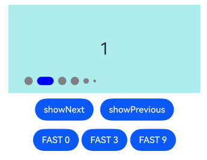
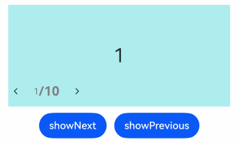

# Swiper

滑块视图容器，提供子组件滑动轮播显示的能力。

> **说明：**
>
> Swiper组件内包含了[PanGesture](./cj-universal-gesture-pangesture.md)拖动手势事件，用于滑动轮播子组件。[disableSwipe](#func-disableswipebool)属性设为true会取消内部的PanGesture事件监听。

## 导入模块

```cangjie
import kit.ArkUI.*
```

## 子组件

可以包含子组件。

> **说明：**
>
> - 子组件类型：系统组件和自定义组件，支持渲染控制类型（[if/else](../../../Dev_Guide/arkui-cj/rendering_control/cj-rendering-control-ifelse.md)、[ForEach](../../../Dev_Guide/arkui-cj/rendering_control/cj-rendering-control-foreach.md)和[LazyForEach](../../../Dev_Guide/arkui-cj/rendering_control/cj-rendering-control-lazyforeach.md)）。不建议子组件中混用懒加载组件（包括LazyForEach）和非懒加载组件，或者子组件中使用多个懒加载组件，否则可能导致懒加载组件预加载能力失效等问题。不建议在组件动画过程中对数据源进行操作，否则会导致布局出现异常。
> - Swiper子组件的[visibility](./cj-universal-attribute-visibility.md#func-visibilityvisibility)属性设置为Visibility.None，且Swiper的displayCount属性设置为'auto'时，对应子组件在视窗内不占位，但不影响导航点个数；visibility属性设置为Visibility.None或者Visibility.Hidden时，对应子组件不显示，但依然会在视窗内占位。
> - 当Swiper子组件设置了[offset](./cj-universal-attribute-location.md#func-offsetlength-length)属性时，会按照子组件的层级进行绘制，层级高的子组件会覆盖层级低的子组件。例如，Swiper包含3个子组件，其中第3个子组件设置了offset({ x : 100 })，那么在横向循环滑动中，第3个子组件会覆盖第1个子组件，此时可设置第1个子组件的[zIndex](./cj-universal-attribute-zorder.md#func-zindexint32)属性值大于第3个子组件，使第1个子组件层级高于第3个子组件。

## 创建组件

### init(?SwiperController, () -> Unit)

```cangjie
public init(controller!: ?SwiperController = Option.None, child!: () -> Unit)
```

**功能：** 创建一个包含Swiper控制器和子组件的Swiper对象。

**系统能力：** SystemCapability.ArkUI.ArkUI.Full

**起始版本：** 22

**参数：**

|参数名|类型|必填|默认值|说明|
|:---|:---|:---|:---|:---|
|controller|?SwiperController|否|Option.None| **命名参数。** 给组件绑定一个控制器，用来控制组件翻页。|
|child|() -> Unit|是|-| **命名参数。** Swiper容器的子组件。|

## 通用属性/通用事件

通用属性：全部支持。

> **说明：**
>
> Swiper组件[通用属性clip](./cj-universal-attribute-shapclip.md#func-clipbool)的初始值为true。

通用事件：全部支持。

## 组件属性

### func autoPlay(?Bool)

```cangjie
public func autoPlay(value: ?Bool): This
```

**功能：** 设置子组件是否自动播放。[loop](#func-loopbool)为false时，自动轮播到最后一页时停止轮播。手势切换后不是最后一页时继续播放。当Swiper不可见时会停止轮播。

**系统能力：** SystemCapability.ArkUI.ArkUI.Full

**起始版本：** 22

**参数：**

|参数名|类型|必填|默认值|说明|
|:---|:---|:---|:---|:---|
|value|?Bool|是|-|子组件是否自动播放。<br>初始值：false，不自动轮播。|

### func cachedCount(?Int32)

```cangjie
public func cachedCount(value: ?Int32): This
```

**功能：** 设置预加载子组件个数，以当前页面为基准，加载当前显示页面的前后个数。例如cachedCount=1时，会将当前显示的页面的前面一页和后面一页的子组件都预加载。如果设置为按组翻页，即displayCount的swipeByGroup参数设为true，预加载时会以组为基本单位。例如cachedCount=1，swipeByGroup=true时，会将当前组的前面一组和后面一组的子组件都预加载。

**系统能力：** SystemCapability.ArkUI.ArkUI.Full

**起始版本：** 22

**参数：**

|参数名|类型|必填|默认值|说明|
|:---|:---|:---|:---|:---|
|value|?Int32|是|-|预加载子组件个数。<br>初始值：1。<br>取值范围：[0, +∞)，设置小于0的值时，按照初始值处理。|

### func curve(?Curve)

```cangjie
public func curve(value: ?Curve): This
```

**功能：** 设置Swiper的动画曲线，默认为弹簧插值曲线。常用曲线参考[Curve枚举说明](./cj-common-types.md#enum-curve)。

**系统能力：** SystemCapability.ArkUI.ArkUI.Full

**起始版本：** 22

**参数：**

|参数名|类型|必填|默认值|说明|
|:---|:---|:---|:---|:---|
|value|?Curve|是|-|Swiper的动画曲线。<br>初始值：Curve.Linear。|

### func disableSwipe(?Bool)

```cangjie
public func disableSwipe(value: ?Bool): This
```

**功能：** 设置禁用组件滑动切换功能。

**系统能力：** SystemCapability.ArkUI.ArkUI.Full

**起始版本：** 22

**参数：**

|参数名|类型|必填|默认值|说明|
|:---|:---|:---|:---|:---|
|value|?Bool|是|-|是否禁用组件滑动切换功能。设置为true禁用，false不禁用。<br>初始值：false。|

### func displayCount(?Int32, ?Bool)

```cangjie
public func displayCount(value: ?Int32, swipeByGroup!: ?Bool = None): This
```

**功能：** 设置Swiper视窗内元素显示个数。

使用Int32类型时，子组件按照主轴均分Swiper宽度（减去displayCount-1个itemSpace）的方式进行主轴拉伸（收缩）布局，设置为小于等于0的值时，按初始值1显示。

当按组进行翻页时，判定翻页的拖拽距离阈值将调整为Swiper宽度的50%（若按子元素翻页，该阈值为子元素宽度的50%）。若最后一组的子元素数量少于displayCount，将利用占位子元素进行填充，占位子元素仅用于布局定位，不显示任何内容，其位置将直接显示Swiper的背景样式。

**系统能力：** SystemCapability.ArkUI.ArkUI.Full

**起始版本：** 22

**参数：**

|参数名|类型|必填|默认值|说明|
|:---|:---|:---|:---|:---|
|value|?Int32|是|-|视窗内显示的子元素个数。设置小于等于0的值时，按照初始值处理。<br>初始值：1。<br>取值范围：(0, +∞)，设置小于等于0的值时，按照初始值处理。|
|swipeByGroup|?Bool|否|None| **命名参数。** 是否按组进行翻页。如果设为true，在翻页时会按组进行翻页，每组内子元素的数量为displayCount value的值；如果为false，则为默认翻页行为，即按照子元素进行翻页。<br>初始值：false。|

> **说明：**
>
> 当Swiper子组件个数小于等于Swiper组件内容区内显示的节点总个数(totalDisplayCount = DisplayCount + prevMargin? (1 : 0) + nextMargin? (1 : 0))时，一般按照非循环模式布局处理，此时，前后边距对应子组件不显示，但依然会在视窗内占位。Swiper组件按照totalDisplayCount个数判断测算规格。例外情况如下：
>
> - 当Swiper子组件个数等于Swiper组件内容区内显示的节点总个数且prevMargin和nextMargin都生效时，设置loop为true支持循环。
> - 当Swiper子组件个数等于Swiper组件DisplayCount数 + 1，且prevMargin和nextMargin至少一个生效时，设置loop为true会生成截图占位组件(如果使用图片异步加载等显示耗时较长的组件可能不能正确生成截图，不建议在该场景开启循环)，支持循环。

### func displayMode(?SwiperDisplayMode)

```cangjie
public func displayMode(value: ?SwiperDisplayMode): This
```

**功能：** 设置主轴方向上元素排列的模式，优先以displayCount设置的个数显示，displayCount未设置时本属性生效。

**系统能力：** SystemCapability.ArkUI.ArkUI.Full

**起始版本：** 22

**参数：**

|参数名|类型|必填|默认值|说明|
|:---|:---|:---|:---|:---|
|value|?SwiperDisplayMode|是|-|主轴方向上元素排列的模式。<br>初始值：SwiperDisplayMode.Stretch。|

### func duration(?UInt32)

```cangjie
public func duration(value: ?UInt32): This
```

**功能：** 设置子组件切换的动画时长。

duration需要和[curve](#func-curvecurve)一起使用。

curve默认曲线为[interpolatingSpring](./cj-apis-curves.md#static-func-interpolatingspringfloat32-float32-float32-float32)，此时动画时长只受曲线自身参数影响，不再受duration的控制。不受duration控制的曲线可以查阅[插值计算](./cj-apis-curves.md)模块，比如，[springMotion](./cj-apis-curves.md#static-func-springmotionfloat32-float32-float32)、[responsiveSpringMotion](./cj-apis-curves.md#static-func-responsivespringmotionfloat32-float32-float32)和interpolatingSpring类型的曲线不受duration控制。如果希望动画时长受到duration控制，需要给curve设置其他曲线。

**系统能力：** SystemCapability.ArkUI.ArkUI.Full

**起始版本：** 22

**参数：**

|参数名|类型|必填|默认值|说明|
|:---|:---|:---|:---|:---|
|value|?UInt32|是|-|子组件切换的动画时长，单位为毫秒。设置小于0的值时，按照初始值处理。<br>初始值：400。<br>取值范围：[0, +∞)，设置小于0的值时，按照初始值处理。|

### func effectMode(?EdgeEffect)

```cangjie
public func effectMode(value: ?EdgeEffect): This
```

**功能：** 设置边缘滑动效果，[loop](#func-loopbool) = false时生效。调用SwiperController.changeIndex()、SwiperController.showNext()和SwiperController.showPrevious()接口跳转至首尾页时不生效回弹。

**系统能力：** SystemCapability.ArkUI.ArkUI.Full

**起始版本：** 22

**参数：**

|参数名|类型|必填|默认值|说明|
|:---|:---|:---|:---|:---|
|value|?EdgeEffect|是|-|边缘滑动效果。<br>初始值：EdgeEffect.Spring。|

### func index(?UInt32)

```cangjie
public func index(value: ?UInt32): This
```

**功能：** 设置当前在容器中显示的子组件的索引值。设置大于等于子组件数量时，按照初始值0处理。

**系统能力：** SystemCapability.ArkUI.ArkUI.Full

**起始版本：** 22

**参数：**

|参数名|类型|必填|默认值|说明|
|:---|:---|:---|:---|:---|
|value|?UInt32|是|-|当前在容器中显示的子组件的索引值。<br> **说明：**<br>设置的值小于0或大于最大页面索引时，取0。<br>初始值：0。|

### func indicator(?Bool)

```cangjie
public func indicator(indicator: ?Bool): This
```

**功能：** 设置可选导航点指示器样式。

**系统能力：** SystemCapability.ArkUI.ArkUI.Full

**起始版本：** 22

**参数：**

|参数名|类型|必填|默认值|说明|
|:---|:---|:---|:---|:---|
|indicator|?Bool|是|-|可选导航点指示器样式。<br>- boolean：是否启用导航点指示器。设置为true启用，false不启用。<br>初始值：true。|

### func indicator(?DotIndicator)

```cangjie
public func indicator(indicator: ?DotIndicator): This
```

**功能：** 设置外部绑定的导航点组件控制器。

**系统能力：** SystemCapability.ArkUI.ArkUI.Full

**起始版本：** 22

**参数：**

|参数名|类型|必填|默认值|说明|
|:---|:---|:---|:---|:---|
|indicator|?DotIndicator|是|-|可选导航点指示器样式。<br>- DotIndicator：圆点指示器样式。<br>初始值：DigitIndicator()。|

### func indicator(?DigitIndicator)

```cangjie
public func indicator(indicator: ?DigitIndicator): This
```

**功能：** 设置外部绑定的导航点组件控制器。

**系统能力：** SystemCapability.ArkUI.ArkUI.Full

**起始版本：** 22

**参数：**

|参数名|类型|必填|默认值|说明|
|:---|:---|:---|:---|:---|
|indicator|?DigitIndicator|是|-|可选导航点指示器样式。<br>- DigitIndicator：数字指示器样式。<br>初始值：DigitIndicator()。|

### func interval(?UInt32)

```cangjie
public func interval(value: ?UInt32): This
```

**功能：** 设置使用自动播放时播放的时间间隔。

**系统能力：** SystemCapability.ArkUI.ArkUI.Full

**起始版本：** 22

**参数：**

|参数名|类型|必填|默认值|说明|
|:---|:---|:---|:---|:---|
|value|?UInt32|是|-|自动播放时播放的时间间隔。当小于[duration](#func-durationuint32)属性值时，翻页完成后会立即开始下一次轮播。<br>初始值：3000。<br>单位：毫秒。<br>设置小于0的值时，按照初始值处理。|

### func itemSpace(?Length)

```cangjie
public func itemSpace(value: ?Length): This
```

**功能：** 设置子组件与子组件之间间隙。不支持设置百分比。

类型为Int64、Float64时，默认单位vp。类型为string时，需要显式指定像素单位，如'10px'；未指定像素单位时，如'10'，单位为vp。

**系统能力：** SystemCapability.ArkUI.ArkUI.Full

**起始版本：** 22

**参数：**

|参数名|类型|必填|默认值|说明|
|:---|:---|:---|:---|:---|
|value|?Length|是|-|子组件与子组件之间间隙。<br/> 类型为Int64、Float64时，默认单位vp。<br>当设置数值小于0或超出Swiper组件宽度范围时，按照初始值处理。<br>初始值：0.0.vp。|

### func loop(?Bool)

```cangjie
public func loop(value: ?Bool): This
```

**功能：** 设置是否开启循环。设置为true时表示开启循环，在LazyForEach懒循环加载模式下，加载的组件数量建议大于5个。

**系统能力：** SystemCapability.ArkUI.ArkUI.Full

**起始版本：** 22

**参数：**

|参数名|类型|必填|默认值|说明|
|:---|:---|:---|:---|:---|
|value|?Bool|是|-|是否开启循环。true为开启循环，false为不开启循环<br>初始值：true。|

### func vertical(?Bool)

```cangjie
public func vertical(value: ?Bool): This
```

**功能：** 设置是否纵向滑动。

**系统能力：** SystemCapability.ArkUI.ArkUI.Full

**起始版本：** 22

**参数：**

|参数名|类型|必填|默认值|说明|
|:---|:---|:---|:---|:---|
|value|?Bool|是|-|是否为纵向滑动。true为纵向滑动，false为横向滑动。<br>初始值：false。|

## 组件事件

### func onChange(?(Int32) -> Unit)

```cangjie
public func onChange(event: ?(Int32) -> Unit): This
```

**功能：** 当前显示的子组件索引变化时触发该事件，返回值为当前显示的子组件的索引值。

Swiper组件结合LazyForEach使用时，不能在onChange事件里触发子页面UI的刷新。

**系统能力：** SystemCapability.ArkUI.ArkUI.Full

**起始版本：** 22

**参数：**

|参数名|类型|必填|默认值|说明|
|:---|:---|:---|:---|:---|
|event|?(Int32) -> Unit|是|-|回调函数，当前显示的子组件索引变化时触发该事件。<br>参数一：当前显示元素的索引。<br>初始值：{ res: Int32 => }。|

**异常：**

- BusinessException：对应错误码如下表，详见[通用错误码](../errorcodes/cj-errorcode-universal.md)。

	| 错误码ID | 错误信息 |
	| :---- | :--- |
	| 100001 | Internal error. |
	| 190002 | The callback function is invalid. |

## 基础类型定义

### class DigitIndicator

```cangjie
public class DigitIndicator <: Indicator {
    public init()
}
```

**功能：** 构造数字指示器的样式。

> **说明：**
>
> 按组翻页时，数字导航点显示的子节点数量，不包括占位节点。数字导航点文本最大的字体缩放倍数[maxFontScale](./cj-text-input-text.md#func-maxfontscalefloat32)为2。

**系统能力：** SystemCapability.ArkUI.ArkUI.Full

**起始版本：** 22

**父类型：**

- [Indicator](#class-indicator)

#### init()

```cangjie
public init()
```

**功能：** DigitIndicator的构造函数。

**系统能力：** SystemCapability.ArkUI.ArkUI.Full

**起始版本：** 22

#### func digitFont(?Font)

```cangjie
public func digitFont(value: ?Font): This
```

**功能：** Swiper组件数字导航点的字体样式。

**系统能力：** SystemCapability.ArkUI.ArkUI.Full

**起始版本：** 22

**参数：**

|参数名|类型|必填|默认值|说明|
|:---|:---|:---|:---|:---|
|value|?Font|是|-|置Swiper组件数字导航点的字体样式。|

#### func fontColor(?ResourceColor)

```cangjie
public func fontColor(value: ?ResourceColor): This
```

**功能：** Swiper组件数字导航点的字体颜色。

**系统能力：** SystemCapability.ArkUI.ArkUI.Full

**起始版本：** 22

**参数：**

|参数名|类型|必填|默认值|说明|
|:---|:---|:---|:---|:---|
|value|?ResourceColor|是|-|设置Swiper组件数字导航点的字体颜色。<br>初始值：0xFF182431。|

#### func selectedDigitFont(?Font)

```cangjie
public func selectedDigitFont(value: ?Font): This
```

**功能：** 选中Swiper组件数字导航点的字体样式。

**系统能力：** SystemCapability.ArkUI.ArkUI.Full

**起始版本：** 22

**参数：**

|参数名|类型|必填|默认值|说明|
|:---|:---|:---|:---|:---|
|value|?Font|是|-|设置选中Swiper组件数字导航点的字体样式。<br>初始值：Font(size: 14.vp, weight: FontWeight.Normal)。|

#### func selectedFontColor(?ResourceColor)

```cangjie
public func selectedFontColor(value: ?ResourceColor): This
```

**功能：** 选中Swiper组件数字导航点的字体颜色。

**系统能力：** SystemCapability.ArkUI.ArkUI.Full

**起始版本：** 22

**参数：**

|参数名|类型|必填|默认值|说明|
|:---|:---|:---|:---|:---|
|value|?ResourceColor|是|-|设置选中Swiper组件数字导航点的字体颜色。<br>初始值：0xFF182431。|

### class DotIndicator

```cangjie
public class DotIndicator <: Indicator {
    public init()
}
```

**功能：** DotIndicator的构造函数。

> **说明：**
>
>按压导航点时，导航点会放大至1.33倍显示，因此非按压态时导航点的可见范围边界至实际范围边界存在一定距离，该距离会随着itemWidth、itemHeight、selectedItemWidth、selectedItemHeight等参数变大而变大。

**系统能力：** SystemCapability.ArkUI.ArkUI.Full

**起始版本：** 22

**父类型：**

- [Indicator](#class-indicator)

#### init()

```cangjie
public init()
```

**功能：** DigitIndicator的构造函数。

**系统能力：** SystemCapability.ArkUI.ArkUI.Full

**起始版本：** 22

#### func color(?ResourceColor)

```cangjie
public func color(value: ?ResourceColor): This
```

**功能：** Swiper组件圆点导航指示器的颜色。

**系统能力：** SystemCapability.ArkUI.ArkUI.Full

**起始版本：** 22

**参数：**

|参数名|类型|必填|默认值|说明|
|:---|:---|:---|:---|:---|
|value|?ResourceColor|是|-|设置Swiper组件圆点导航指示器的颜色。<br>初始值：0x182431（10%透明度）。|

#### func itemHeight(?Length)

```cangjie
public func itemHeight(value: ?Length): This
```

**功能：** Swiper组件圆点导航指示器的高，不支持设置百分比。

**系统能力：** SystemCapability.ArkUI.ArkUI.Full

**起始版本：** 22

**参数：**

|参数名|类型|必填|默认值|说明|
|:---|:---|:---|:---|:---|
|value|?Length|是|-|设置Swiper组件圆点导航指示器的高，不支持设置百分比。<br>初始值：6。<br>单位：vp。|

#### func itemWidth(?Length)

```cangjie
public func itemWidth(value: ?Length): This
```

**功能：** Swiper组件圆点导航指示器的宽，不支持设置百分比。

**系统能力：** SystemCapability.ArkUI.ArkUI.Full

**起始版本：** 22

**参数：**

|参数名|类型|必填|默认值|说明|
|:---|:---|:---|:---|:---|
|value|?Length|是|-|设置Swiper组件圆点导航指示器的宽，不支持设置百分比。<br>初始值：6。<br>单位：vp。|

#### func mask(?Bool)

```cangjie
public func mask(value: ?Bool): This
```

**功能：** 是否显示Swiper组件圆点导航指示器的蒙版样式。

**系统能力：** SystemCapability.ArkUI.ArkUI.Full

**起始版本：** 22

**参数：**

|参数名|类型|必填|默认值|说明|
|:---|:---|:---|:---|:---|
|value|?Bool|是|-|设置是否显示Swiper组件圆点导航指示器的蒙版样式。<br>初始值：false。|

#### func maxDisplayCount(UInt32)

```cangjie
public func maxDisplayCount(value: UInt32): This
```

**功能：** 圆点导航点指示器样式下，导航点显示个数最大值。

单独导航点组件在没有和Swiper绑定使用时，该属性不生效。

**系统能力：** SystemCapability.ArkUI.ArkUI.Full

**起始版本：** 22

**参数：**

|参数名|类型|必填|默认值|说明|
|:---|:---|:---|:---|:---|
|value|UInt32|是|-|设置圆点导航点指示器样式下，导航点显示个数最大值，当实际导航点个数大于最大导航点个数时，会生效超长效果样式，样式如示例4所示。<br>初始值：这个属性没有初始值，如果设置异常值那等同于没有超长显示效果。<br>取值范围：6-9。<br> **说明：**<br>1、超长显示场景，目前暂时不支持交互功能（包括：手指点击拖拽、鼠标操作等）。<br>2、在超长显示场景下，中间页面对应的选中导航点的位置，并不是完全固定的，取决于之前的翻页操作序列。<br>3、当前仅支持displayCount为1的场景。|

#### func selectedColor(?ResourceColor)

```cangjie
public func selectedColor(value: ?ResourceColor): This
```

**功能：** 选中Swiper组件圆点导航指示器的颜色。

**系统能力：** SystemCapability.ArkUI.ArkUI.Full

**起始版本：** 22

**参数：**

|参数名|类型|必填|默认值|说明|
|:---|:---|:---|:---|:---|
|value|?ResourceColor|是|-|设置选中Swiper组件圆点导航指示器的颜色。<br>初始值：0x007DFF。|

#### func selectedItemHeight(?Length)

```cangjie
public func selectedItemHeight(value: ?Length): This
```

**功能：** 选中Swiper组件圆点导航指示器的高，不支持设置百分比。

**系统能力：** SystemCapability.ArkUI.ArkUI.Full

**起始版本：** 22

**参数：**

|参数名|类型|必填|默认值|说明|
|:---|:---|:---|:---|:---|
|value|?Length|是|-|设置选中Swiper组件圆点导航指示器的高，不支持设置百分比。<br>初始值：6。<br>单位：vp。|

#### func selectedItemWidth(?Length)

```cangjie
public func selectedItemWidth(value: ?Length): This
```

**功能：** 选中Swiper组件圆点导航指示器的宽，不支持设置百分比。

**系统能力：** SystemCapability.ArkUI.ArkUI.Full

**起始版本：** 22

**参数：**

|参数名|类型|必填|默认值|说明|
|:---|:---|:---|:---|:---|
|value|?Length|是|-|设置选中Swiper组件圆点导航指示器的宽，不支持设置百分比。<br>初始值：12。<br>单位：vp。|

### class Indicator

```cangjie
public open class Indicator {
    public func bottom(?Length): This
    public func end(?Length): This
    public func left(?Length): This
    public func right(?Length): This
    public func start(?Length): This
    public func top(?Length): This
    public static func digit(): DigitIndicator
    public static func dot(): DotIndicator
    public init()
}
```

**功能：** 设置导航点距离Swiper组件距离。由于导航点有默认交互区域，交互区域高度为32.vp，所以无法让显示部分完全贴底。

**系统能力：** SystemCapability.ArkUI.ArkUI.Full

**起始版本：** 22

#### init()

```cangjie
public init()
```

**功能：** 指示器的构造函数。

**系统能力：** SystemCapability.ArkUI.ArkUI.Full

**起始版本：** 22

#### static func digit()

```cangjie
public static func digit(): DigitIndicator
```

**功能：** 返回一个DigitIndicator对象。

**系统能力：** SystemCapability.ArkUI.ArkUI.Full

**起始版本：** 22

**返回值：**

|类型|说明|
|:----|:----|
|[DigitIndicator](#class-digitindicator)|数字指示器。|

#### static func dot()

```cangjie
public static func dot(): DotIndicator
```

**功能：** 返回一个DotIndicator对象。

**系统能力：** SystemCapability.ArkUI.ArkUI.Full

**起始版本：** 22

**返回值：**

|类型|说明|
|:----|:----|
|[DotIndicator](#class-dotindicator)|圆点指示器。|

#### func bottom(?Length)

```cangjie
public func bottom(value: ?Length): This
```

**功能：** 导航点底部相对于Swiper的位置。

**系统能力：** SystemCapability.ArkUI.ArkUI.Full

**起始版本：** 22

**参数：**

|参数名|类型|必填|默认值|说明|
|:---|:---|:---|:---|:---|
|value|?Length|是|-|设置导航点底部相对于Swiper的位置。<br>未设置top和bottom时，进行自适应大小布局，按照指示器本身大小和Swiper的大小，在交叉轴方向上，位于底部，效果与设置bottom=0一致。<br>设置为0时：按照0位置布局计算。<br>优先级：低于top属性。<br>取值范围：[0,Swiper高度-导航点区域高度]，超出该范围时，取最近的边界值。|

#### func end(?Length)

```cangjie
public func end(value: ?Length): This
```

**功能：** 在RTL模式下为导航点距离Swiper组件左边的距离，在LTR模式下为导航点距离Swiper组件右边的距离。

**系统能力：** SystemCapability.ArkUI.ArkUI.Full

**起始版本：** 22

**参数：**

|参数名|类型|必填|默认值|说明|
|:---|:---|:---|:---|:---|
|value|?Length|是|-|在RTL模式下为导航点距离Swiper组件左边的距离，在LTR模式下为导航点距离Swiper组件右边的距离。<br>初始值：0。<br>单位：vp。|

#### func left(?Length)

```cangjie
public func left(value: ?Length): This
```

**功能：** 导航点左侧相对于Swiper的位置。

**系统能力：** SystemCapability.ArkUI.ArkUI.Full

**起始版本：** 22

**参数：**

|参数名|类型|必填|默认值|说明|
|:---|:---|:---|:---|:---|
|value|?Length|是|-|设置导航点左侧相对于Swiper的位置。<br>未设置left和right时，进行自适应大小布局，按照指示器本身大小和Swiper的大小在主轴方向上进行居中对齐。<br>设置为0时：按照0位置布局计算。<br>优先级：高于right属性。<br>取值范围：[0,Swiper宽度-导航点区域宽度]，超出该范围时，取最近的的边界值。|

#### func right(?Length)

```cangjie
public func right(value: ?Length): This
```

**功能：** 导航点右侧相对于Swiper的位置。

**系统能力：** SystemCapability.ArkUI.ArkUI.Full

**起始版本：** 22

**参数：**

|参数名|类型|必填|默认值|说明|
|:---|:---|:---|:---|:---|
|value|?Length|是|-|设置导航点右侧相对于Swiper的位置。<br>未设置left和right时，进行自适应大小布局，按照指示器本身大小和Swiper的大小在主轴方向上进行居中对齐。设置为0时：按照0位置布局计算。<br>优先级：低于left属性。<br>取值范围：[0,Swiper宽度-导航点区域宽度]，超出该范围时，取最近的的边界值。|

#### func start(?Length)

```cangjie
public func start(value: ?Length): This
```

**功能：** 在RTL模式下为导航点距离Swiper组件右边的距离，在LTR模式下为导航点距离Swiper组件左边的距离。

**系统能力：** SystemCapability.ArkUI.ArkUI.Full

**起始版本：** 22

**参数：**

|参数名|类型|必填|默认值|说明|
|:---|:---|:---|:---|:---|
|value|?Length|是|-|设置在RTL模式下为导航点距离Swiper组件右边的距离，在LTR模式下为导航点距离Swiper组件左边的距离。<br>初始值：0。<br>单位：vp。|

#### func top(?Length)

```cangjie
public func top(value: ?Length): This
```

**功能：** 导航点顶部相对于Swiper的位置。

**系统能力：** SystemCapability.ArkUI.ArkUI.Full

**起始版本：** 22

**参数：**

|参数名|类型|必填|默认值|说明|
|:---|:---|:---|:---|:---|
|value|?Length|是|-|设置导航点顶部相对于Swiper的位置。<br>未设置top和bottom时，进行自适应大小布局，按照指示器本身大小和Swiper的大小，在交叉轴方向上，位于底部，效果与设置bottom=0一致。设置为0时：按照0位置布局计算。<br>优先级：高于bottom属性。<br>取值范围：[0,Swiper高度-导航点区域高度]，超出该范围时，取最近的边界值。|

### class SwiperController

```cangjie
public class SwiperController {
    public init()
}
```

**功能：** SwiperController是Swiper容器组件的控制器，可以定义该类型的对象并绑定至Swiper组件，实现控制子组件的翻页。

**系统能力：** SystemCapability.ArkUI.ArkUI.Full

**起始版本：** 22

#### init()

```cangjie
public init()
```

**功能：** SwiperController的构造函数。

**系统能力：** SystemCapability.ArkUI.ArkUI.Full

**起始版本：** 22

#### func finishAnimation()

```cangjie
public func finishAnimation(): Unit
```
**功能：** 停止播放动画。

**系统能力：** SystemCapability.ArkUI.ArkUI.Full

**起始版本：** 22

#### func finishAnimation(?() -> Unit)

```cangjie
public func finishAnimation(callback: ?() -> Unit): Unit
```

**功能：** 停止播放动画。

**系统能力：** SystemCapability.ArkUI.ArkUI.Full

**起始版本：** 22

**参数：**

|参数名|类型|必填|默认值|说明|
|:---|:---|:---|:---|:---|
|callback|?() -> Unit|是|-|回调函数，动画结束时触发。<br>初始值：{ => }。|

#### func showNext()

```cangjie
public func showNext(): Unit
```

**功能：** 翻至下一页。翻页带动效切换过程，时长通过Swiper的[duration](#func-durationuint32)属性设置。

**系统能力：** SystemCapability.ArkUI.ArkUI.Full

**起始版本：** 22

#### func showPrevious()

```cangjie
public func showPrevious(): Unit
```

**功能：** 翻至上一页。翻页带动效切换过程，时长通过Swiper的[duration](#func-durationuint32)属性设置。

**系统能力：** SystemCapability.ArkUI.ArkUI.Full

**起始版本：** 22

## 示例代码

### 示例代码1（设置导航点交互及翻页动效）

该示例通过changeIndex接口设置SwiperAnimationMode动效模式，实现了Swiper组件翻页至指定页面。

```cangjie
package ohos_app_cangjie_entry

import kit.ArkUI.*
import ohos.arkui.state_macro_manage.*
import std.collection.ArrayList

class MyDataSource<T> <: IDataSource<T> {
    private var list: ArrayList<T> = ArrayList<T>([])

    MyDataSource(list: ArrayList<T>) {
        this.list = list
    }

    public func totalCount(): Int64 {
        return this.list.size
    }

    public func getData(index: Int64): T {
        return this.list[index]
    }

    public func registerDataChangeListener(listener: DataChangeListener): Unit {
    }

    public func unregisterDataChangeListener(listener: DataChangeListener): Unit {
    }
}

@Entry
@Component
class EntryView {
    private var swiperController: SwiperController = SwiperController()
    private var data: MyDataSource<Int64> = MyDataSource<Int64>(ArrayList<Int64>([]))

    protected override func aboutToAppear() {
        var list: ArrayList<Int64> = ArrayList<Int64>([])
        for (i in 0..10) {
            list.add(i)
        }
        this.data = MyDataSource<Int64>(list)
    }

    func build() {
        Column(space: 5) {
            Swiper(controller: this.swiperController) {
                LazyForEach(
                    this.data,
                    itemGeneratorFunc: {
                        item: Int64, idx: Int64 => Text(item.toString())
                            .width(90.percent)
                            .height(160)
                            .backgroundColor(0xAFEEEE)
                            .textAlign(TextAlign.Center)
                            .fontSize(30)
                    }
                )
            }
                .cachedCount(2)
                .index(1)
                .autoPlay(true)
                .interval(4000)
                .loop(true)
                .duration(1000)
                .itemSpace(0)
                .indicator( // 设置圆点导航点样式
                    DotIndicator()
                        .itemWidth(15)
                        .itemHeight(15)
                        .selectedItemWidth(15)
                        .selectedItemHeight(15)
                        .color(Color.Gray)
                        .selectedColor(Color.Blue))
                .curve(Curve.Linear)

            Row(space: 12) {
                Button("showNext").onClick({
                    _ => this
                        .swiperController
                        .showNext()
                })

                Button("showPrevious").onClick({
                    _ => this
                        .swiperController
                        .showPrevious()
                })
            }.margin(5)
        }
            .width(100.percent)
            .margin(top: 5)
    }
}
```



### 示例代码2（设置数字指示器）

该示例通过DigitIndicator接口，实现了数字指示器的效果和功能。

```cangjie
package ohos_app_cangjie_entry

import kit.ArkUI.*
import ohos.arkui.state_macro_manage.*
import std.collection.ArrayList

class MyDataSource<T> <: IDataSource<T> {
    private var list: ArrayList<T> = ArrayList<T>([])

    MyDataSource(list: ArrayList<T>) {
        this.list = list
    }

    public func totalCount(): Int64 {
        return this
            .list
            .size
    }

    public func getData(index: Int64): T {
        return this.list[index]
    }

    public func registerDataChangeListener(listener: DataChangeListener): Unit {
    }

    public func unregisterDataChangeListener(listener: DataChangeListener): Unit {
    }
}

@Entry
@Component
class EntryView {
    private var swiperController: SwiperController = SwiperController()
    private var data: MyDataSource<Int64> = MyDataSource<Int64>(ArrayList<Int64>([]))

    protected override func aboutToAppear() {
        var list: ArrayList<Int64> = ArrayList<Int64>([])
        for (i in 1..=10) {
            list.add(i)
        }
        this.data = MyDataSource<Int64>(list)
    }

    func build() {
        Column(space: 5) {
            Swiper(controller: this.swiperController) {
                LazyForEach(
                    this.data,
                    itemGeneratorFunc: {
                        item: Int64, idx: Int64 => Text(item.toString())
                            .width(90.percent)
                            .height(160)
                            .backgroundColor(0xAFEEEE)
                            .textAlign(TextAlign.Center)
                            .fontSize(30)
                    }
                )
            }
                .cachedCount(2)
                .index(1)
                .autoPlay(true)
                .interval(4000)
                .indicator( // 设置数字导航点样式
                    Indicator
                        .digit()
                        .top(200)
                        .fontColor(Color.Gray)
                        .selectedFontColor(Color.Gray)
                        .digitFont(Font(size: 20, weight: FontWeight.Bold)))
                .loop(true)
                .duration(1000)
                .itemSpace(0)

            Row(space: 12) {
                Button("showNext").onClick({
                    _ => this
                        .swiperController
                        .showNext()
                })

                Button("showPrevious").onClick({
                    _ => this
                        .swiperController
                        .showPrevious()
                })
            }.margin(5)
        }
            .width(100.percent)
            .margin(top: 5)
    }
}
```



### 示例代码3（设置按组翻页）

该示例通过displayCount属性实现了按组翻页效果。

```cangjie
package ohos_app_cangjie_entry

import kit.ArkUI.*
import ohos.arkui.state_macro_manage.*
import std.collection.ArrayList

class MyDataSource<T> <: IDataSource<T> {
    private var list: ArrayList<T> = ArrayList<T>([])

    MyDataSource(list: ArrayList<T>) {
        this.list = list
    }

    public func totalCount(): Int64 {
        return this
            .list
            .size
    }

    public func getData(index: Int64): T {
        return this.list[index]
    }

    public func registerDataChangeListener(listener: DataChangeListener): Unit {
    }

    public func unregisterDataChangeListener(listener: DataChangeListener): Unit {
    }
}

@Entry
@Component
class EntryView {
    private var swiperController: SwiperController = SwiperController()
    private var data: MyDataSource<Int64> = MyDataSource<Int64>(ArrayList<Int64>([]))

    protected override func aboutToAppear() {
        var list: ArrayList<Int64> = ArrayList<Int64>([])
        for (i in 1..=10) {
            list.add(i)
        }
        this.data = MyDataSource<Int64>(list)
    }

    func build() {
        Column(space: 5) {
            Swiper(controller: this.swiperController) {
                LazyForEach(
                    this.data,
                    itemGeneratorFunc: {
                        item: Int64, idx: Int64 => Text(item.toString())
                            .width(90.percent)
                            .height(160)
                            .backgroundColor(0xAFEEEE)
                            .textAlign(TextAlign.Center)
                            .fontSize(30)
                    }
                )
            }
                .displayCount(3, swipeByGroup: true)
                .autoPlay(true)
                .interval(4000)
                .indicator( // 设置圆点导航点样式
                    DotIndicator()
                        .itemWidth(15)
                        .itemHeight(15)
                        .selectedItemWidth(15)
                        .selectedItemHeight(15)
                        .color(Color.Gray)
                        .selectedColor(Color.Blue))
                .loop(true)
                .duration(1000)

            Row(space: 12) {
                Button("showNext").onClick({
                    _ => this
                        .swiperController
                        .showNext()
                })

                Button("showPrevious").onClick({
                    _ => this
                        .swiperController
                        .showPrevious()
                })
            }.margin(5)
        }
            .width(100.percent)
            .margin(top: 5)
    }
}
```


### 示例代码4（设置圆点导航点超长显示）

该示例通过DotIndicator接口的maxDisplayCount属性，实现了圆点导航点超长显示动画效果。

```cangjie
package ohos_app_cangjie_entry

import kit.ArkUI.*
import ohos.arkui.state_macro_manage.*
import std.collection.ArrayList

class MyDataSource<T> <: IDataSource<T> {
    private var list: ArrayList<T> = ArrayList<T>([])

    MyDataSource(list: ArrayList<T>) {
        this.list = list
    }

    public func totalCount(): Int64 {
        return this
            .list
            .size
    }

    public func getData(index: Int64): T {
        return this.list[index]
    }

    public func registerDataChangeListener(listener: DataChangeListener): Unit {
    }

    public func unregisterDataChangeListener(listener: DataChangeListener): Unit {
    }
}

@Entry
@Component
class EntryView {
    private var swiperController: SwiperController = SwiperController()
    private var data: MyDataSource<Int64> = MyDataSource<Int64>(ArrayList<Int64>([]))

    protected override func aboutToAppear() {
        var list: ArrayList<Int64> = ArrayList<Int64>([])
        for (i in 1..=10) {
            list.add(i)
        }
        this.data = MyDataSource<Int64>(list)
    }

    func build() {
        Column(space: 5) {
            Swiper(controller: this.swiperController) {
                LazyForEach(
                    this.data,
                    itemGeneratorFunc: {
                        item: Int64, idx: Int64 => Text(item.toString())
                            .width(90.percent)
                            .height(160)
                            .backgroundColor(0xAFEEEE)
                            .textAlign(TextAlign.Center)
                            .fontSize(30)
                    }
                )
            }
                .cachedCount(2)
                .index(5)
                .autoPlay(true)
                .interval(4000)
                .loop(true)
                .duration(1000)
                .itemSpace(0)
                .indicator(
                    DotIndicator()
                        .itemWidth(8)
                        .itemHeight(8)
                        .selectedItemWidth(16)
                        .selectedItemHeight(8)
                        .color(Color.Gray)
                        .selectedColor(Color.Blue)
                        .maxDisplayCount(9))
                .curve(Curve.Linear)

            Row(space: 12) {
                Button("showNext").onClick({
                    _ => this
                        .swiperController
                        .showNext()
                })

                Button("showPrevious").onClick({
                    _ => this
                        .swiperController
                        .showPrevious()
                })
            }.margin(5)
        }
            .width(100.percent)
            .margin(top: 5)
    }
}
```

