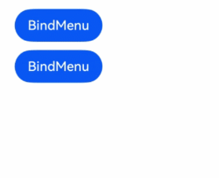
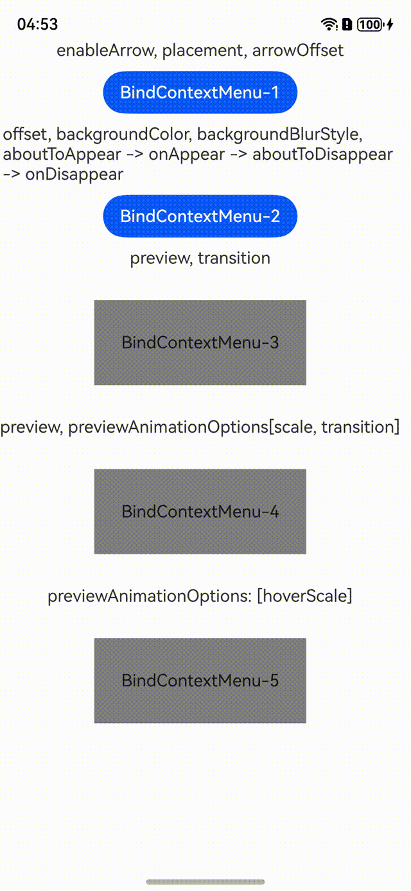

# 菜单控制

为组件绑定弹出式菜单，弹出式菜单以垂直列表形式显示菜单项，可通过长按、点击或鼠标右键触发。

> **说明：**
>
> - CustomBuilder里不支持再使用bindMenu、bindContextMenu弹出菜单。多级菜单可使用[Menu](./cj-menu-menu.md#menu)组件。
> - 弹出菜单的文本内容不支持长按选中。
> - 若组件是可拖动节点，绑定bindContextMenu未指定preview时，菜单弹出会浮起拖拽预览图且菜单选项和预览图不会发生避让。对此，开发者可根据使用场景设置preview或者将目标节点设置成不可拖动节点。
> - 菜单支持长按500ms弹出子菜单，支持按压态跟随手指移动。<br> a.仅支持使用[Menu](./cj-menu-menu.md#menu)组件且子组件包含[MenuItem](./cj-menu-menuitem.md#menuitem)或[MenuItemGroup](./cj-menu-menuitemgroup.md#menuitemgroup)的场景。<br> b.仅支持[MenuPreviewMode](./cj-common-types.md#enum-menupreviewmode)为NONE的菜单。

## 导入模块

```cangjie
import kit.ArkUI.*
```

## func bindContextMenu(?CustomBuilder, ?ResponseType, ?ContextMenuOptions)

```cangjie
public func bindContextMenu(builder!: ?CustomBuilder, responseType!: ?ResponseType,
    options!: ?ContextMenuOptions = None): T
```

**功能：** 绑定上下文菜单到组件。

**系统能力：** SystemCapability.ArkUI.ArkUI.Full

**起始版本：** 22

**参数：**

|参数名|类型|必填|默认值|说明|
| :--- | :--- | :--- | :--- | :--- |
| builder | ?[CustomBuilder](./cj-common-types.md#type-custombuilder) | 是 | \- | **命名参数。** 自定义构建器。<br>初始值：{ => }。|
| responseType | ?[ResponseType](./cj-common-types.md#enum-responsetype) |是|-| **命名参数。** 响应类型。<br>初始值：ResponseType.LongPress。|
| options | ?[ContextMenuOptions](./cj-common-types.md#class-contextmenuoptions) | 否 | None | **命名参数。** 上下文菜单选项。<br>初始值：ContextMenuOptions()。|

**返回值：**

|类型|说明|
|:---|:---|
|T|返回调用此接口的组件实例本身。|

## func bindMenu(?Array\<MenuElement>)

```cangjie
public func bindMenu(content: ?Array<MenuElement>): T
```

**功能：** 绑定菜单到组件。

**系统能力：** SystemCapability.ArkUI.ArkUI.Full

**起始版本：** 22

**参数：**

|参数名|类型|必填|默认值|说明|
| :--- | :--- | :--- | :--- | :--- |
| content | ?Array\<[MenuElement](./cj-common-types.md#class-menuelement)> | 是 | \- | **命名参数。** 菜单元素数组。|

**返回值：**

|类型|说明|
|:---|:---|
|T|返回调用此接口的组件实例本身。|

## func bindMenu(?CustomBuilder)

```cangjie
public func bindMenu(builder!: ?CustomBuilder): T
```

**功能：** 绑定自定义菜单到组件。

**系统能力：** SystemCapability.ArkUI.ArkUI.Full

**起始版本：** 22

**参数：**

|参数名|类型|必填|默认值|说明|
| :--- | :--- | :--- | :--- | :--- |
| builder | ?[CustomBuilder](./cj-common-types.md#type-custombuilder) | 是 | \- | **命名参数。** 自定义构建器。<br>初始值：{ => }。|

**返回值：**

|类型|说明|
|:---|:---|
|T|返回通用方法接口类型|

## 示例代码

### 示例1（弹出自定义菜单）

该示例为通过bindMenu配置CustomBuilder弹出自定义菜单。

<!-- run -->

```cangjie

package ohos_app_cangjie_entry
import kit.ArkUI.*
import ohos.arkui.state_macro_manage.*
import ohos.hilog.*

@Entry
@Component
class EntryView {
    @Builder
    func builder() {
        Column {
            Button("Builder 内容")
                .width(300.px)
                .onClick({
                    evt => Hilog.info(1, "info", "Builder 中的按钮被点击")
                })
        }
        .width(300.px)
    }

    func build() {
        Column(space: 20) {
            Button("BindMenu").bindMenu(
                [
                    MenuElement(
                        value: "菜单1",
                        action: {
                            => Hilog.info(1, "info", "菜单1被点击")
                        }
                    ),
                    MenuElement(
                        value: "菜单2",
                        action: {
                            => Hilog.info(1, "info", "菜单2被点击")
                        }
                    )
                ]
            )

            Button("BindMenu-Custom")
                .bindMenu(builder: builder)
            Button("BindContextMenu-长按")
                .bindContextMenu(builder: builder, responseType: ResponseType.RightClick)
        }
    }
}
```


### 示例2（弹出普通菜单）

该示例为bindMenu通过配置MenuElement弹出普通菜单。

<!-- run -->

```cangjie

package ohos_app_cangjie_entry

import kit.ArkUI.*
import ohos.arkui.state_macro_manage.*
import ohos.hilog.*

@Entry
@Component
class EntryView {
    func build() {
        Scroll() {
            Column(space: 10) {
                Button("BindMenu").bindMenu(
                    [
                        MenuElement(
                            value: "菜单1",
                            action: {
                                => Hilog.info(1, "info", "MenuElement test: 菜单1被点击")
                            }
                        ),
                        MenuElement(
                            value: "菜单2",
                            action: {
                                => Hilog.info(1, "info", "MenuElement test: 菜单2被点击")
                            }
                        )
                    ]
                )

                Button("BindMenu").bindMenu(
                    [
                        MenuElement(
                            value: "菜单1",
                            action: {
                                => Hilog.info(1, "info", "MenuElement test: 菜单1被点击")
                            }
                        ),
                        MenuElement(
                            value: "菜单2",
                            action: {
                                => Hilog.info(1, "info", "MenuElement test: 菜单2被点击")
                            }
                        )
                    ]
                )
            }
        }
    }
}
```



### 示例3（不同菜单的显示、变化和过渡效果）

该示例为测试为enableArrow, placement, arrowOffset，offset, backgroundColor, backgroundBlurStyle的显示效果，为bindContextMenu通过配置transition，实现自定义菜单以及菜单预览时的显示和退出动效，为bindContextMenu通过配置preview中hoverScale，实现组件截图到自定义预览图的一镜到底过渡动效。

<!-- run -->

```cangjie

package ohos_app_cangjie_entry
import kit.ArkUI.*
import ohos.arkui.state_macro_manage.*
import ohos.resource_manager.*
import ohos.hilog.*
import ohos.resource.__GenerateResource__

@Entry
@Component
class EntryView {
    @Builder
    func myBuilder() {
        Row() {
            Image(@r(app.media.startIcon)).size(width: 30.vp, height: 30.vp)
            Text("Builder 内容")
                .width(300.px)
                .onClick({
                    evt => Hilog.info(1, "info", "Builder test: builder clicked!!!")
                })
        }
        .width(150)
    }

    @Builder
    func MyPreview() {
        Column() {
            Image(@r(app.media.background))
                .width(120)
                .height(120)
        }
    }

    func build() {
        Scroll() {
            Column(space: 10) {
                Text("enableArrow, placement, arrowOffset")
                Button("BindContextMenu-1").bindContextMenu(
                    builder: myBuilder,
                    responseType: ResponseType.LongPress,
                    options: ContextMenuOptions(
                        enableArrow: true,
                        placement: Placement.Bottom,
                        arrowOffset: 20.vp
                    )
                )

                Text(
                    "offset, backgroundColor, backgroundBlurStyle, aboutToAppear -> onAppear -> aboutToDisappear -> onDisappear"
                )
                Button("BindContextMenu-2")
                .bindContextMenu(
                    builder: myBuilder,
                    responseType: ResponseType.LongPress,
                    options: ContextMenuOptions(
                        offset: Position(x: 80.0, y: 80.0),
                        backgroundColor: Color.Blue,
                        backgroundBlurStyle: BlurStyle.BackgroundUltraThick,
                        onAppear: {=> Hilog.info(1, "info", "ContextMenuOptions test: onAppear")},
                        onDisappear: {=> Hilog.info(1, "info", "ContextMenuOptions test: onDisappear")},
                        aboutToAppear: {=> Hilog.info(1, "info", "ContextMenuOptions test: aboutToAppear")},
                        aboutToDisappear: {=> Hilog.info(1, "info", "ContextMenuOptions test: aboutToDisappear")}
                    )
                )

                Text("preview, transition")
                Text("BindContextMenu-3")
                    .width(200)
                    .height(80)
                    .backgroundColor(Color.Gray)
                    .textAlign(TextAlign.Center)
                    .margin(20)
                    .bindContextMenu(
                        builder: myBuilder,
                        responseType: ResponseType.LongPress,
                        options: ContextMenuOptions(
                            preview: bind(this.MyPreview, this),
                            transition: TransitionEffect.SLIDE_SWITCH
                        )
                    )

                Text("preview, previewAnimationOptions[scale, transition]")
                Text("BindContextMenu-4")
                    .width(200)
                    .height(80)
                    .backgroundColor(Color.Gray)
                    .textAlign(TextAlign.Center)
                    .margin(20)
                    .bindContextMenu(
                        builder: myBuilder,
                        responseType: ResponseType.LongPress,
                        options: ContextMenuOptions(
                            preview: bind(this.MyPreview, this),
                            previewAnimationOptions: ContextMenuAnimationOptions(
                                transition: TransitionEffect
                                    .OPACITY
                                    .animation(AnimateParam(duration: 4000, curve: Curve.Ease))
                            )
                        )
                    )

                Text("previewAnimationOptions: [hoverScale]")
                Text("BindContextMenu-5")
                    .width(200)
                    .height(80)
                    .backgroundColor(Color.Gray)
                    .textAlign(TextAlign.Center)
                    .margin(20)
                    .bindContextMenu(
                        builder: myBuilder,
                        responseType: ResponseType.LongPress,
                        options: ContextMenuOptions(
                            preview: bind(this.MyPreview, this),
                            previewAnimationOptions: ContextMenuAnimationOptions()
                        )
                    )
            }
        }
    }
}
```

